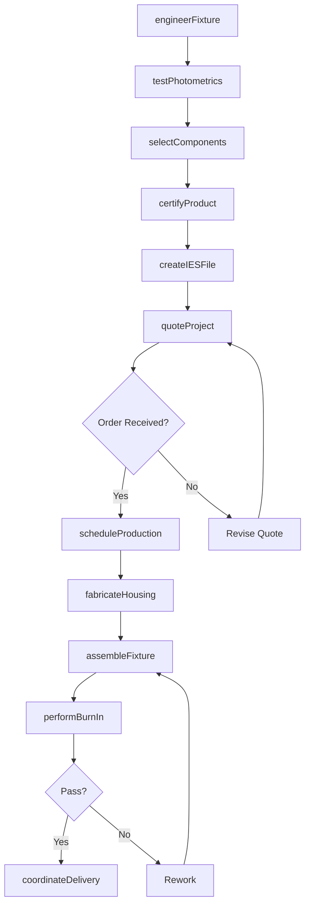
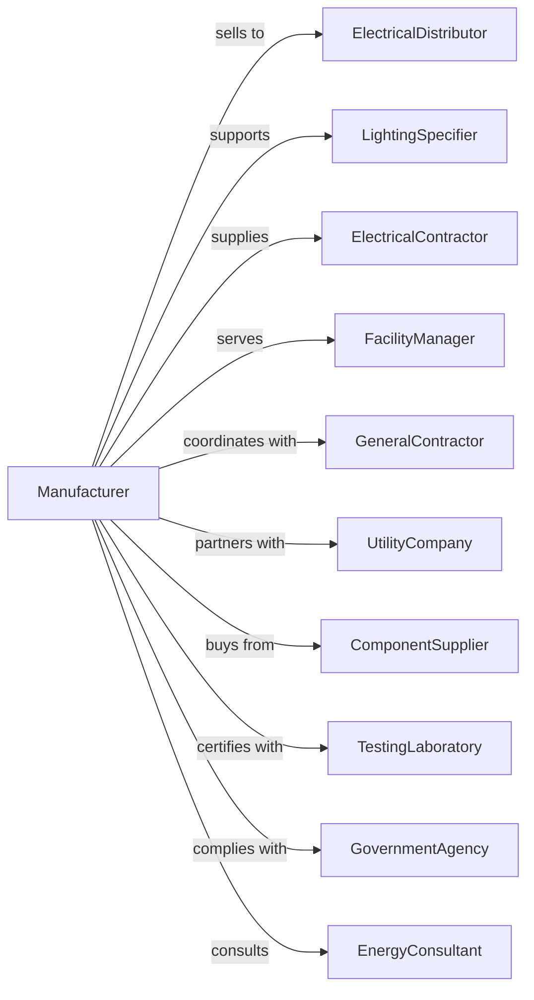

# Commercial, Industrial, and Institutional Electric Lighting Fixture Manufacturing

> Business-as-Code definition for commercial, industrial, and institutional electric lighting fixture production. Models the complete manufacturing lifecycle from engineering through installation support.

## Overview

This U.S. industry comprises establishments primarily engaged in manufacturing commercial, industrial, and institutional electric lighting fixtures. Products include troffer lights, high-bay fixtures, emergency lighting, exit signs, outdoor area lighting, and architectural lighting systems for offices, factories, schools, hospitals, and public spaces.

## Actors

| Actor | Description |
|-------|-------------|
| ElectricalDistributor | Wholesale distributor serving contractors |
| LightingSpecifier | Engineer or architect specifying fixtures |
| ElectricalContractor | Installs fixtures in commercial projects |
| FacilityManager | Manages building lighting systems |
| GeneralContractor | Coordinates construction lighting packages |
| UtilityCompany | Offers rebates for energy-efficient lighting |
| ComponentSupplier | Provides drivers, LEDs, and optical components |
| TestingLaboratory | Provides DLC, UL, and performance certifications |
| EnergyConsultant | Advises on lighting efficiency upgrades |
| GovernmentAgency | Sets energy codes and procurement standards |

## Roles

| Role | Description |
|------|-------------|
| PhotometricEngineer | Designs optical performance and light distribution |
| ElectricalEngineer | Develops driver circuits and electrical systems |
| ProductManager | Manages product lines and market positioning |
| ApplicationEngineer | Provides technical support for specifications |
| AssemblyTechnician | Assembles and wires commercial fixtures |
| QualityEngineer | Develops and monitors quality standards |
| ProductionPlanner | Schedules manufacturing runs and inventory |

## Entities

| Entity | Description |
|--------|-------------|
| Fixture | Complete luminaire assembly for commercial use |
| LEDModule | Solid-state light source array |
| Driver | Electronic power supply for LED operation |
| Lens | Optical element controlling light distribution |
| Housing | Enclosure providing mounting and heat dissipation |
| EmergencyBattery | Backup power for egress lighting |
| ControlInterface | Dimming or sensor connection capability |
| IESFile | Photometric data file for lighting design software |
| Specification | Technical requirements for project bidding |
| Warranty | Product guarantee terms and conditions |

## Actions

| Action | Description |
|--------|-------------|
| engineerFixture | Design luminaire optics and electrical systems |
| testPhotometrics | Measure and document light output and distribution |
| selectComponents | Choose LEDs, drivers, and optical elements |
| fabricateHousing | Manufacture fixture enclosures and brackets |
| assembleFixture | Build complete luminaire from components |
| performBurnIn | Operate fixture to stabilize and verify output |
| certifyProduct | Obtain DLC, UL, and energy certifications |
| createIESFile | Generate photometric data for specifiers |
| quoteProject | Provide pricing for contractor specifications |
| manageWarranty | Process warranty claims and replacements |
| supportApplication | Assist specifiers with lighting calculations |
| trackRebates | Process utility rebate documentation |
| scheduleProduction | Plan manufacturing to meet delivery dates |
| coordinateDelivery | Arrange shipment to job sites |

## Events

| Event | Description |
|-------|-------------|
| fixtureEngineered | Design has been completed and approved |
| photometricsTested | Light performance has been documented |
| componentsSelected | Bill of materials has been finalized |
| housingFabricated | Enclosure manufacturing is complete |
| fixtureAssembled | Luminaire has been fully built |
| burnInCompleted | Product has passed operational testing |
| productCertified | Regulatory certifications obtained |
| iesFileCreated | Photometric data is available for download |
| projectQuoted | Pricing has been submitted to contractor |
| warrantyProcessed | Claim has been resolved |
| productionScheduled | Manufacturing run has been planned |
| deliveryCompleted | Order has arrived at job site |

## Searches

| Search | Description |
|--------|-------------|
| findFixtures | Search by application, wattage, or lumen output |
| getPhotometrics | Retrieve IES files by product model |
| findProjects | List active quotes and orders by contractor |
| getCertifications | Check DLC and UL listing status |
| getInventory | View stock levels by product and warehouse |
| findSpecifications | Search bid opportunities by region or size |
| getRebates | List eligible utility incentive programs |
| getWarrantyClaims | Review open and closed warranty cases |

## Workflow

## Actor Relationships

