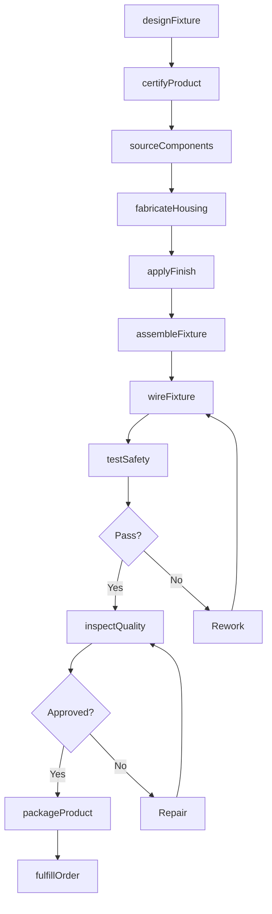
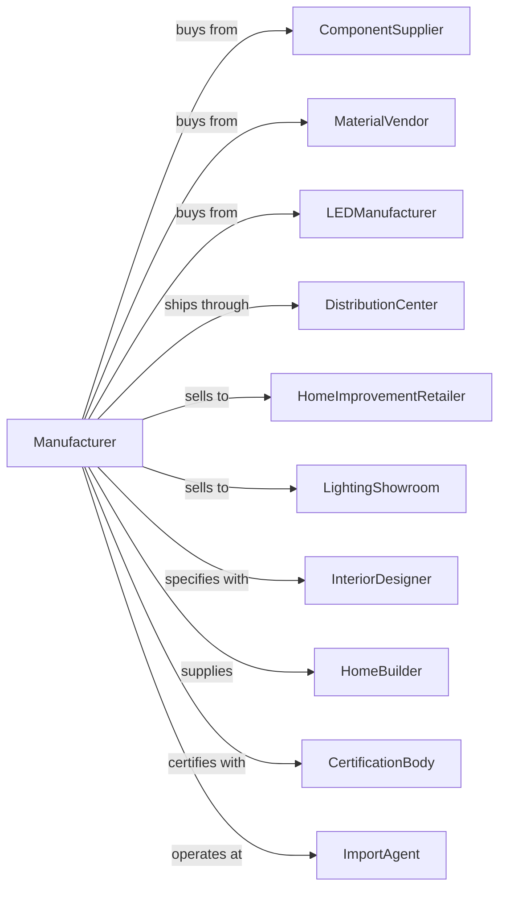

# Residential Electric Lighting Fixture Manufacturing

> Business-as-Code definition for residential electric lighting fixture production operations. Models the complete manufacturing lifecycle from design through distribution of home lighting products.

## Overview

This U.S. industry comprises establishments primarily engaged in manufacturing fixed or portable residential electric lighting fixtures and lamp shades of metal, paper, or textiles. Residential electric lighting fixtures include those for use both inside and outside the residence. Illustrative Examples: Ceiling lighting fixtures, residential, manufacturing Chandeliers, residential, manufacturing Table lamps (i.e., lighting fixtures) manufacturing.

## Actors

| Actor | Description |
|-------|-------------|
| ComponentSupplier | Provides electrical components, sockets, and wiring |
| MaterialVendor | Supplies metals, glass, plastics, and fabric materials |
| LEDManufacturer | Provides LED modules and light sources |
| DistributionCenter | Warehouses and ships finished products |
| HomeImprovementRetailer | Large retail chains selling to consumers |
| LightingShowroom | Specialty retailers displaying fixtures |
| InteriorDesigner | Specifies fixtures for residential projects |
| HomeBuilder | Purchases fixtures for new construction |
| ImportAgent | Handles overseas component and product sourcing |
| CertificationBody | Provides UL, ETL, and safety certifications |

## Roles

| Role | Description |
|------|-------------|
| ProductDesigner | Creates fixture designs and specifications |
| IndustrialEngineer | Optimizes manufacturing processes and layouts |
| AssemblyWorker | Assembles components into finished fixtures |
| QualityInspector | Tests electrical safety and finish quality |
| ProductionSupervisor | Manages assembly line operations and scheduling |
| PackagingSpecialist | Designs and executes product packaging |
| SupplyChainManager | Coordinates procurement and inventory |

## Entities

| Entity | Description |
|--------|-------------|
| Fixture | The complete lighting unit including housing and components |
| LightSource | Bulb, LED module, or other illumination element |
| Shade | Decorative cover that diffuses or directs light |
| Socket | Electrical connection point for light source |
| Wiring | Internal electrical conductors and connections |
| Finish | Surface treatment such as chrome, brass, or painted |
| Mounting | Hardware for ceiling, wall, or surface installation |
| SKU | Stock keeping unit identifying product variant |
| BillOfMaterials | List of components required for assembly |
| Certification | Safety approval from testing laboratory |

## Actions

| Action | Description |
|--------|-------------|
| designFixture | Create product specifications and CAD drawings |
| sourceComponents | Procure electrical parts and raw materials |
| fabricateHousing | Form metal or plastic fixture bodies |
| applyFinish | Apply paint, plating, or other surface treatments |
| assembleFixture | Combine components into complete unit |
| wireFixture | Install electrical connections and sockets |
| testSafety | Perform electrical safety and ground tests |
| inspectQuality | Check finish, function, and appearance |
| packageProduct | Prepare fixture for shipping with hardware |
| certifyProduct | Submit for UL or ETL safety certification |
| createCatalog | Develop product literature and specifications |
| fulfillOrder | Pick, pack, and ship customer orders |
| processReturn | Handle defective or unwanted product returns |
| updatePricing | Adjust wholesale and retail price lists |

## Events

| Event | Description |
|-------|-------------|
| fixtureDesigned | New product design has been approved |
| componentsReceived | Procurement order has arrived at facility |
| housingFabricated | Fixture bodies are ready for finishing |
| finishApplied | Surface treatment has been completed |
| fixtureAssembled | Unit has been fully assembled |
| fixtureWired | Electrical connections are complete |
| safetyTested | Electrical safety test has passed |
| qualityApproved | Product has passed final inspection |
| productPackaged | Fixture is ready for shipment |
| productCertified | Safety certification has been granted |
| orderFulfilled | Customer shipment has been dispatched |
| returnProcessed | Product return has been completed |

## Searches

| Search | Description |
|--------|-------------|
| findFixtures | List fixtures by style, finish, or light source type |
| getInventory | Check stock levels by SKU and location |
| findComponents | Locate available components by specification |
| getOrders | Retrieve orders by customer, status, or date |
| findCertifications | List products by certification status |
| getProductionSchedule | View assembly schedule and capacity |
| findSuppliers | List vendors by component type or lead time |
| getSalesData | Retrieve sales by product line or channel |

## Workflow

## Actor Relationships

