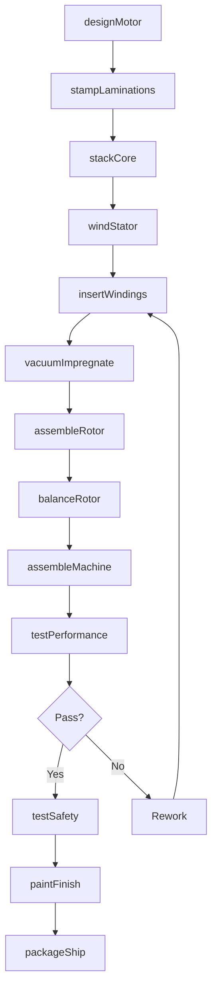
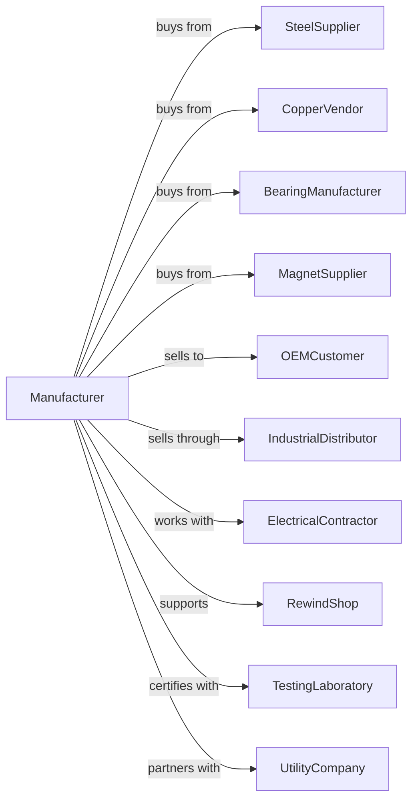

# Motor and Generator Manufacturing

> Business-as-Code definition for electric motor and generator production operations. Models the complete manufacturing lifecycle from design through field service and rewinding.

## Overview

This U.S. industry comprises establishments primarily engaged in manufacturing electric motors (except internal combustion engine starting motors), power generators (except battery charging alternators for internal combustion engines), and motor generator sets (except turbine generator set units). This industry includes establishments rewinding armatures on a factory basis.

## Actors

| Actor | Description |
|-------|-------------|
| SteelSupplier | Provides electrical steel laminations |
| CopperVendor | Supplies magnet wire and conductors |
| BearingManufacturer | Provides precision bearings |
| MagnetSupplier | Supplies permanent magnets for motors |
| OEMCustomer | Integrates motors into equipment |
| IndustrialDistributor | Sells motors to end users |
| ElectricalContractor | Installs and connects motors |
| RewindShop | Provides field repair and rewinding services |
| TestingLaboratory | Certifies efficiency and safety standards |
| UtilityCompany | Offers rebates for high-efficiency motors |

## Roles

| Role | Description |
|------|-------------|
| MotorDesignEngineer | Creates electrical and mechanical designs |
| StatorAssembler | Builds stator cores and windings |
| RotorAssembler | Assembles rotor components |
| WindingTechnician | Winds coils and connects windings |
| MachineOperator | Operates balancing and machining equipment |
| TestTechnician | Performs performance and safety testing |
| RewindSpecialist | Repairs and rewinds failed motors |

## Entities

| Entity | Description |
|--------|-------------|
| Motor | Rotating machine converting electrical to mechanical energy |
| Generator | Rotating machine converting mechanical to electrical energy |
| Stator | Stationary component with windings |
| Rotor | Rotating component producing torque |
| Winding | Copper coils carrying electrical current |
| Bearing | Precision component supporting shaft rotation |
| Frame | Housing and mounting structure |
| Shaft | Output component transmitting mechanical power |
| TerminalBox | Electrical connection enclosure |
| Nameplate | Rating and efficiency data label |

## Actions

| Action | Description |
|--------|-------------|
| designMotor | Create electrical and mechanical specifications |
| stampLaminations | Cut electrical steel lamination shapes |
| stackCore | Assemble laminations into stator or rotor core |
| windStator | Install and connect stator windings |
| assembleRotor | Build rotor with shaft and windings or magnets |
| insertWindings | Place coils into stator slots |
| vacuumImpregnate | Apply insulation varnish under vacuum |
| balanceRotor | Dynamically balance rotating assembly |
| assembleMachine | Combine stator, rotor, bearings, and frame |
| testPerformance | Measure efficiency, torque, and speed |
| testSafety | Perform dielectric and ground tests |
| paintFinish | Apply protective surface coating |
| packageShip | Prepare motor for delivery |
| rewindMotor | Replace failed windings in existing motor |

## Events

| Event | Description |
|-------|-------------|
| motorDesigned | Engineering specifications approved |
| laminationsStamped | Core material has been produced |
| coreStacked | Lamination assembly complete |
| statorWound | Stator windings installed |
| rotorAssembled | Rotor construction complete |
| windingsInserted | Coils placed in core slots |
| impregnationCompleted | Insulation varnish cured |
| rotorBalanced | Dynamic balance verified |
| machineAssembled | Motor or generator fully built |
| performanceTested | Electrical specifications verified |
| safetyVerified | Dielectric tests passed |
| finishApplied | Protective coating complete |
| productShipped | Motor delivered to customer |
| motorRewound | Repair winding replacement complete |

## Searches

| Search | Description |
|--------|-------------|
| findMotors | Search by horsepower, voltage, or frame size |
| findGenerators | Search by kW rating or application |
| getInventory | Check stock by model and location |
| findOrders | Retrieve orders by customer or delivery date |
| getTestData | Access performance test results |
| findRewindJobs | List repair orders by status |
| getEfficiencyRatings | Retrieve IE class and efficiency data |
| findRebates | List utility incentive programs |

## Workflow

## Actor Relationships

