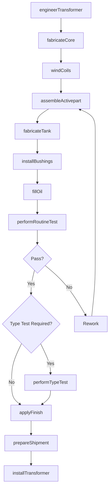
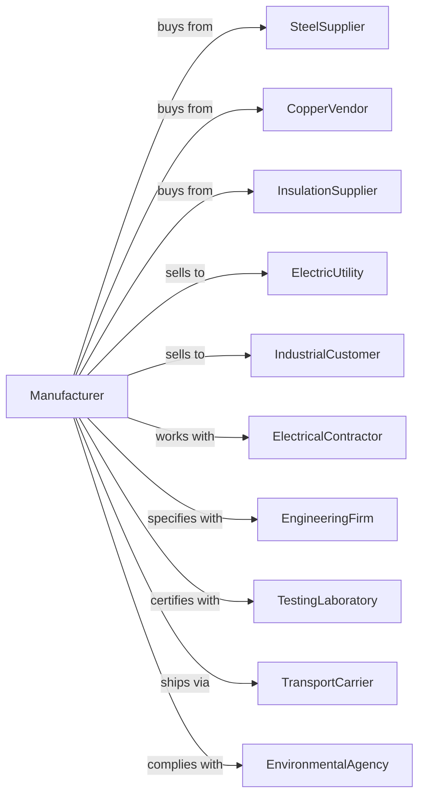

# Power, Distribution, and Specialty Transformer Manufacturing

> Business-as-Code definition for power, distribution, and specialty transformer production. Models the complete manufacturing lifecycle from engineering through field installation and service.

## Overview

This U.S. industry comprises establishments primarily engaged in manufacturing power, distribution, and specialty transformers (except electronic components). Industrial-type and consumer-type transformers in this industry vary (e.g., step up or step down) voltage but do not convert alternating to direct or direct to alternating current. Illustrative Examples: Fluorescent ballasts (i.e., transformers) manufacturing Substation transformers, electric power distribution, manufacturing Distribution transformers manufacturing.

## Actors

| Actor | Description |
|-------|-------------|
| SteelSupplier | Provides electrical steel laminations and cores |
| CopperVendor | Supplies copper wire and conductors |
| InsulationSupplier | Provides insulating materials and oils |
| ElectricUtility | Purchases power and distribution transformers |
| IndustrialCustomer | Buys transformers for facility power systems |
| ElectricalContractor | Installs transformers at customer sites |
| EngineeringFirm | Specifies transformers for projects |
| TestingLaboratory | Provides certification and type testing |
| TransportCarrier | Handles heavy equipment shipping |
| EnvironmentalAgency | Regulates oil handling and PCB disposal |

## Roles

| Role | Description |
|------|-------------|
| TransformerEngineer | Designs electrical and mechanical specifications |
| CoreBuilder | Assembles laminated steel cores |
| CoilWinder | Winds primary and secondary coils |
| TankFabricator | Builds transformer enclosures and tanks |
| AssemblyTechnician | Assembles core, coils, and accessories |
| TestEngineer | Performs electrical and thermal testing |
| FieldServiceTechnician | Installs and maintains transformers on site |

## Entities

| Entity | Description |
|--------|-------------|
| Transformer | Complete voltage conversion unit |
| Core | Laminated steel magnetic circuit |
| Coil | Wound copper or aluminum windings |
| Tank | Oil-filled enclosure for cooling and insulation |
| Bushing | Insulated conductor passing through tank wall |
| TapChanger | Voltage adjustment mechanism |
| InsulatingOil | Dielectric fluid for cooling and insulation |
| Radiator | External cooling fins for heat dissipation |
| ConservatorTank | Oil expansion reservoir |
| Nameplate | Rating and specification label |

## Actions

| Action | Description |
|--------|-------------|
| engineerTransformer | Design electrical and thermal specifications |
| fabricateCore | Cut, stack, and assemble laminated steel core |
| windCoils | Wind copper conductors on coil forms |
| assembleActivepart | Combine core and coils into active assembly |
| fabricateTank | Weld and finish transformer enclosure |
| installBushings | Mount high and low voltage bushings |
| fillOil | Fill tank with insulating oil and degas |
| performRoutineTest | Conduct standard factory acceptance tests |
| performTypeTest | Execute temperature rise and impulse tests |
| applyFinish | Paint and apply corrosion protection |
| prepareShipment | Load transformer for transport |
| installTransformer | Set up and energize at customer site |
| performMaintenance | Conduct oil testing and inspections |
| rebuildTransformer | Refurbish or repair failed unit |

## Events

| Event | Description |
|-------|-------------|
| transformerEngineered | Design specifications approved |
| coreFabricated | Magnetic core assembly complete |
| coilsWound | Primary and secondary windings complete |
| activepartAssembled | Core and coil assembly complete |
| tankFabricated | Enclosure is ready for assembly |
| bushingsInstalled | High voltage connections mounted |
| oilFilled | Tank filled and degassed |
| routineTestPassed | Factory acceptance tests complete |
| typeTestPassed | Special tests successfully completed |
| finishApplied | Surface protection complete |
| shipmentPrepared | Transformer ready for transport |
| transformerInstalled | Unit energized at customer site |
| maintenanceCompleted | Service inspection finished |
| transformerRebuilt | Refurbishment complete |

## Searches

| Search | Description |
|--------|-------------|
| findTransformers | Search by kVA rating, voltage class, or type |
| getProductionSchedule | View manufacturing queue and delivery dates |
| findOrders | Retrieve orders by customer or project |
| getTestResults | Access factory and type test reports |
| findSpareparts | Locate available replacement components |
| getServiceHistory | Review maintenance records by serial number |
| findInstallations | List transformers by location or utility |
| getOilAnalysis | Retrieve dissolved gas analysis results |

## Workflow

## Actor Relationships

