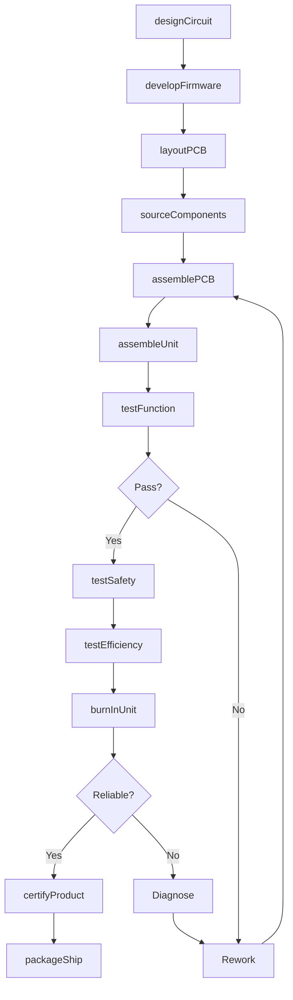
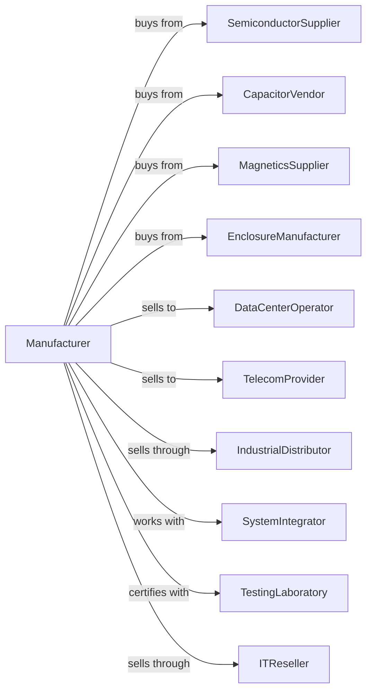

# All Other Miscellaneous Electrical Equipment and Component Manufacturing

> Business-as-Code definition for miscellaneous electrical equipment and component production. Models the complete manufacturing lifecycle from design through distribution and support.

## Overview

This U.S. industry comprises establishments primarily engaged in manufacturing industrial and commercial electric apparatus and other equipment (except lighting equipment, household appliances, transformers, motors, generators, switchgear, relays, industrial controls, batteries, communication and energy wire and cable, wiring devices, and carbon and graphite products). Examples of products made by these establishments are power converters (i.e., AC to DC and DC to AC), power supplies, surge suppressors, and uninterruptible power supplies (UPS).

## Actors

| Actor | Description |
|-------|-------------|
| SemiconductorSupplier | Provides transistors, diodes, and ICs |
| CapacitorVendor | Supplies electrolytic and film capacitors |
| MagneticsSupplier | Provides transformers and inductors |
| EnclosureManufacturer | Supplies metal and plastic housings |
| DataCenterOperator | Purchases UPS and power conditioning |
| TelecomProvider | Uses power supplies for network equipment |
| IndustrialDistributor | Wholesales equipment to end users |
| SystemIntegrator | Designs power solutions for customers |
| TestingLaboratory | Provides UL, CE, and energy certifications |
| ITReseller | Distributes power products with computing |

## Roles

| Role | Description |
|------|-------------|
| PowerElectronicsEngineer | Designs converter and power supply circuits |
| FirmwareEngineer | Develops embedded control software |
| PCBDesigner | Creates circuit board layouts |
| AssemblyTechnician | Builds electronic assemblies |
| TestEngineer | Verifies performance and safety |
| QualityInspector | Performs final inspection and testing |
| ApplicationEngineer | Supports customers with system design |

## Entities

| Entity | Description |
|--------|-------------|
| PowerSupply | Device converting AC to DC power |
| UPS | Uninterruptible power supply with battery backup |
| PowerConverter | Device changing voltage or current form |
| Inverter | DC to AC converter |
| Rectifier | AC to DC converter |
| SurgeProtector | Device limiting voltage spikes |
| PowerConditioner | Equipment improving power quality |
| ChargerModule | Device charging batteries |
| PDU | Power distribution unit for equipment racks |
| Firmware | Embedded software controlling operation |

## Actions

| Action | Description |
|--------|-------------|
| designCircuit | Create power electronics schematic |
| developFirmware | Write embedded control software |
| layoutPCB | Design circuit board for manufacturing |
| sourceComponents | Procure semiconductors and passives |
| assemblePCB | Populate and solder circuit boards |
| assembleUnit | Build complete unit in enclosure |
| testFunction | Verify electrical performance |
| testSafety | Perform dielectric and ground tests |
| testEfficiency | Measure power conversion efficiency |
| burnInUnit | Operate under load to verify reliability |
| certifyProduct | Obtain safety and efficiency certifications |
| packageShip | Prepare for customer delivery |
| supportInstallation | Assist with system integration |
| updateFirmware | Release software improvements |

## Events

| Event | Description |
|-------|-------------|
| circuitDesigned | Schematic approved |
| firmwareDeveloped | Embedded software ready |
| pcbLayoutCompleted | Board design released |
| componentsReceived | Parts arrived at facility |
| pcbAssembled | Circuit board populated |
| unitAssembled | Complete system built |
| functionTested | Performance verified |
| safetyTested | Dielectric tests passed |
| efficiencyTested | Conversion efficiency measured |
| burnInCompleted | Reliability verified |
| productCertified | Certifications obtained |
| orderShipped | Delivery dispatched |
| installationSupported | Customer integration complete |
| firmwareUpdated | New version released |

## Searches

| Search | Description |
|--------|-------------|
| findPowerSupplies | Search by wattage, voltage, or form factor |
| findUPS | Search by VA rating or runtime |
| findConverters | Search by input/output voltage |
| getInventory | Check stock by product and location |
| findOrders | Retrieve orders by customer |
| getCertifications | List products by safety rating |
| getEfficiencyData | Access efficiency test results |
| findApplications | Search by industry or use case |

## Workflow

## Actor Relationships

