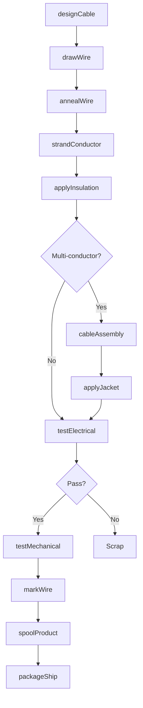
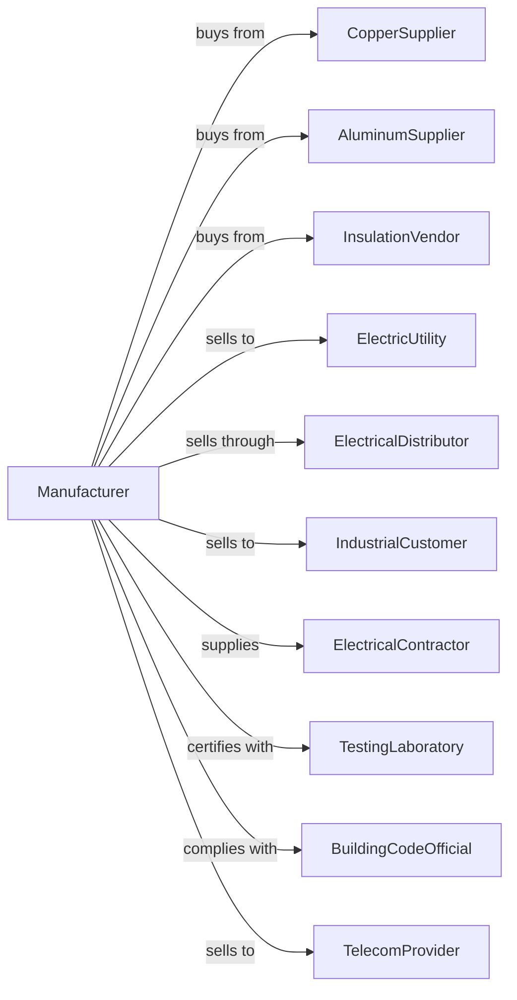

# Other Communication and Energy Wire Manufacturing

> Business-as-Code definition for communication and energy wire production operations. Models the complete manufacturing lifecycle from wire drawing through testing and distribution.

## Overview

This U.S. industry comprises establishments primarily engaged in manufacturing insulated wire and cable of nonferrous metals from purchased wire. Products include power cables, building wire, telecommunications cables, control cables, and specialty wire products for electrical transmission and communication.

## Actors

| Actor | Description |
|-------|-------------|
| CopperSupplier | Provides copper rod and wire |
| AluminumSupplier | Supplies aluminum conductors |
| InsulationVendor | Provides PVC, XLPE, and rubber compounds |
| ElectricUtility | Purchases power transmission cables |
| ElectricalDistributor | Wholesales wire to contractors |
| IndustrialCustomer | Buys cables for facility wiring |
| ElectricalContractor | Installs wire in construction projects |
| TestingLaboratory | Provides UL and CSA certifications |
| BuildingCodeOfficial | Enforces electrical code compliance |
| TelecomProvider | Uses cables for communication networks |

## Roles

| Role | Description |
|------|-------------|
| CableEngineer | Designs wire and cable specifications |
| DrawingOperator | Operates wire drawing equipment |
| ExtrusionOperator | Runs insulation and jacketing lines |
| CablingOperator | Operates stranding and twisting equipment |
| QualityTechnician | Tests electrical and physical properties |
| ProductionPlanner | Schedules manufacturing runs |
| InventoryManager | Manages wire stock and reel inventory |

## Entities

| Entity | Description |
|--------|-------------|
| Conductor | Copper or aluminum current-carrying element |
| Insulation | Dielectric covering preventing short circuits |
| Jacket | Outer protective layer |
| Cable | Multi-conductor insulated assembly |
| BuildingWire | Wire rated for permanent installation |
| PowerCable | Heavy gauge cable for power transmission |
| ControlCable | Multi-conductor cable for instrumentation |
| Reel | Spool containing wire for shipping |
| AWGSize | American wire gauge conductor size |
| VoltageRating | Maximum operating voltage |

## Actions

| Action | Description |
|--------|-------------|
| designCable | Specify conductor size, insulation, and rating |
| drawWire | Reduce conductor diameter through dies |
| annealWire | Heat treat to restore conductivity |
| strandConductor | Combine wires into flexible conductor |
| applyInsulation | Extrude dielectric covering |
| cableAssembly | Combine insulated conductors into cable |
| applyJacket | Extrude outer protective layer |
| testElectrical | Verify insulation resistance and continuity |
| testMechanical | Check flexibility and crush resistance |
| markWire | Print identification and ratings |
| spoolProduct | Wind wire onto reels or coils |
| cutToLength | Prepare custom lengths for orders |
| packageShip | Prepare product for delivery |
| certifyProduct | Obtain safety listing and ratings |

## Events

| Event | Description |
|-------|-------------|
| cableDesigned | Specifications approved |
| wireDrawn | Conductor reduced to size |
| wireAnnealed | Heat treatment complete |
| conductorStranded | Multi-wire conductor formed |
| insulationApplied | Dielectric covering extruded |
| cableAssembled | Multi-conductor cable formed |
| jacketApplied | Outer layer extruded |
| electricalTested | Insulation verified |
| mechanicalTested | Physical properties confirmed |
| wireMarked | Identification printed |
| productSpooled | Wound onto delivery package |
| lengthCut | Custom order prepared |
| orderShipped | Delivery dispatched |
| productCertified | Safety listing obtained |

## Searches

| Search | Description |
|--------|-------------|
| findWire | Search by gauge, voltage rating, or type |
| findCables | Search by conductor count or application |
| getInventory | Check stock by product and length |
| findOrders | Retrieve orders by customer or product |
| getTestResults | Access electrical test data |
| findSuppliers | List vendors for copper or insulation |
| getProductionSchedule | View manufacturing queue |
| getCertifications | Check UL or CSA listing status |

## Workflow

## Actor Relationships

