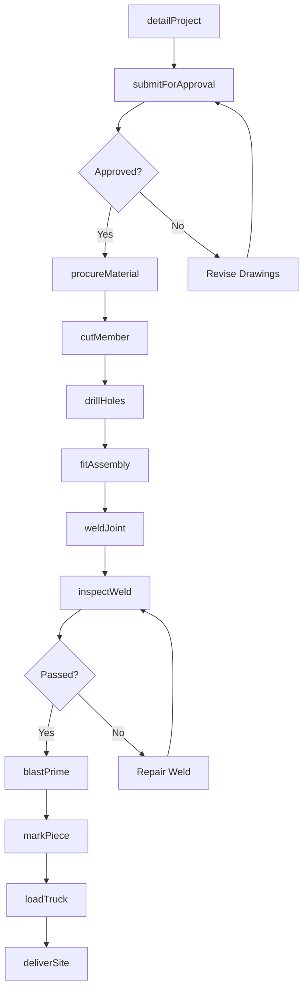
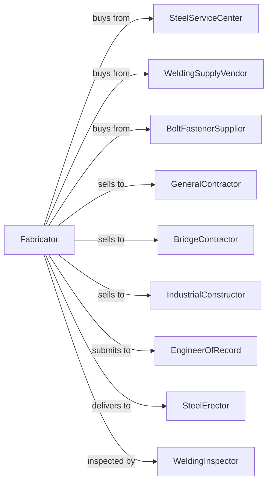

# Fabricated Structural Metal Manufacturing

> Business-as-Code definition for structural steel fabrication. Models the complete process from detailing through fabrication of steel frames, beams, columns, and connections.

## Overview

This U.S. industry comprises establishments primarily engaged in fabricating structural metal products, such as assemblies of concrete reinforcing bars and fabricated bar joists. Products include fabricated steel beams, columns, trusses, and connection components for commercial, industrial, and infrastructure construction.

## Actors

| Actor | Description |
|-------|-------------|
| SteelServiceCenter | Provides structural shapes, plate, and bar stock |
| WeldingSupplyVendor | Supplies welding consumables and gases |
| BoltFastenerSupplier | Provides high-strength bolts and connectors |
| GeneralContractor | Purchases structural steel for building projects |
| BridgeContractor | Orders fabricated steel for bridge construction |
| IndustrialConstructor | Buys structural steel for plant and facility projects |
| EngineerOfRecord | Designs structures and approves shop drawings |
| SteelErector | Installs fabricated steel at job site |
| WeldingInspector | Certifies welder qualifications and weld quality |

## Roles

| Role | Description |
|------|-------------|
| PlantManager | Oversees fabrication shop operations |
| ProjectManager | Coordinates projects from award through delivery |
| StructuralDetailer | Creates shop drawings and cut lists |
| FitterWelder | Fits and welds structural assemblies |
| CNCMachineOperator | Operates CNC drill lines and cutting equipment |
| QualityControlInspector | Inspects welds and dimensions |
| PainterCoater | Applies primer and protective coatings |
| ShippingCoordinator | Manages material handling and load sequencing |

## Entities

| Entity | Description |
|--------|-------------|
| WideFlange | W-shape beam used for columns and beams |
| Plate | Flat steel stock for connections and stiffeners |
| BarJoist | Open-web steel joist for floor and roof support |
| RebarAssembly | Fabricated reinforcing bar cage for concrete |
| Connection | Welded or bolted joint between members |
| Truss | Triangulated structural frame |
| ShopDrawing | Fabrication drawing approved by engineer |
| WeldProcedure | Documented welding process specification |
| PieceNumber | Unique identifier for each fabricated member |
| LoadSequence | Order of pieces for efficient erection |

## Actions

| Action | Description |
|--------|-------------|
| detailProject | Create shop drawings and bills of material |
| submitForApproval | Send drawings to engineer for review |
| procureMaterial | Order structural steel shapes and plate |
| cutMember | Saw or plasma cut members to length |
| drillHoles | CNC drill bolt holes in members |
| fitAssembly | Position components for welding |
| weldJoint | Join members using specified weld procedures |
| inspectWeld | Examine welds visually and with NDT |
| blastPrime | Abrasive blast and apply primer coating |
| markPiece | Stencil piece numbers on members |
| loadTruck | Sequence and load pieces for delivery |
| deliverSite | Transport fabricated steel to job site |

## Events

| Event | Description |
|-------|-------------|
| drawingsApproved | Engineer has approved shop drawings |
| materialReceived | Structural steel has arrived in shop |
| membersCut | Members have been cut to length |
| holesCompleted | All drilling and coping operations done |
| weldingCompleted | Assemblies have been welded |
| inspectionPassed | Welds and dimensions have been accepted |
| coatingApplied | Primer or paint has been applied |
| pieceMarked | Members are identified for erection |
| loadedForShipment | Truck has been loaded with project steel |
| deliveredToSite | Steel has arrived at construction site |

## Searches

| Search | Description |
|--------|-------------|
| findProjects | List projects by status, customer, or delivery date |
| getDrawingStatus | Check approval status of shop drawings |
| getMaterialStatus | Track ordered material by project |
| getShopSchedule | View fabrication schedule by work center |
| trackWelderCerts | Monitor welder certifications and expirations |
| getInspectionRecords | Retrieve QC reports by project or piece |
| calculateTonnage | Sum tonnage by project for billing |
| getLoadSequence | View erection sequence for deliveries |

## Workflow

## Actor Relationships

