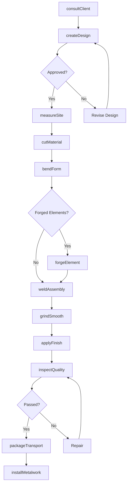
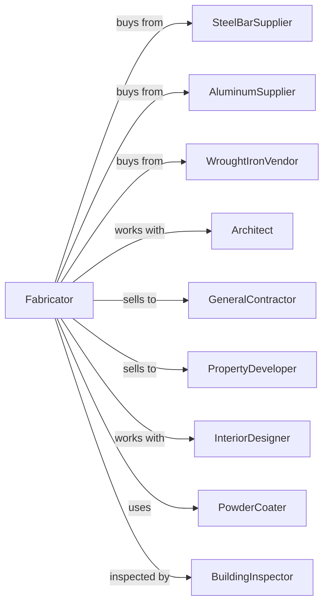

# Ornamental and Architectural Metal Work Manufacturing

> Business-as-Code definition for ornamental and architectural metal work manufacturing. Models the fabrication of custom railings, staircases, and decorative metalwork.

## Overview

This U.S. industry comprises establishments primarily engaged in manufacturing ornamental and architectural metal work, such as staircases, metal open steel flooring, fire escapes, railings, and scaffolding. Products include custom railings, spiral stairs, gates, fencing, and decorative metal elements for commercial and residential applications.

## Actors

| Actor | Description |
|-------|-------------|
| SteelBarSupplier | Provides bar stock, tubing, and flat bar |
| AluminumSupplier | Supplies aluminum extrusions and sheet |
| WroughtIronVendor | Provides decorative iron components |
| Architect | Specifies custom metalwork for projects |
| GeneralContractor | Purchases railings and stairs for construction |
| PropertyDeveloper | Orders metalwork for residential and commercial projects |
| InteriorDesigner | Specifies decorative metal elements |
| PowderCoater | Applies durable powder coat finishes |
| BuildingInspector | Inspects installations for code compliance |

## Roles

| Role | Description |
|------|-------------|
| ShopOwner | Manages ornamental metal shop operations |
| MetalDesigner | Creates custom designs and shop drawings |
| Blacksmith | Forges and shapes decorative elements |
| WelderFabricator | Fabricates and welds metal assemblies |
| CNCOperator | Operates laser and plasma cutting equipment |
| BenderOperator | Forms curves and scrolls using bending equipment |
| Finisher | Prepares and applies finishes to metalwork |
| Installer | Mounts finished metalwork at job sites |

## Entities

| Entity | Description |
|--------|-------------|
| Railing | Handrail and balustrade assembly |
| Staircase | Metal stair structure including treads and stringers |
| Gate | Hinged or sliding entry barrier |
| Fencing | Perimeter enclosure system |
| Baluster | Vertical member supporting handrail |
| Scroll | Decorative curved metal element |
| Grating | Open steel flooring for industrial use |
| FireEscape | Emergency egress stair and landing system |
| Newel | Main supporting post for stair railing |
| DesignDrawing | Architectural drawing showing metalwork details |

## Actions

| Action | Description |
|--------|-------------|
| consultClient | Discuss design requirements with architect or owner |
| createDesign | Develop custom metalwork design and drawings |
| measureSite | Take field measurements for accurate fabrication |
| cutMaterial | Cut bar, tube, and flat stock to length |
| bendForm | Create curves, scrolls, and custom shapes |
| forgeElement | Hand forge decorative components |
| weldAssembly | Join components by welding |
| grindSmooth | Finish welds and prepare surfaces |
| applyFinish | Powder coat, paint, or patina metalwork |
| inspectQuality | Check dimensions and finish quality |
| packageTransport | Protect and deliver to job site |
| installMetalwork | Mount and secure at installation location |

## Events

| Event | Description |
|-------|-------------|
| designApproved | Client has approved design and drawings |
| measurementsTaken | Field dimensions have been recorded |
| materialOrdered | Stock has been ordered for project |
| componentsCut | All pieces have been cut to size |
| assembliesWelded | Metalwork has been fabricated |
| finishApplied | Coating has been applied and cured |
| qualityApproved | Metalwork has passed inspection |
| deliveredToSite | Products have arrived at installation |
| installationCompleted | Metalwork has been mounted and secured |
| finalInspectionCompleted | Building inspector has approved installation |

## Searches

| Search | Description |
|--------|-------------|
| findProjects | List projects by customer, type, or status |
| getDesignLibrary | Browse standard and custom design options |
| getMaterialInventory | Check bar, tube, and decorative stock |
| getProductionSchedule | View shop schedule by project |
| trackInstallations | Monitor installation schedule and progress |
| getFinishOptions | List available coating and patina options |
| calculateWeight | Compute weight for structural and shipping |
| getCodeRequirements | Retrieve railing height and spacing codes |

## Workflow

## Actor Relationships

