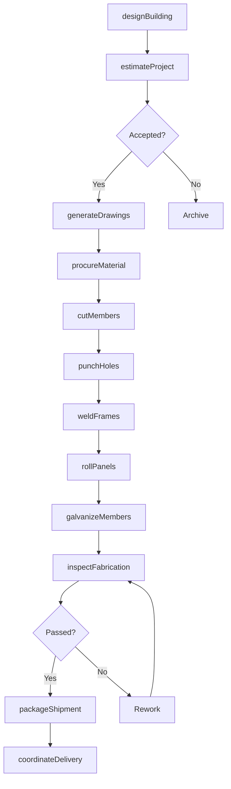
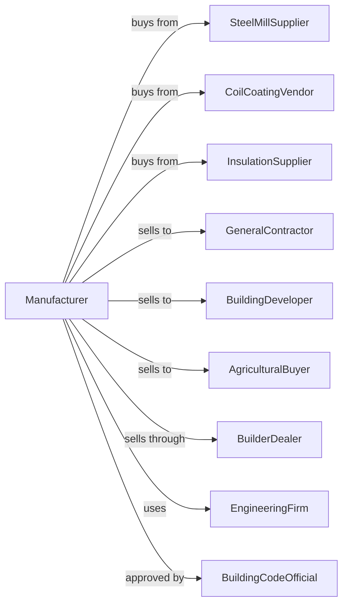

# Prefabricated Metal Building and Component Manufacturing

> Business-as-Code definition for prefabricated metal building manufacturing. Models the design, fabrication, and delivery of pre-engineered steel buildings and components.

## Overview

This U.S. industry comprises establishments primarily engaged in manufacturing prefabricated metal buildings, panels, and sections. Products include pre-engineered steel buildings, metal building systems, wall and roof panels, and structural components for commercial, industrial, and agricultural applications.

## Actors

| Actor | Description |
|-------|-------------|
| SteelMillSupplier | Provides structural steel shapes and coil |
| CoilCoatingVendor | Supplies pre-painted and galvanized coil |
| InsulationSupplier | Provides insulation panels and materials |
| GeneralContractor | Purchases building systems for construction projects |
| BuildingDeveloper | Orders prefab buildings for commercial development |
| AgriculturalBuyer | Buys metal buildings for farm and storage use |
| BuilderDealer | Authorized dealer that sells and erects buildings |
| EngineeringFirm | Provides structural engineering services |
| BuildingCodeOfficial | Approves designs and inspects installations |

## Roles

| Role | Description |
|------|-------------|
| PlantManager | Oversees manufacturing operations and production |
| StructuralEngineer | Designs building frames and connections |
| Detailer | Creates fabrication drawings and bills of material |
| CNCOperator | Programs and operates CNC cutting and punching |
| WelderFabricator | Welds and assembles structural components |
| PanelLineOperator | Runs roll forming lines for wall and roof panels |
| QualityInspector | Verifies dimensions and weld quality |
| ProjectCoordinator | Manages orders from design through delivery |

## Entities

| Entity | Description |
|--------|-------------|
| StructuralSteel | Wide-flange beams, columns, and shapes |
| MetalCoil | Coated steel coil for panel production |
| RigidFrame | Primary structural frame for metal buildings |
| PurlinGirt | Secondary structural members supporting panels |
| WallPanel | Exterior cladding panel for building walls |
| RoofPanel | Metal panel system for building roofs |
| InsulatedPanel | Panel with foam or fiberglass insulation core |
| BuildingPackage | Complete set of components for one building |
| ErectionDrawings | Instructions for field assembly |
| LoadCalculation | Engineering analysis of structural loads |

## Actions

| Action | Description |
|--------|-------------|
| designBuilding | Engineer building layout and structural system |
| generateDrawings | Create fabrication and erection drawings |
| estimateProject | Calculate costs and prepare quotation |
| procureMaterial | Order steel shapes and coated coil |
| cutMembers | CNC cut structural members to length |
| punchHoles | Punch connection holes in members |
| weldFrames | Fabricate welded rigid frame sections |
| rollPanels | Form wall and roof panels on roll lines |
| galvanizeMembers | Apply zinc coating to secondary members |
| inspectFabrication | Verify dimensions and weld quality |
| packageShipment | Bundle and load components for delivery |
| coordinateDelivery | Schedule shipments to construction site |

## Events

| Event | Description |
|-------|-------------|
| designApproved | Customer has approved building design |
| drawingsReleased | Fabrication drawings issued to shop |
| materialReceived | Steel and coil stock has arrived |
| framesWelded | Rigid frame sections are complete |
| panelsRolled | Wall and roof panels are formed |
| inspectionPassed | Components meet quality standards |
| packagePrepared | Building package prepared for shipment |
| deliveryScheduled | Shipment date confirmed with customer |
| buildingShipped | Components dispatched to job site |
| erectionCompleted | Field crew has erected the building |

## Searches

| Search | Description |
|--------|-------------|
| findProjects | List active projects by customer or delivery date |
| getDrawingStatus | Check status of engineering and detailing |
| getMaterialInventory | View steel and coil stock levels |
| getProductionSchedule | See fabrication schedule by project |
| trackShipments | Monitor deliveries to job sites |
| getFrameWeights | Calculate weights for shipping and erection |
| findDealers | List authorized builder dealers by region |
| getCodeCompliance | Verify building meets applicable codes |

## Workflow

## Actor Relationships

