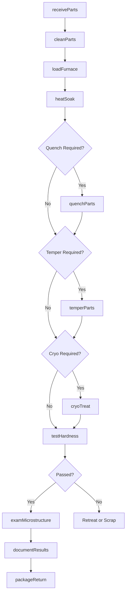
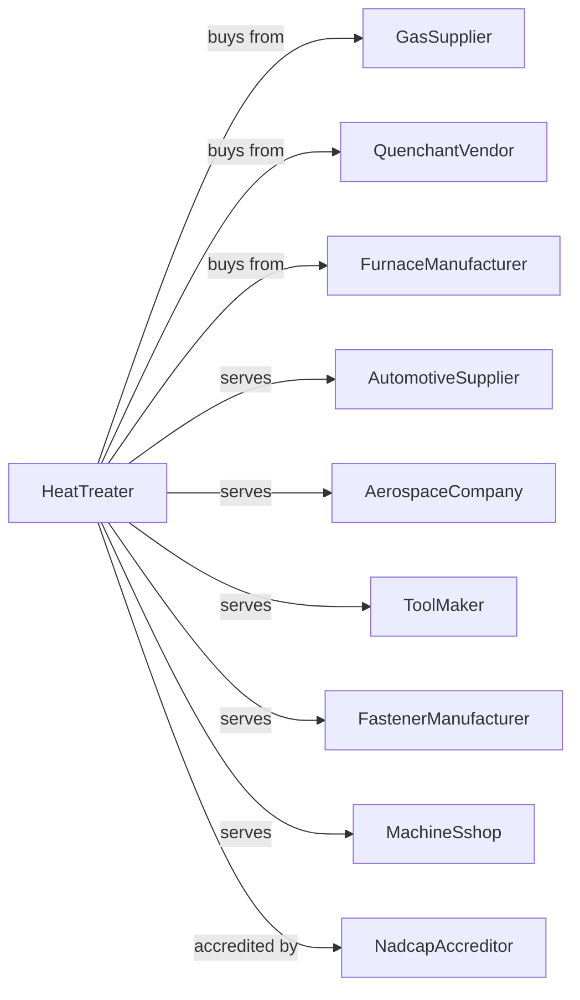

# Metal Heat Treating

> Business-as-Code definition for metal heat treating services. Models the thermal processing of metal parts including hardening, tempering, annealing, and cryogenic treatment.

## Overview

This U.S. industry comprises establishments primarily engaged in heat treating, such as annealing, tempering, and brazing, and cryogenically treating metals and metal products for the trade. Services include hardening, case hardening, stress relieving, normalizing, and specialty thermal processes.

## Actors

| Actor | Description |
|-------|-------------|
| GasSupplier | Provides atmosphere gases for furnaces |
| QuenchantVendor | Supplies quenching oils and polymers |
| FurnaceManufacturer | Provides heat treating equipment |
| AutomotiveSupplier | Sends parts for hardening and case hardening |
| AerospaceCompany | Requires Nadcap-certified heat treat services |
| ToolMaker | Orders hardening for dies and cutting tools |
| FastenerManufacturer | Sends bolts and screws for heat treatment |
| MachineSshop | Outsources heat treating for machined parts |
| NadcapAccreditor | Certifies aerospace heat treat processes |

## Roles

| Role | Description |
|------|-------------|
| PlantManager | Directs heat treating operations |
| MetallurgicalEngineer | Develops heat treat processes and specifications |
| FurnaceOperator | Loads and operates heat treating furnaces |
| QuenchOperator | Manages quenching operations |
| LabTechnician | Tests hardness and microstructure |
| QualityManager | Maintains certifications and quality records |
| MaintenanceTech | Services furnaces and atmosphere systems |
| MaterialHandler | Manages incoming and outgoing parts |

## Entities

| Entity | Description |
|--------|-------------|
| BatchFurnace | Enclosed furnace for batch heat treating |
| ContinuousFurnace | Conveyor-based furnace for high volume |
| VacuumFurnace | Furnace operating under reduced pressure |
| QuenchTank | Container holding quenching medium |
| AtmosphereGas | Protective or reactive gas in furnace |
| HardnessSpecification | Required hardness value for parts |
| CaseDepth | Depth of hardened layer in case hardening |
| HeatTreatRecipe | Time, temperature, and atmosphere parameters |
| TestCoupon | Sample processed with parts for testing |
| Pyrometer | Temperature measurement instrument |

## Actions

| Action | Description |
|--------|-------------|
| receiveParts | Accept incoming parts and verify specifications |
| cleanParts | Remove oil and contaminants before treatment |
| loadFurnace | Place parts in furnace with test coupons |
| heatSoak | Raise temperature and hold for specified time |
| quenchParts | Rapidly cool parts in oil, water, or polymer |
| temperParts | Reheat to reduce brittleness |
| cryoTreat | Subject parts to cryogenic temperatures |
| testHardness | Measure hardness on parts and coupons |
| examMicrostructure | Analyze metallurgical structure |
| documentResults | Record all parameters and test data |
| packageReturn | Package and return treated parts |
| maintainFurnace | Calibrate and service equipment |

## Events

| Event | Description |
|-------|-------------|
| partsReceived | Customer parts have arrived |
| furnaceLoaded | Parts are in furnace ready for cycle |
| soakCompleted | Parts have reached target time and temperature |
| quenchCompleted | Parts have been rapidly cooled |
| temperCompleted | Tempering cycle has finished |
| hardnessPassed | Parts meet hardness specification |
| microstructureApproved | Metallurgical analysis is acceptable |
| partsShipped | Treated parts returned to customer |
| furnaceMaintenanceBecameDue | Equipment requires scheduled service |

## Searches

| Search | Description |
|--------|-------------|
| findJobs | List jobs by customer, material, or due date |
| getFurnaceSchedule | View furnace loading schedule |
| getRecipeLibrary | Retrieve heat treat recipes by material |
| getTestResults | View hardness and microstructure data |
| trackCertifications | Monitor Nadcap and quality certifications |
| getAtmosphereLogs | Retrieve furnace atmosphere records |
| calculateCycleTime | Estimate total process time |
| getEquipmentStatus | Check furnace availability and condition |

## Workflow

## Actor Relationships

