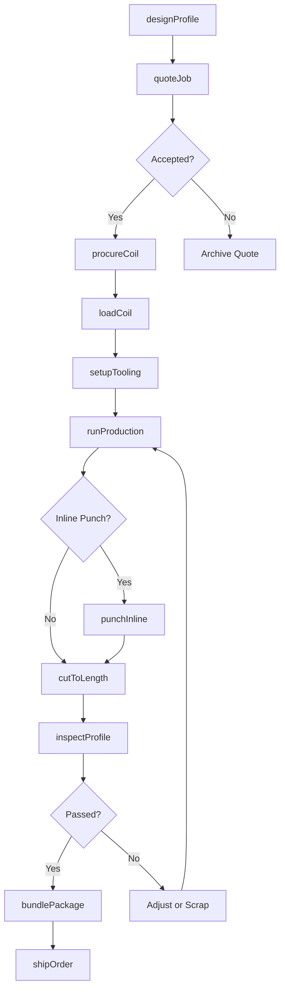
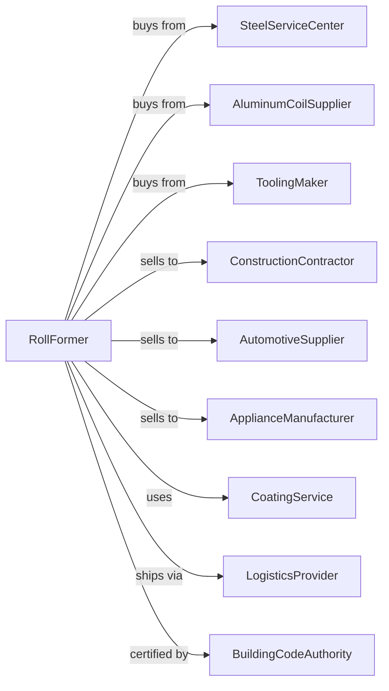

# Custom Roll Forming

> Business-as-Code definition for custom roll forming operations. Models the continuous bending process that shapes metal strip and sheet into complex profiles.

## Overview

This U.S. industry comprises establishments primarily engaged in custom roll forming metal products by use of rotary motion of rolls with various contours to bend or shape the products. Roll forming creates long lengths of consistent cross-sectional profiles used in construction, automotive, appliances, and industrial applications.

## Actors

| Actor | Description |
|-------|-------------|
| SteelServiceCenter | Supplies coiled steel strip and sheet in various grades |
| AluminumCoilSupplier | Provides aluminum coil for lightweight profiles |
| ToolingMaker | Designs and manufactures roll tooling sets |
| ConstructionContractor | Purchases structural profiles for building projects |
| AutomotiveSupplier | Buys roll-formed components for vehicle frames and trim |
| ApplianceManufacturer | Orders profiles for refrigerators, HVAC, and appliances |
| CoatingService | Applies paint or galvanizing to finished profiles |
| LogisticsProvider | Handles shipping of long profile lengths |
| BuildingCodeAuthority | Certifies structural profiles for construction use |

## Roles

| Role | Description |
|------|-------------|
| PlantManager | Oversees roll forming production and business operations |
| RollFormingEngineer | Designs roll tooling and optimizes forming sequences |
| LineOperator | Runs roll forming lines and monitors product quality |
| SetupTechnician | Changes and aligns roll tooling for different profiles |
| QualityTechnician | Measures profiles and verifies dimensional accuracy |
| CoilHandler | Loads coil stock and manages material flow |
| MaintenanceMechanic | Maintains roll forming equipment and tooling |
| Estimator | Calculates costs and prepares quotes for custom profiles |

## Entities

| Entity | Description |
|--------|-------------|
| Coil | Rolled strip or sheet metal stock for forming |
| RollTooling | Set of contoured rolls that progressively shape the profile |
| Profile | The finished roll-formed cross-sectional shape |
| RollFormingLine | Production line with multiple roll stations |
| Cutoff | Equipment that cuts profiles to length |
| Decoiler | Device that unwinds coil stock for feeding into the line |
| PunchUnit | Inline equipment for adding holes or notches |
| Specification | Customer requirements for profile dimensions and tolerances |
| SetupSheet | Instructions for tooling configuration and line settings |
| Scrap | Off-spec material or trim waste from production |

## Actions

| Action | Description |
|--------|-------------|
| designProfile | Engineer custom profile geometry to meet requirements |
| quoteJob | Calculate costs and lead time for customer inquiry |
| procureCoil | Order steel or aluminum coil to specification |
| loadCoil | Mount coil on decoiler and thread through line |
| setupTooling | Install and align roll tooling for the profile |
| runProduction | Operate roll forming line to produce profiles |
| punchInline | Add holes, slots, or notches during forming |
| cutToLength | Shear profiles to specified lengths |
| inspectProfile | Verify cross-section dimensions and surface quality |
| bundlePackage | Group and package profiles for shipment |
| shipOrder | Dispatch finished profiles to customer |
| refurbishTooling | Regrind or replace worn roll tooling |

## Events

| Event | Description |
|-------|-------------|
| profileDesigned | Custom profile engineering has been completed |
| quoteAccepted | Customer has approved the quotation |
| coilReceived | Material has arrived and passed inspection |
| lineSetupCompleted | Tooling installed and line ready for production |
| productionStarted | Roll forming run has begun |
| profileCut | Lengths have been cut and accumulated |
| inspectionPassed | Profiles meet dimensional specifications |
| orderShipped | Finished profiles dispatched to customer |
| toolingWorn | Roll tooling requires maintenance or replacement |
| coilDepleted | Current coil exhausted, new coil needed |

## Searches

| Search | Description |
|--------|-------------|
| findProfiles | List standard and custom profiles by dimensions or material |
| getCoilInventory | Check available coil stock by grade, width, and gauge |
| getToolingLibrary | List roll tooling sets by profile type |
| findOpenOrders | Retrieve work orders by customer or due date |
| getLineSchedule | View production schedule for roll forming lines |
| calculateYield | Compute material utilization and scrap rates |
| trackShipments | Monitor delivery status of outbound orders |
| getSetupHistory | Retrieve past setup parameters for repeat orders |

## Workflow

## Actor Relationships

