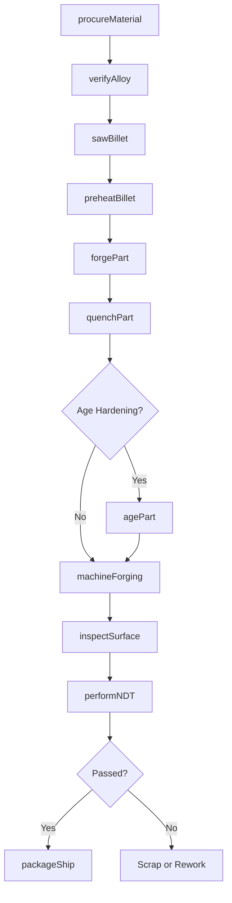
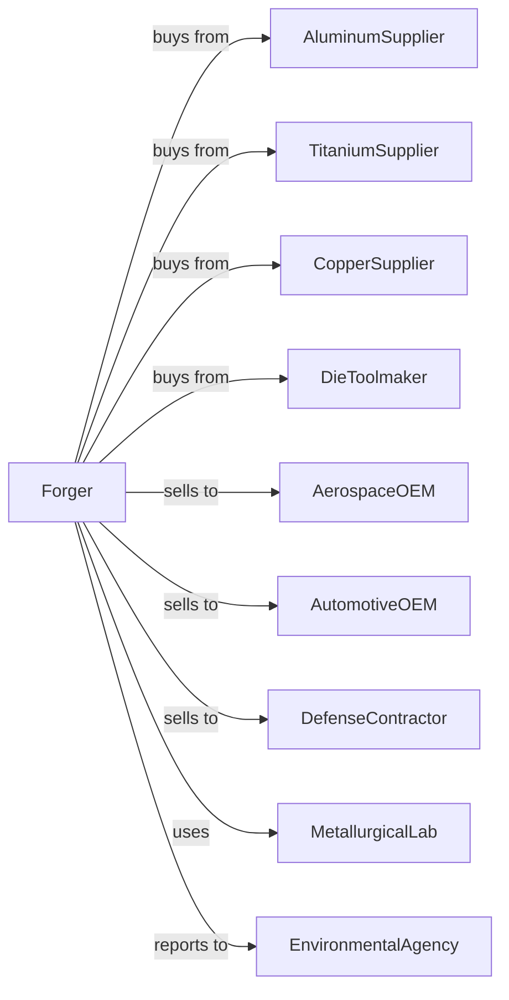

# Nonferrous Forging

> Business-as-Code definition for nonferrous metal forging operations. Models the complete forging process for aluminum, copper, titanium, and other nonferrous alloys.

## Overview

This U.S. industry comprises establishments primarily engaged in manufacturing nonferrous forgings from purchased nonferrous metals by hammering mill shapes. Establishments making nonferrous forgings and further manufacturing (e.g., machining, assembling) a specific manufactured product are classified in the industry of the finished product. Nonferrous forging establishments may perform surface finishing operations, such as cleaning and deburring, on the forgings they manufacture.

## Actors

| Actor | Description |
|-------|-------------|
| AluminumSupplier | Provides aluminum billets and extrusions for forging |
| TitaniumSupplier | Supplies titanium alloys for aerospace forgings |
| CopperSupplier | Provides copper and brass stock for electrical and marine forgings |
| DieToolmaker | Manufactures precision forging dies for nonferrous metals |
| AerospaceOEM | Purchases high-specification forgings for aircraft components |
| AutomotiveOEM | Buys lightweight aluminum forgings for vehicle parts |
| DefenseContractor | Procures specialty forgings for military applications |
| MetallurgicalLab | Provides alloy testing and certification services |
| EnvironmentalAgency | Regulates emissions and waste from forging operations |

## Roles

| Role | Description |
|------|-------------|
| PlantManager | Directs all forging operations and business functions |
| ForgingEngineer | Develops forging processes for specific alloys and geometries |
| PressOperator | Operates hydraulic and mechanical forging presses |
| FurnaceTechnician | Controls induction and gas furnaces for billet heating |
| QualityEngineer | Ensures product meets aerospace and automotive specifications |
| NDTInspector | Performs nondestructive testing using ultrasonic and dye penetrant methods |
| ToolingSpecialist | Manages die design, fabrication, and maintenance |
| MaterialsHandler | Moves billets and forgings through production stages |

## Entities

| Entity | Description |
|--------|-------------|
| AluminumBillet | Aluminum alloy stock prepared for forging |
| TitaniumBillet | Titanium alloy material for high-strength forgings |
| BrassBillet | Copper-zinc alloy stock for corrosion-resistant parts |
| ForgingDie | Tool that imparts shape to heated nonferrous metal |
| Forging | Shaped nonferrous metal part |
| InductionFurnace | Equipment that heats billets using electromagnetic induction |
| HydraulicPress | Press that uses hydraulic force for forging operations |
| MaterialCertification | Document verifying alloy composition and properties |
| ProcessSheet | Instructions specifying forging parameters for each part |
| ScrapReclaim | Nonferrous scrap collected for recycling |

## Actions

| Action | Description |
|--------|-------------|
| procureMaterial | Source and order nonferrous billets to specification |
| verifyAlloy | Confirm material composition matches certification |
| sawBillet | Cut bar stock to required billet length |
| preheatBillet | Heat billet to optimal forging temperature for the alloy |
| forgePart | Shape heated nonferrous metal in forging press |
| quenchPart | Rapidly cool forging to achieve desired microstructure |
| agePart | Apply thermal aging treatment to precipitation-hardened alloys |
| machineForging | Remove excess stock and achieve final dimensions |
| inspectSurface | Check for cracks, laps, and surface defects |
| performNDT | Conduct ultrasonic or radiographic inspection |
| packageShip | Prepare and dispatch forgings to customer |
| reclaimScrap | Collect and process scrap for recycling |

## Events

| Event | Description |
|-------|-------------|
| materialVerified | Incoming alloy has passed composition verification |
| billetPreheated | Billet has reached target forging temperature |
| forgingCompleted | Part has been forged to near-net shape |
| quenchCompleted | Rapid cooling cycle has finished |
| agingCompleted | Thermal aging treatment has concluded |
| ndtPassed | Nondestructive testing found no rejectable indications |
| ndtFailed | Inspection detected defects requiring disposition |
| orderFulfilled | Customer order has been completed and shipped |
| alloyChanged | Production switched to different alloy requiring die and process changes |

## Searches

| Search | Description |
|--------|-------------|
| findOpenOrders | List work orders by alloy type, customer, or due date |
| getAlloyInventory | Check stock levels by alloy grade and size |
| getDieLibrary | List available dies by part number and condition |
| getCertifications | Retrieve material and process certifications |
| getProcessHistory | Trace forging parameters used for specific lots |
| findQualifiedSuppliers | List approved suppliers by alloy type |
| getScrapValue | Calculate recoverable value of nonferrous scrap |
| trackLeadTimes | Monitor material procurement and production lead times |

## Workflow

## Actor Relationships

