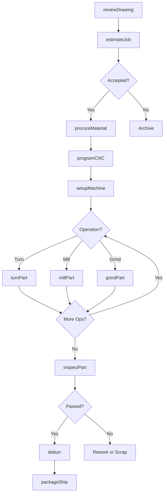
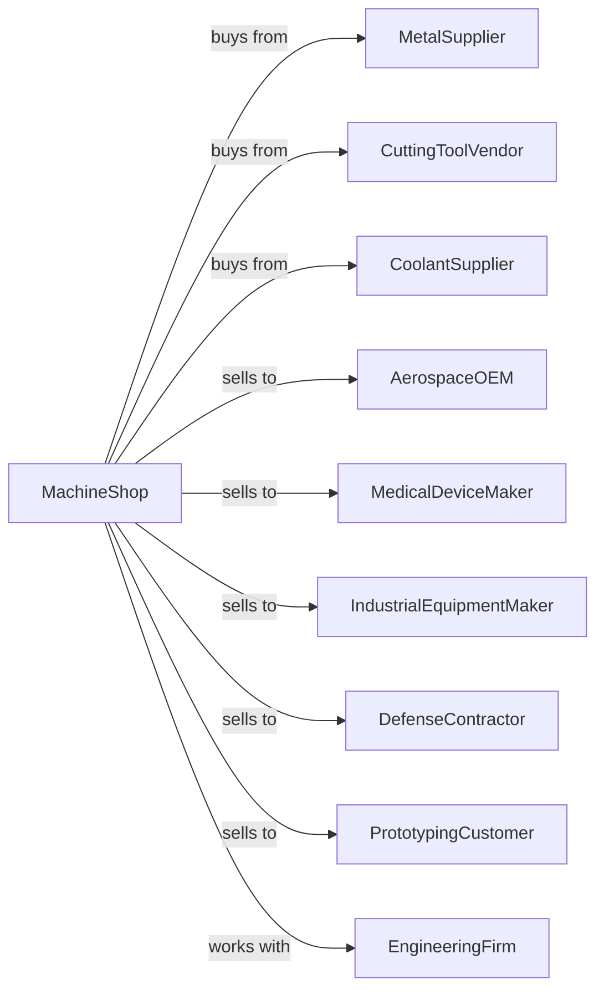

# Machine Shops

> Business-as-Code definition for machine shop operations. Models the job shop machining of precision parts using CNC lathes, mills, and specialty equipment.

## Overview

This industry comprises establishments known as machine shops primarily engaged in machining metal and plastic parts and parts of other composite materials on a job or order basis. Generally machine shop jobs are low volume using machine tools, such as lathes (including computer numerically controlled); automatic screw machines; and machines for boring, grinding, milling, and additive manufacturing.

## Actors

| Actor | Description |
|-------|-------------|
| MetalSupplier | Provides bar stock, plate, and specialty alloys |
| CuttingToolVendor | Supplies carbide inserts, end mills, and tooling |
| CoolantSupplier | Provides metalworking fluids and lubricants |
| AerospaceOEM | Orders precision machined components for aircraft |
| MedicalDeviceMaker | Purchases surgical instruments and implant components |
| IndustrialEquipmentMaker | Buys machined parts for machinery |
| DefenseContractor | Orders precision components for military systems |
| PrototypingCustomer | Sources prototype and development parts |
| EngineeringFirm | Provides design support and specifications |

## Roles

| Role | Description |
|------|-------------|
| ShopOwner | Manages machine shop business and operations |
| Machinist | Sets up and operates machine tools |
| CNCProgrammer | Creates programs for CNC machining centers |
| QualityInspector | Measures parts and verifies specifications |
| ToolCribAttendant | Manages cutting tools and supplies |
| SetupTechnician | Prepares machines for production runs |
| Estimator | Calculates job costs and prepares quotes |
| ShippingClerk | Packages and ships completed parts |

## Entities

| Entity | Description |
|--------|-------------|
| BarStock | Round, square, or hex metal bars for machining |
| Billet | Block of material prepared for machining |
| MachinedPart | Finished component produced by machining |
| CNCLathe | Computer-controlled turning machine |
| MillingMachine | Machine for removing material with rotating cutters |
| GrindingMachine | Precision finishing machine using abrasive wheels |
| CuttingTool | Carbide insert, drill, or end mill for machining |
| Fixture | Workholding device for securing parts |
| GCodeProgram | Instructions controlling CNC machine movements |
| InspectionReport | Documentation of part measurements |

## Actions

| Action | Description |
|--------|-------------|
| reviewDrawing | Analyze customer drawing for manufacturability |
| estimateJob | Calculate material, labor, and setup costs |
| procureMaterial | Order metal stock or customer-supplied material |
| programCNC | Write G-code for machining operations |
| setupMachine | Install tooling and fixtures, verify program |
| machinePart | Remove material to create finished geometry |
| turnPart | Produce cylindrical features on lathe |
| millPart | Create pockets, slots, and surfaces on mill |
| grindPart | Achieve precision dimensions and finish |
| inspectPart | Measure dimensions against specifications |
| deburr | Remove sharp edges and machining burrs |
| packageShip | Protect and ship completed parts |

## Events

| Event | Description |
|-------|-------------|
| quoteAccepted | Customer has approved job quotation |
| materialReceived | Metal stock has arrived in shop |
| programVerified | CNC program has been proven out |
| setupCompleted | Machine is ready for production |
| machiningCompleted | All cutting operations are finished |
| inspectionPassed | Parts meet drawing specifications |
| inspectionFailed | Parts require rework or scrap disposition |
| orderShipped | Completed parts dispatched to customer |
| toolWorn | Cutting tool requires replacement |

## Searches

| Search | Description |
|--------|-------------|
| findJobs | List jobs by customer, status, or due date |
| getMaterialInventory | Check bar stock and billet inventory |
| getToolingInventory | View cutting tool availability |
| getMachineSchedule | See machine loading and availability |
| trackJobProgress | Monitor job status through production |
| getInspectionData | Retrieve measurement data by job |
| calculateCycleTime | Estimate machining time for parts |
| getCustomerHistory | Review past orders by customer |

## Workflow

## Actor Relationships

