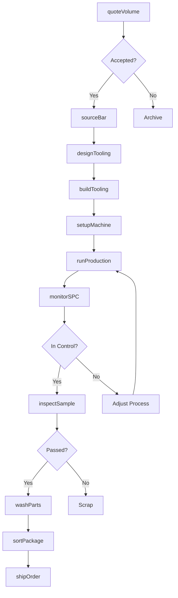
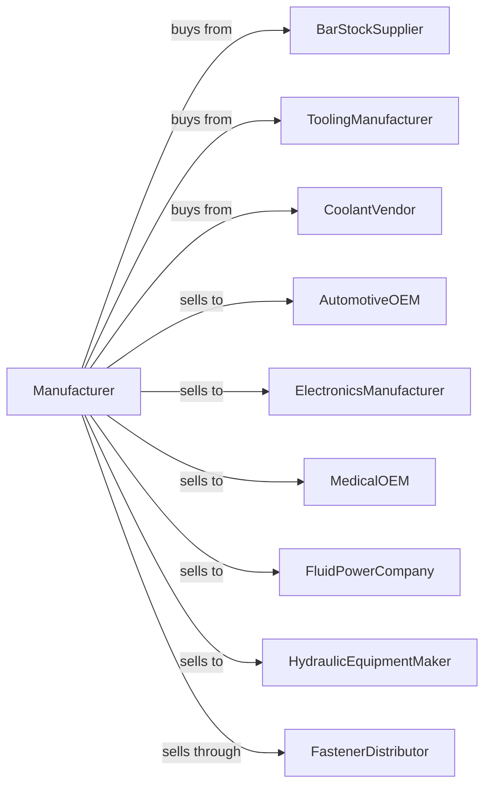

# Precision Turned Product Manufacturing

> Business-as-Code definition for precision turned product manufacturing. Models high-volume production of precision machined components using screw machines and CNC turning centers.

## Overview

This U.S. industry comprises establishments known as precision turned manufacturers primarily engaged in machining precision products of all materials on a job or order basis. Generally precision turned product jobs are large volume using machines, such as automatic screw machines, rotary transfer machines, computer numerically controlled (CNC) lathes, or turning centers.

## Actors

| Actor | Description |
|-------|-------------|
| BarStockSupplier | Provides precision ground bar in various alloys |
| ToolingManufacturer | Supplies screw machine tooling and inserts |
| CoolantVendor | Provides cutting oils and metalworking fluids |
| AutomotiveOEM | Purchases high-volume turned parts for vehicles |
| ElectronicsManufacturer | Orders precision connectors and pins |
| MedicalOEM | Buys bone screws and surgical components |
| FluidPowerCompany | Purchases fittings and valve components |
| HydraulicEquipmentMaker | Orders precision hydraulic components |
| FastenerDistributor | Stocks precision turned fasteners |

## Roles

| Role | Description |
|------|-------------|
| PlantManager | Directs manufacturing operations |
| ProcessEngineer | Designs tooling and optimizes processes |
| ScrewMachineOperator | Runs multi-spindle automatic screw machines |
| CNCTurningOperator | Operates CNC lathes and turning centers |
| SetupTechnician | Sets up and adjusts machine tooling |
| QualityTechnician | Inspects parts and monitors SPC charts |
| ToolMaker | Designs and builds special tooling |
| MaterialHandler | Manages bar stock and finished inventory |

## Entities

| Entity | Description |
|--------|-------------|
| PrecisionBar | Ground bar stock held to tight tolerances |
| TurnedPart | Cylindrical precision component |
| ScrewMachine | Multi-spindle automatic bar machine |
| SwissLathe | Sliding headstock precision turning machine |
| RotaryTransfer | Multi-station machining system |
| Collet | Precision workholding device for bar stock |
| FormTool | Shaped cutting tool for profile turning |
| Cam | Mechanical program for automatic operations |
| SPCChart | Statistical process control monitoring chart |
| PartsWasher | Equipment for cleaning machined parts |

## Actions

| Action | Description |
|--------|-------------|
| quoteVolume | Estimate costs for high-volume production |
| sourceBar | Procure precision bar stock to specification |
| designTooling | Engineer cam, form tools, and workholding |
| buildTooling | Fabricate special tooling in tool room |
| setupMachine | Install tooling and program machine |
| runProduction | Produce parts at high volume rates |
| monitorSPC | Track dimensions using statistical control |
| inspectSample | Verify parts against blueprint |
| washParts | Clean chips and oil from finished parts |
| sortPackage | Inspect, count, and package parts |
| shipOrder | Dispatch parts to customer |
| maintainMachine | Service and adjust equipment |

## Events

| Event | Description |
|-------|-------------|
| orderReceived | Customer purchase order has arrived |
| barStockReceived | Precision bar has been delivered |
| toolingCompleted | Special tooling is ready |
| setupApproved | First article parts have passed inspection |
| productionStarted | Machine is producing parts at rate |
| spcAlarmTriggered | Process has gone out of control limits |
| lotCompleted | Production quantity has been completed |
| orderShipped | Parts dispatched to customer |
| toolWearDetected | Tools require replacement or adjustment |

## Searches

| Search | Description |
|--------|-------------|
| findOrders | List orders by customer, part, or ship date |
| getBarInventory | Check precision bar stock levels |
| getMachineSchedule | View production schedule by machine |
| getToolingStatus | Track tooling readiness and wear |
| getSPCData | Retrieve process capability data |
| trackProduction | Monitor parts count and scrap rates |
| getSetupRecords | Review past setup parameters |
| calculateCycleTime | Determine cycle time for parts |

## Workflow

## Actor Relationships

