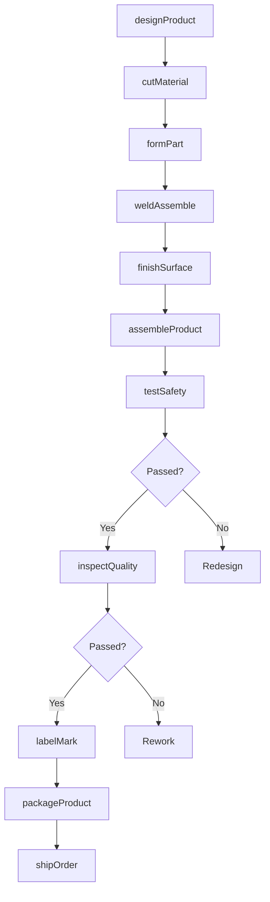
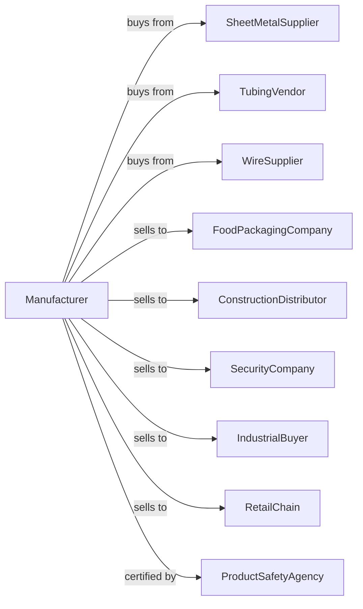

# All Other Miscellaneous Fabricated Metal Product Manufacturing

> Business-as-Code definition for miscellaneous fabricated metal product manufacturing. Models the production of specialty metal products not classified elsewhere.

## Overview

This U.S. industry comprises establishments primarily engaged in manufacturing fabricated metal products (except forgings and stampings, cutlery and handtools, architectural and structural metals, boilers, tanks, shipping containers, hardware, spring and wire products, machine shop products, turned products, screws, nuts and bolts, metal valves, ball and roller bearings, ammunition, small arms and other ordnances and accessories, and fabricated pipes and pipe fittings). Products include foil containers, metal ladders, safes, and specialty metal fabrications.

## Actors

| Actor | Description |
|-------|-------------|
| SheetMetalSupplier | Provides aluminum and steel sheet |
| TubingVendor | Supplies steel and aluminum tubing |
| WireSupplier | Provides wire for fabrication |
| FoodPackagingCompany | Purchases foil containers and trays |
| ConstructionDistributor | Stocks ladders and scaffolding |
| SecurityCompany | Orders safes and security products |
| IndustrialBuyer | Purchases custom fabricated products |
| RetailChain | Stocks consumer metal products |
| ProductSafetyAgency | Certifies product safety compliance |

## Roles

| Role | Description |
|------|-------------|
| PlantManager | Oversees miscellaneous metal fabrication |
| ProductEngineer | Designs specialty metal products |
| PressOperator | Operates stamping and forming presses |
| WelderAssembler | Fabricates and welds metal assemblies |
| FinishingOperator | Applies coatings and surface treatments |
| QualityInspector | Verifies product specifications |
| PackagingWorker | Prepares products for shipment |
| SafetyTester | Conducts product safety testing |

## Entities

| Entity | Description |
|--------|-------------|
| FoilContainer | Aluminum tray for food service |
| MetalLadder | Aluminum or steel climbing equipment |
| Safe | Security container for valuables |
| MetalSign | Fabricated metal signage |
| MetalShelving | Storage rack and shelving systems |
| WireBasket | Shopping or storage basket |
| MetalFrame | Structural frame for furniture or equipment |
| StampedPart | Custom formed metal component |
| Nameplate | Identification or branding plate |
| CustomFabrication | Made-to-order metal product |

## Actions

| Action | Description |
|--------|-------------|
| designProduct | Engineer product specifications |
| cutMaterial | Shear or laser cut sheet and tube |
| formPart | Stamp, bend, or press form components |
| weldAssemble | Join components by welding |
| finishSurface | Paint, plate, or anodize products |
| assembleProduct | Combine components into finished item |
| testSafety | Conduct strength and safety tests |
| inspectQuality | Verify dimensions and finish |
| labelMark | Apply branding and specifications |
| packageProduct | Prepare for retail or bulk shipment |
| shipOrder | Dispatch products to customers |
| developPrototype | Create samples for new products |

## Events

| Event | Description |
|-------|-------------|
| designApproved | Product specifications finalized |
| materialReceived | Metal stock has arrived |
| partsFormed | Components have been fabricated |
| assemblyCompleted | Products are assembled |
| finishApplied | Surface treatment is complete |
| safetyTestPassed | Products meet safety standards |
| qualityApproved | Products pass inspection |
| orderShipped | Products dispatched to customer |
| prototypeApproved | Sample has been accepted |

## Searches

| Search | Description |
|--------|-------------|
| findProducts | List products by type or application |
| getMaterialInventory | Check sheet, tube, and wire stock |
| getProductionSchedule | View schedule by product line |
| findOpenOrders | Retrieve orders by customer or date |
| getTestRecords | View safety test documentation |
| trackQuality | Monitor defect rates |
| getCertifications | Verify product safety compliance |
| getCustomProjects | List custom fabrication jobs |

## Workflow

## Actor Relationships

