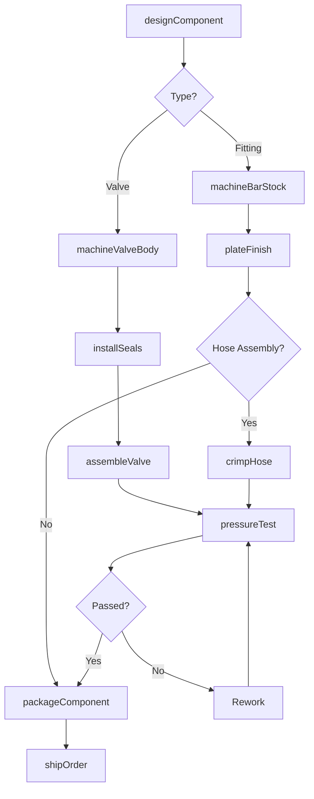
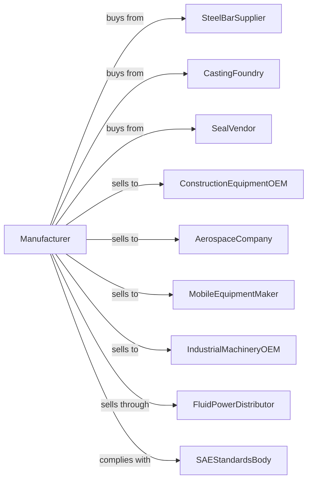

# Fluid Power Valve and Hose Fitting Manufacturing

> Business-as-Code definition for fluid power valve and hose fitting manufacturing. Models the production of hydraulic and pneumatic valves, fittings, and hose assemblies.

## Overview

This U.S. industry comprises establishments primarily engaged in manufacturing fluid power valves and hose fittings. Products include hydraulic valves, pneumatic valves, hose fittings, tube fittings, and hose assemblies for mobile equipment, industrial machinery, and aerospace applications.

## Actors

| Actor | Description |
|-------|-------------|
| SteelBarSupplier | Provides bar stock for machined fittings |
| CastingFoundry | Supplies cast valve bodies |
| SealVendor | Provides O-rings and sealing elements |
| ConstructionEquipmentOEM | Purchases hydraulic components for machines |
| AerospaceCompany | Orders fluid power components for aircraft |
| MobileEquipmentMaker | Buys hydraulics for agricultural and off-road equipment |
| IndustrialMachineryOEM | Purchases components for presses and machine tools |
| FluidPowerDistributor | Stocks fittings and valves for MRO market |
| SAEStandardsBody | Sets hydraulic fitting and connection standards |

## Roles

| Role | Description |
|------|-------------|
| PlantManager | Directs fluid power component manufacturing |
| HydraulicEngineer | Designs valves and fittings for fluid systems |
| ScrewMachineOperator | Produces fittings on automatic screw machines |
| CNCMachinist | Machines valve bodies and complex fittings |
| AssemblyTechnician | Assembles valves and hose assemblies |
| TestOperator | Conducts pressure and flow tests |
| QualityInspector | Verifies dimensions and leak-free performance |
| HoseAssembler | Crimps and assembles hose products |

## Entities

| Entity | Description |
|--------|-------------|
| HydraulicValve | Valve controlling hydraulic fluid flow |
| PneumaticValve | Valve controlling compressed air flow |
| HoseFitting | Connector for attaching hose to components |
| TubeFitting | Connector for rigid tubing |
| HoseAssembly | Hose with fittings crimped on ends |
| DirectionalValve | Valve controlling flow direction |
| ReliefValve | Valve limiting system pressure |
| CheckValve | Valve preventing reverse flow |
| Crimp | Mechanical joint between hose and fitting |
| ORing | Elastomeric sealing element |

## Actions

| Action | Description |
|--------|-------------|
| designComponent | Engineer valve or fitting geometry |
| machineBarStock | Produce fittings on screw machines |
| machineValveBody | CNC machine cast or forged valve bodies |
| installSeals | Place O-rings and seals in assemblies |
| assembleValve | Combine spool, body, and actuator |
| crimpHose | Attach fittings to hose ends |
| pressureTest | Verify leak-free performance |
| flowTest | Measure flow capacity through components |
| plateFinish | Apply protective zinc or other plating |
| packageComponent | Bag, box, or bulk pack components |
| shipOrder | Dispatch products to customer |
| maintainTooling | Service screw machine tooling |

## Events

| Event | Description |
|-------|-------------|
| materialReceived | Bar stock and castings have arrived |
| fittingsMachined | Screw machine run is complete |
| valvesAssembled | Valves are ready for testing |
| hoseCrimped | Hose assemblies have been made |
| testPassed | Components have passed pressure test |
| platingCompleted | Protective finish has been applied |
| orderShipped | Products dispatched to customer |
| toolingChanged | Screw machine set up for new part |

## Searches

| Search | Description |
|--------|-------------|
| findProducts | List components by type, size, or thread |
| getBarInventory | Check bar stock levels by material |
| getMachineSchedule | View screw machine production schedule |
| getTestRecords | Retrieve pressure test documentation |
| getThreadSpecs | Look up thread dimensions by standard |
| trackOrders | Monitor order status through production |
| getHoseOptions | List compatible hose by fitting type |
| getCrimpData | Retrieve crimp specifications by fitting |

## Workflow

## Actor Relationships

