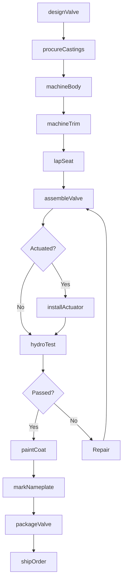
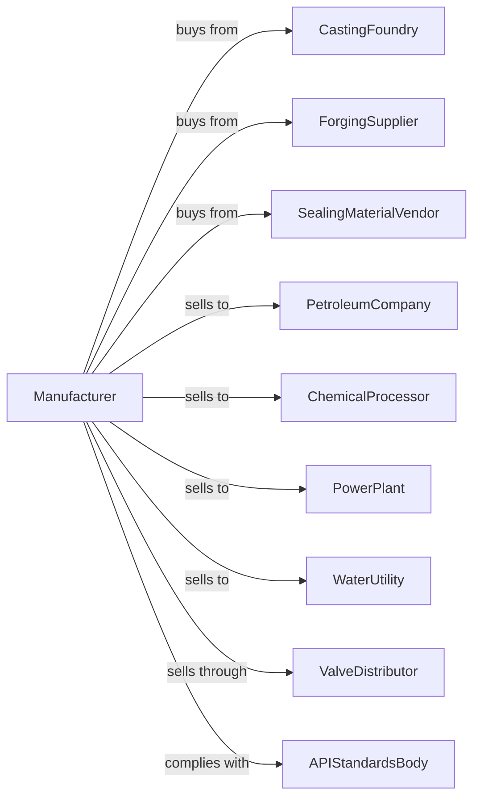

# Industrial Valve Manufacturing

> Business-as-Code definition for industrial valve manufacturing. Models the production of gate, globe, ball, butterfly, and check valves for process and infrastructure applications.

## Overview

This U.S. industry comprises establishments primarily engaged in manufacturing industrial valves and valves for water works and municipal water systems. Products include gate valves, globe valves, ball valves, butterfly valves, check valves, plug valves, solenoid valves, and fire hydrants for oil and gas, chemical, power, and water utility applications.

## Actors

| Actor | Description |
|-------|-------------|
| CastingFoundry | Provides cast iron and steel valve bodies |
| ForgingSupplier | Supplies forged valve bodies and components |
| SealingMaterialVendor | Provides gaskets, packing, and seals |
| PetroleumCompany | Purchases valves for oil and gas pipelines |
| ChemicalProcessor | Orders valves for corrosive service |
| PowerPlant | Buys valves for steam and water systems |
| WaterUtility | Purchases gate valves and fire hydrants |
| ValveDistributor | Stocks valves for industrial customers |
| APIStandardsBody | Sets valve design and testing standards |

## Roles

| Role | Description |
|------|-------------|
| PlantManager | Oversees valve manufacturing operations |
| ValveEngineer | Designs valves and selects materials |
| MachinistOperator | Machines valve bodies and components |
| AssemblyTechnician | Assembles valve internals and actuators |
| HydroTestOperator | Conducts pressure tests on valves |
| QualityInspector | Verifies dimensions and material certifications |
| PainterCoater | Applies protective coatings |
| ShippingCoordinator | Manages order fulfillment and logistics |

## Entities

| Entity | Description |
|--------|-------------|
| GateValve | Linear motion valve for on-off service |
| GlobeValve | Linear motion valve for throttling |
| BallValve | Quarter-turn valve with spherical closure |
| ButterflyValve | Quarter-turn valve with disc closure |
| CheckValve | Valve preventing reverse flow |
| FireHydrant | Water supply connection for firefighting |
| ValveBody | Main housing containing flow passage |
| Trim | Internal components including seat and disc |
| Actuator | Device for remote valve operation |
| PressureClass | Rating indicating maximum pressure |

## Actions

| Action | Description |
|--------|-------------|
| designValve | Engineer valve geometry and materials |
| procureCastings | Order cast valve bodies and bonnets |
| machineBody | Machine seating surfaces and threads |
| machineTrim | Produce valve discs, balls, and seats |
| lapSeat | Precision finish seating surfaces |
| assembleValve | Install trim and packing |
| installActuator | Mount manual or automated actuator |
| hydroTest | Pressure test valve for leaks |
| paintCoat | Apply protective finish |
| markNameplate | Affix identification and ratings |
| packageValve | Protect and prepare for shipment |
| shipOrder | Dispatch valves to customer |

## Events

| Event | Description |
|-------|-------------|
| castingsReceived | Valve bodies have arrived from foundry |
| machiningCompleted | Bodies and trim have been machined |
| assemblyCompleted | Valve has been assembled |
| hydroTestPassed | Valve has passed pressure test |
| coatingApplied | Protective finish has been applied |
| orderShipped | Valves dispatched to customer |
| designApproved | New valve design certified |
| materialCertReceived | Mill test reports have arrived |

## Searches

| Search | Description |
|--------|-------------|
| findProducts | List valves by type, size, or pressure class |
| getCastingInventory | Check body and bonnet casting stock |
| getTrimInventory | View trim component availability |
| getProductionSchedule | See manufacturing schedule by valve type |
| getTestRecords | Retrieve hydro test documentation |
| getMaterialCerts | Access mill test reports |
| trackOrders | Monitor order status through production |
| getActuatorOptions | List compatible actuators by valve |

## Workflow

## Actor Relationships

