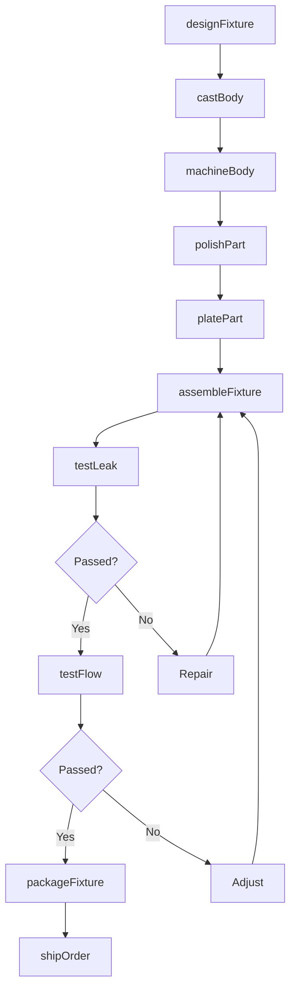
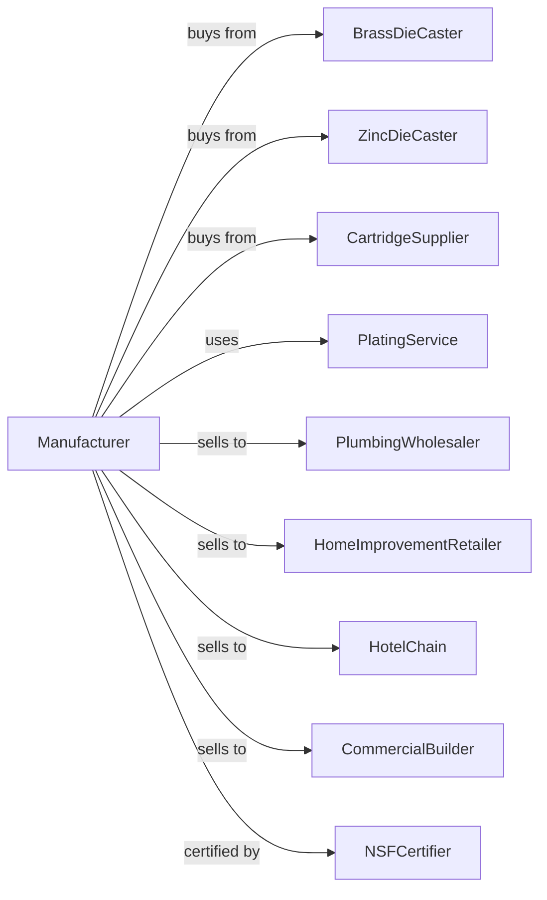

# Plumbing Fixture Fitting and Trim Manufacturing

> Business-as-Code definition for plumbing fixture fitting and trim manufacturing. Models the production of faucets, flush valves, shower heads, and related plumbing fixtures.

## Overview

This U.S. industry comprises establishments primarily engaged in manufacturing plumbing fixture fittings and trim of all materials, such as faucets, flush valves, and shower heads. Products serve residential, commercial, and institutional plumbing applications.

## Actors

| Actor | Description |
|-------|-------------|
| BrassDieCaster | Provides brass die castings for faucet bodies |
| ZincDieCaster | Supplies zinc die castings for handles |
| CartridgeSupplier | Provides ceramic disc and compression cartridges |
| PlumbingWholesaler | Distributes fixtures to plumbing contractors |
| HomeImprovementRetailer | Stocks faucets for consumer market |
| HotelChain | Orders commercial fixtures for properties |
| CommercialBuilder | Specifies fixtures for construction projects |
| PlatingService | Provides chrome and specialty finishes |
| NSFCertifier | Certifies fixtures for drinking water safety |

## Roles

| Role | Description |
|------|-------------|
| PlantManager | Oversees fixture manufacturing operations |
| ProductDesigner | Designs faucet aesthetics and function |
| DieCastOperator | Runs die casting machines for bodies |
| MachinistOperator | Machines castings to finish dimensions |
| AssemblyWorker | Assembles faucets with cartridges and handles |
| PolishingOperator | Buffs castings before plating |
| QualityInspector | Tests for leaks and flow performance |
| PackagingWorker | Packages fixtures with installation hardware |

## Entities

| Entity | Description |
|--------|-------------|
| Faucet | Water control fixture for sinks and tubs |
| FlushValve | Commercial toilet flushing mechanism |
| ShowerHead | Water spray fixture for showers |
| Cartridge | Replaceable valve mechanism inside faucet |
| FaucetBody | Cast brass or zinc main housing |
| Handle | User-operated control for water flow |
| Aerator | Screen device for flow and splash control |
| Escutcheon | Decorative plate covering wall opening |
| SupplyLine | Flexible connector to water supply |
| FinishOption | Plated or coated surface treatment |

## Actions

| Action | Description |
|--------|-------------|
| designFixture | Create product design and specifications |
| castBody | Die cast faucet bodies and components |
| machineBody | Finish machine cast parts |
| polishPart | Buff surfaces for plating |
| platePart | Apply chrome or specialty finish |
| assembleFixture | Install cartridge, handles, and aerator |
| testLeak | Verify leak-free performance under pressure |
| testFlow | Measure water flow rate |
| packageFixture | Box fixture with supply lines and instructions |
| shipOrder | Dispatch products to distributors or retailers |
| developFinish | Create new decorative finishes |
| certifyProduct | Obtain NSF and code certifications |

## Events

| Event | Description |
|-------|-------------|
| designApproved | New fixture design is finalized |
| castingsReceived | Bodies have arrived from foundry |
| machiningCompleted | Parts are ready for finishing |
| platingCompleted | Finish has been applied |
| assemblyCompleted | Fixtures are assembled |
| testPassed | Leak and flow tests passed |
| certificationObtained | Product meets NSF standards |
| orderShipped | Products dispatched to customer |

## Searches

| Search | Description |
|--------|-------------|
| findProducts | List fixtures by style, finish, or application |
| getCastingInventory | Check body and handle casting stock |
| getCartridgeInventory | View cartridge availability by type |
| getFinishOptions | List available plated finishes |
| getProductionSchedule | See assembly schedule by product line |
| getTestResults | Retrieve leak and flow test data |
| getCertifications | Verify NSF and code compliance |
| trackOrders | Monitor order status |

## Workflow

## Actor Relationships

