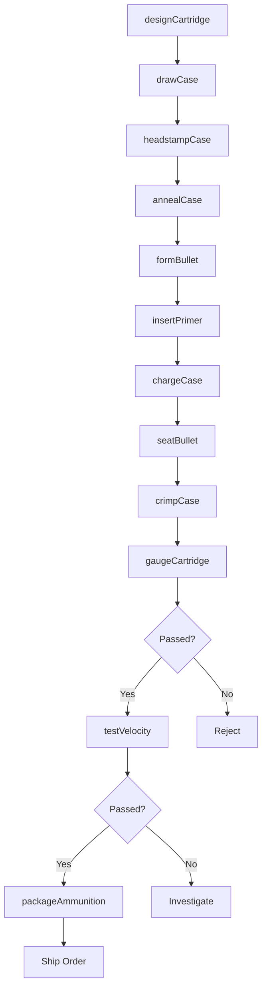
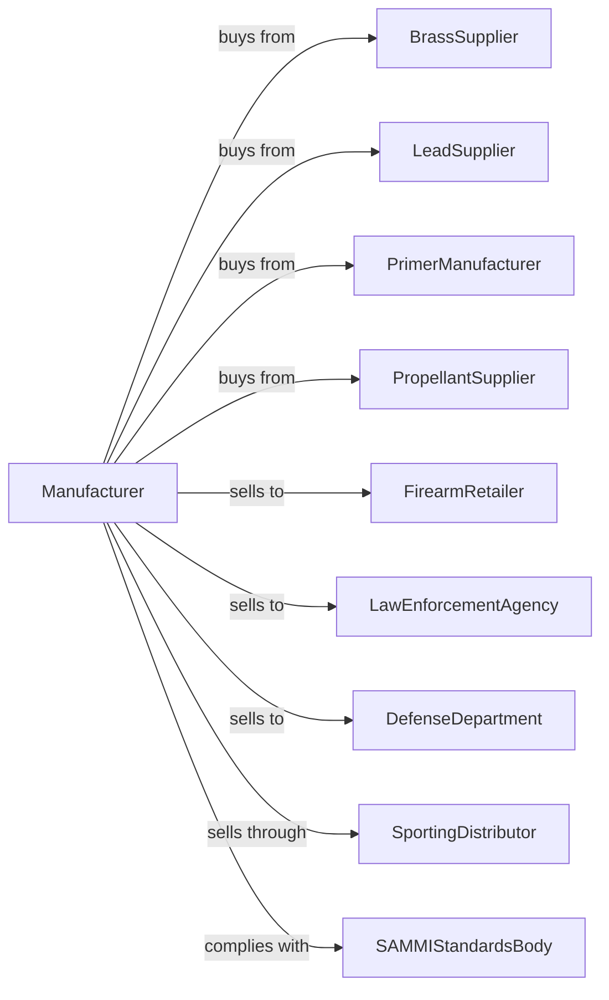

# Small Arms Ammunition Manufacturing

> Business-as-Code definition for small arms ammunition manufacturing. Models the production of cartridges for handguns, rifles, and shotguns.

## Overview

This U.S. industry comprises establishments primarily engaged in manufacturing small arms ammunition. Products include centerfire rifle cartridges, pistol cartridges, rimfire ammunition, shotgun shells, and reloading components for commercial, law enforcement, and military markets.

## Actors

| Actor | Description |
|-------|-------------|
| BrassSupplier | Provides brass strip for cartridge cases |
| LeadSupplier | Supplies lead for bullet cores |
| PrimerManufacturer | Provides percussion primer components |
| PropellantSupplier | Supplies smokeless powder |
| FirearmRetailer | Purchases ammunition for consumer sales |
| LawEnforcementAgency | Orders duty and training ammunition |
| DefenseDepartment | Procures military specification ammunition |
| SportingDistributor | Stocks ammunition for hunting and shooting sports |
| SAMMIStandardsBody | Sets ammunition dimensions and pressure standards |

## Roles

| Role | Description |
|------|-------------|
| PlantManager | Oversees ammunition manufacturing operations |
| BallisticsEngineer | Designs cartridges and specifies propellants |
| CaseFormOperator | Operates case drawing and forming equipment |
| BulletMaker | Produces bullets by swaging or casting |
| LoadingOperator | Charges cases with powder and seats bullets |
| PrimerInstaller | Inserts primers into case heads |
| QualityInspector | Gauges dimensions and tests samples |
| PackagingWorker | Boxes and labels finished ammunition |

## Entities

| Entity | Description |
|--------|-------------|
| CartridgeCase | Brass container holding primer, powder, and bullet |
| Bullet | Projectile launched from firearm |
| Primer | Ignition device in cartridge head |
| Propellant | Smokeless powder providing propulsion |
| CenterfireCartridge | Cartridge with primer in center of head |
| RimfireCartridge | Cartridge with priming compound in rim |
| ShotgunShell | Cartridge containing multiple pellets |
| Caliber | Diameter specification for ammunition |
| LoadData | Specifications for powder charge and seating depth |
| LotNumber | Tracking identifier for production batch |

## Actions

| Action | Description |
|--------|-------------|
| designCartridge | Specify dimensions, bullet, and propellant |
| drawCase | Form brass cup into cartridge case |
| headstampCase | Mark case head with caliber and brand |
| annealCase | Heat treat case neck for proper hardness |
| formBullet | Swage or cast bullet to specification |
| insertPrimer | Press primer into case head |
| chargeCase | Meter powder into cartridge case |
| seatBullet | Press bullet into case mouth |
| crimpCase | Secure bullet with case mouth crimp |
| gaugeCartridge | Verify dimensions with gauges |
| testVelocity | Measure velocity and pressure in test barrel |
| packageAmmunition | Box and label for sale |

## Events

| Event | Description |
|-------|-------------|
| materialsReceived | Brass, lead, and powder have arrived |
| casesFormed | Cartridge cases have been drawn |
| bulletsComplete | Bullets have been manufactured |
| cartridgesLoaded | Ammunition has been assembled |
| gaugingPassed | Dimensions meet specification |
| velocityTestPassed | Ballistic performance is acceptable |
| lotApproved | Production lot has passed QC |
| orderShipped | Ammunition dispatched to customer |

## Searches

| Search | Description |
|--------|-------------|
| findProducts | List ammunition by caliber or type |
| getBrassInventory | Check brass strip and case stock |
| getPowderInventory | View propellant availability |
| getBulletInventory | Check bullet component stock |
| getLoadData | Retrieve specifications by cartridge |
| getTestData | View velocity and pressure test results |
| trackLots | Monitor lot status through production |
| getComplianceStatus | Verify SAAMI specification compliance |

## Workflow

## Actor Relationships

