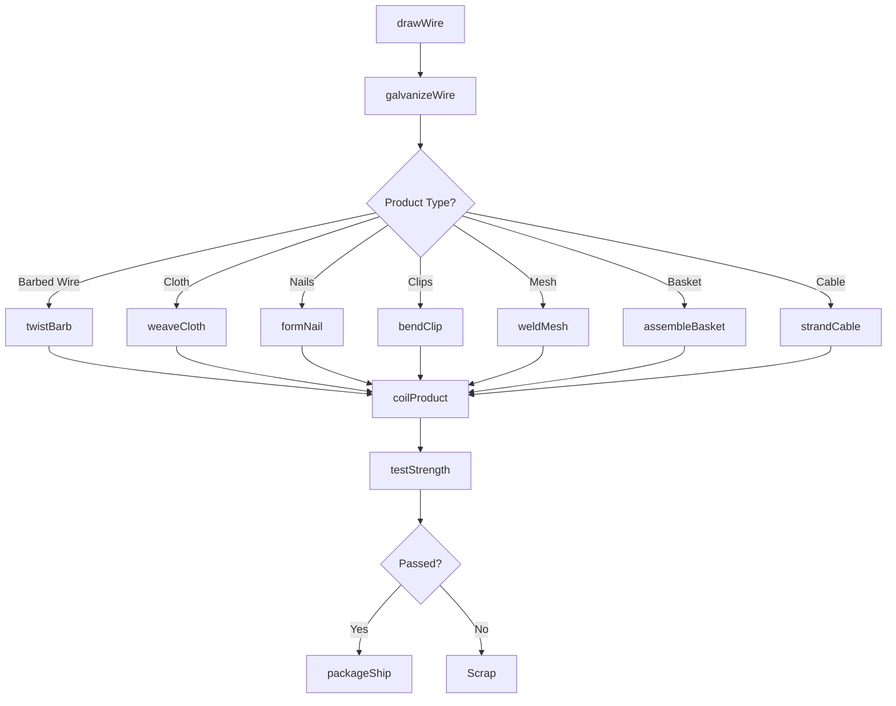
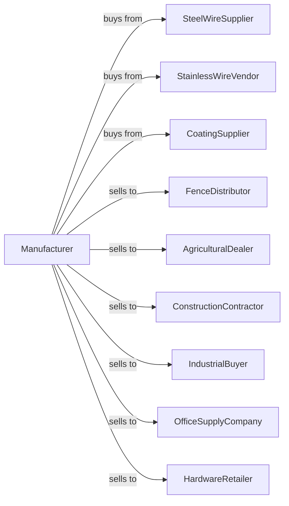

# Other Fabricated Wire Product Manufacturing

> Business-as-Code definition for fabricated wire product manufacturing. Models the production of fencing, nails, wire cloth, and other wire products from purchased wire.

## Overview

This U.S. industry comprises establishments primarily engaged in manufacturing fabricated wire products (except springs) made from purchased wire. Products include barbed wire, chain link fencing, woven wire cloth, nails, staples, paper clips, wire baskets, and noninsulated wire cable for agricultural, construction, and industrial applications.

## Actors

| Actor | Description |
|-------|-------------|
| SteelWireSupplier | Provides low-carbon and galvanized wire |
| StainlessWireVendor | Supplies stainless steel wire for specialty products |
| CoatingSupplier | Provides galvanizing and vinyl coating materials |
| FenceDistributor | Purchases fencing products for building supply |
| AgriculturalDealer | Buys barbed wire and farm fencing |
| ConstructionContractor | Orders nails, mesh, and reinforcement products |
| IndustrialBuyer | Purchases wire cloth, baskets, and cable |
| OfficeSupplyCompany | Buys paper clips and wire fasteners |
| HardwareRetailer | Stocks nails, staples, and wire products |

## Roles

| Role | Description |
|------|-------------|
| PlantManager | Directs wire product manufacturing operations |
| ProductEngineer | Designs products and optimizes processes |
| WireDrawOperator | Operates wire drawing machines to size wire |
| WeavingOperator | Runs looms for wire cloth production |
| FormingOperator | Operates machines for nails, clips, and forms |
| GalvanizingOperator | Applies zinc coating to wire products |
| QualityInspector | Tests products for strength and dimensions |
| PackagingWorker | Coils, bundles, and packages finished products |

## Entities

| Entity | Description |
|--------|-------------|
| SteelWire | Low-carbon wire stock for fabrication |
| BarbedWire | Twisted wire with sharp barbs for fencing |
| ChainLinkFence | Woven diamond-pattern wire fabric |
| WovenWireCloth | Fine mesh fabric for screening and filtration |
| Nail | Pointed fastener driven by hammer |
| Staple | U-shaped fastener for securing materials |
| PaperClip | Wire loop for holding papers together |
| WireBasket | Open-weave container made from wire |
| WireCable | Bundle of wires twisted or braided together |
| Coil | Wound length of wire or wire product |

## Actions

| Action | Description |
|--------|-------------|
| drawWire | Reduce wire diameter through drawing dies |
| galvanizeWire | Apply zinc coating by hot dip or electroplating |
| twistBarb | Twist two wires with barbs for barbed wire |
| weaveCloth | Interlace wires on loom to create mesh |
| formNail | Cut, point, and head wire to make nails |
| bendClip | Form wire into paper clips or fasteners |
| weldMesh | Weld wire intersections to create panels |
| assembleBasket | Form and join wire into basket shapes |
| strandCable | Twist or braid wires into cable |
| coilProduct | Wind finished product into coils |
| testStrength | Measure tensile strength and dimensions |
| packageShip | Package and dispatch to customers |

## Events

| Event | Description |
|-------|-------------|
| wireReceived | Wire stock has arrived from supplier |
| wireDrawn | Wire has been drawn to target diameter |
| galvanizingCompleted | Zinc coating has been applied |
| productFormed | Nails, clips, or forms have been made |
| clothWoven | Wire mesh has been produced |
| productCoiled | Finished product wound into coils |
| qualityApproved | Products have passed testing |
| orderShipped | Products dispatched to customer |
| machineSetUp | Equipment configured for product changeover |

## Searches

| Search | Description |
|--------|-------------|
| findProducts | List wire products by type or application |
| getWireInventory | Check raw wire stock levels |
| getProductionSchedule | View schedule by product line |
| findOpenOrders | Retrieve orders by customer or due date |
| trackOutputRates | Monitor production rates by machine |
| getTestResults | View tensile strength and coating tests |
| calculateYield | Compute material usage and scrap rates |
| getMeshSpecs | Look up wire cloth specifications |

## Workflow

## Actor Relationships

