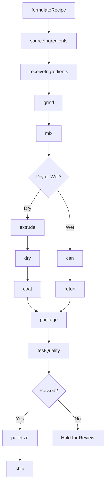
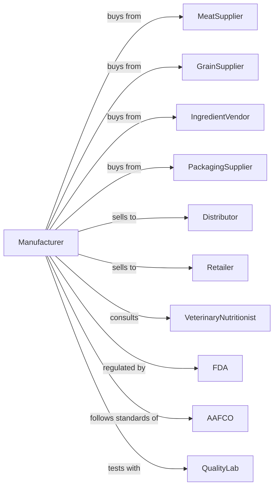

# Dog and Cat Food Manufacturing

> Business-as-Code definition for pet food manufacturing operations. Models the complete production lifecycle from ingredient sourcing through finished product distribution for dogs and cats.

## Overview

This U.S. industry comprises establishments primarily engaged in manufacturing dog and cat food from ingredients, such as grains, oilseed mill products, and meat products. This definition exposes actions for formulation development, ingredient processing, extrusion or canning, quality testing, and distribution to retailers and distributors.

## Actors

| Actor | Description |
|-------|-------------|
| MeatSupplier | Provides animal proteins and meat byproducts |
| GrainSupplier | Supplies corn, wheat, rice, and other carbohydrates |
| IngredientVendor | Provides vitamins, minerals, and specialty additives |
| PackagingSupplier | Supplies bags, cans, pouches, and packaging materials |
| Retailer | Purchases finished products for consumer sale |
| Distributor | Warehouses and delivers products to retail channels |
| VeterinaryNutritionist | Consults on formulation and nutritional standards |
| FDA | Regulates pet food safety and labeling requirements |
| AAFCO | Sets nutritional standards and feeding trial protocols |
| QualityLab | Provides third-party testing and certification |

## Roles

| Role | Description |
|------|-------------|
| PlantManager | Oversees daily manufacturing operations |
| Formulator | Develops recipes and nutritional profiles |
| QualityManager | Ensures product safety and compliance |
| ProductionSupervisor | Coordinates production line activities |
| ExtrusionOperator | Operates extrusion and cooking equipment |
| PackagingOperator | Runs filling, sealing, and labeling lines |
| WarehouseManager | Manages inventory and shipping logistics |
| ProcurementManager | Sources ingredients and negotiates contracts |

## Entities

| Entity | Description |
|--------|-------------|
| Formula | Recipe specifying ingredients and proportions |
| Batch | Production lot with traceable ingredients |
| Ingredient | Raw material used in pet food production |
| Product | Finished pet food item with SKU |
| Kibble | Dry extruded pet food pieces |
| Can | Wet pet food in sealed container |
| NutritionalProfile | Protein, fat, fiber, and micronutrient levels |
| QualityReport | Test results for batch safety and compliance |
| Label | Product packaging with guaranteed analysis |
| PurchaseOrder | Ingredient or material procurement request |

## Actions

| Action | Description |
|--------|-------------|
| formulateRecipe | Develop nutritional formula meeting AAFCO standards |
| sourceIngredients | Procure raw materials from approved suppliers |
| receiveIngredients | Inspect and accept incoming raw materials |
| grind | Reduce particle size of dry ingredients |
| mix | Combine dry and wet ingredients to specification |
| extrude | Cook and shape kibble through extruder |
| dry | Remove moisture to target level for shelf stability |
| coat | Apply fats, flavors, or palatants to kibble |
| can | Fill and seal wet food in containers |
| retort | Heat-sterilize canned products |
| package | Fill bags, seal, and label finished products |
| testQuality | Analyze batch for safety and nutritional content |
| palletize | Stack finished goods for warehouse storage |
| ship | Dispatch orders to distributors and retailers |

## Events

| Event | Description |
|-------|-------------|
| recipeFormulated | New formula approved for production |
| ingredientsReceived | Raw materials inspected and accepted |
| batchMixed | Ingredients combined and ready for processing |
| batchExtruded | Kibble formed and cooked |
| batchDried | Moisture reduced to target level |
| batchCoated | Palatants applied to product |
| batchCanned | Wet food filled and sealed |
| batchRetorted | Canned products sterilized |
| batchPackaged | Finished products packaged and labeled |
| qualityApproved | Batch passed safety and quality tests |
| qualityFailed | Batch failed testing and requires disposition |
| orderShipped | Products dispatched to customer |
| recallInitiated | Product recall triggered for safety issue |

## Searches

| Search | Description |
|--------|-------------|
| findBatches | List batches by date, product, or status |
| getFormulas | Retrieve formulas by product line or species |
| checkInventory | Get ingredient and finished goods stock levels |
| getSuppliers | List approved suppliers by ingredient type |
| findOrders | Retrieve orders by customer or ship date |
| getQualityReports | Retrieve test results by batch or date range |
| getProductionSchedule | View scheduled production runs |
| traceIngredients | Track ingredient lots through finished products |

## Workflow



## Actor Relationships



## Usage

### Calling Actions

```typescript
import { manufactureDogCat } from '@headlessly/manufacture-dog-cat'

const plant = manufactureDogCat()

// Develop a new formula
const formula = await plant.formulateRecipe({
  species: 'dog',
  lifestage: 'adult',
  proteinMin: 26,
  fatMin: 15,
  fiberMax: 4,
  primaryProtein: 'chicken'
})

// Start production batch
const batch = await plant.mix({
  formulaId: formula.id,
  batchSize: 10000,
  ingredients: [
    { id: 'chicken-meal', quantity: 2500 },
    { id: 'corn', quantity: 3000 },
    { id: 'rice', quantity: 2000 },
    { id: 'chicken-fat', quantity: 800 }
  ]
})

// Extrude and process
await plant.extrude({
  batchId: batch.id,
  temperature: 150,
  pressure: 35,
  dieShape: 'kibble-medium'
})
```

### Event-Driven Automation

```typescript
// Auto-respond to quality test results
plant.qualityApproved(async ({ batchId, testResults }) => {
  await plant.palletize({
    batchId,
    palletsRequired: Math.ceil(testResults.totalWeight / 2000)
  })
})

// Alert on quality failures
plant.qualityFailed(async ({ batchId, failureReason, contaminant }) => {
  if (contaminant === 'salmonella') {
    await plant.recallInitiated({
      batchId,
      reason: 'pathogen-detection',
      scope: 'all-distributed'
    })
  }
})
```
