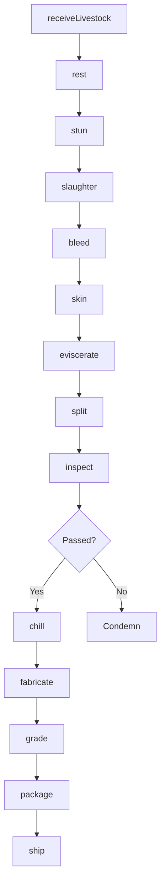
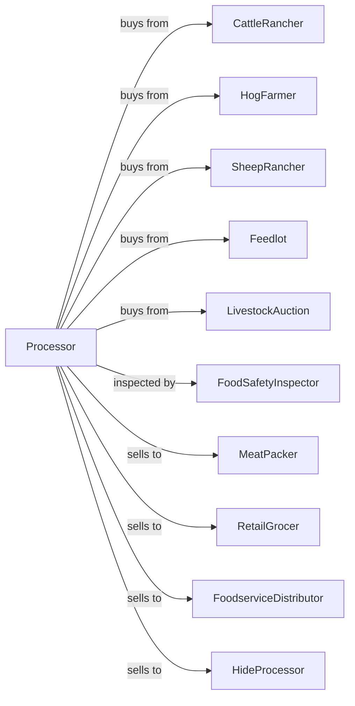

# Animal (except Poultry) Slaughtering

> Business-as-Code definition for animal slaughtering operations. Models livestock receiving, humane handling, slaughter, inspection, fabrication, and cold chain distribution for beef, pork, and lamb processing.

## Overview

This U.S. industry comprises establishments primarily engaged in slaughtering animals (except poultry and small game). Establishments that slaughter and prepare meats are included in this industry. Cross-References. Establishments primarily engaged in--

## Actors

| Actor | Description |
|-------|-------------|
| CattleRancher | Supplies beef cattle for slaughter |
| HogFarmer | Provides pigs for processing |
| SheepRancher | Supplies lambs and sheep |
| Feedlot | Finishes cattle before slaughter |
| LivestockAuction | Facilitates animal purchasing |
| FoodSafetyInspector | Conducts ante and post-mortem inspection |
| MeatPacker | Purchases carcasses for further processing |
| RetailGrocer | Buys boxed beef for retail sale |
| FoodserviceDistributor | Supplies restaurants and institutions |
| HideProcessor | Purchases hides for leather production |

## Roles

| Role | Description |
|------|-------------|
| PlantManager | Oversees slaughter facility operations |
| QualityManager | Ensures regulatory compliance and food safety |
| LivestockReceiver | Handles incoming animal inspection |
| KillFloorSupervisor | Manages slaughter line operations |
| FabricationSupervisor | Oversees carcass breakdown |
| USDALiaisonOfficer | Coordinates with federal inspectors |
| ColdChainManager | Manages refrigerated storage and shipping |
| SanitationManager | Ensures plant hygiene and sanitation |

## Entities

| Entity | Description |
|--------|-------------|
| Livestock | Live animal received for slaughter |
| Carcass | Dressed animal body after slaughter |
| PrimalCut | Large section of carcass |
| SubprimalCut | Further divided primal section |
| BoxedBeef | Vacuum-packed cuts for distribution |
| Offal | Edible organ meats |
| Hide | Animal skin for leather processing |
| InspectionMark | Regulatory approval stamp |
| GradeStamp | Quality grade designation |
| ColdStorage | Refrigerated holding facility |

## Actions

| Action | Description |
|--------|-------------|
| receiveLivestock | Accept and inspect incoming animals |
| rest | Hold animals in pens before processing |
| stun | Render animal unconscious humanely |
| slaughter | Perform humane slaughter |
| bleed | Drain blood from carcass |
| skin | Remove hide from carcass |
| eviscerate | Remove internal organs |
| split | Divide carcass into halves |
| inspect | Conduct post-mortem inspection |
| chill | Rapidly cool carcasses |
| fabricate | Break carcass into primal cuts |
| grade | Assign quality grade |
| package | Vacuum pack cuts |
| ship | Dispatch refrigerated loads |

## Events

| Event | Description |
|-------|-------------|
| livestockReceived | Animals accepted and tagged |
| animalStunned | Humane stunning completed |
| animalSlaughtered | Slaughter process completed |
| carcassEviscerated | Organs removed |
| carcassInspected | Post-mortem inspection passed |
| carcassFailed | Carcass condemned by inspector |
| carcassChilled | Target temperature reached |
| carcassFabricated | Primal cuts separated |
| carcassGraded | Quality grade assigned |
| meatPackaged | Vacuum sealing completed |
| orderShipped | Product dispatched |

## Searches

| Search | Description |
|--------|-------------|
| findLivestock | List animals in holding pens |
| getCarcassInventory | Check carcass and cut inventory |
| getInspectionRecords | View inspection results |
| getGradeDistribution | Analyze quality grade breakdown |
| getOrders | Retrieve orders by customer |
| getYieldData | View yield by lot and supplier |
| getByproducts | Track offal and hide inventory |
| getColdChainStatus | Monitor temperature records |

## Workflow



## Actor Relationships



## Usage

### Calling Actions

```typescript
import { processAnimalSlaughtering } from '@headlessly/process-animal-slaughtering'

const plant = processAnimalSlaughtering()

// Check livestock in holding pens
const penInventory = await plant.findLivestock({ status: 'resting', species: 'beef-cattle' })

// Receive cattle lot
const lot = await plant.receiveLivestock({
  supplier: 'high-plains-feedlot',
  species: 'beef-cattle',
  headCount: 120,
  avgWeight: 1350,
  unit: 'lbs'
})

// Process through slaughter
await plant.rest({
  lotId: lot.id,
  duration: 4,
  unit: 'hours'
})

await plant.stun({
  animalId: lot.animals[0].id,
  method: 'captive-bolt'
})

await plant.slaughter({ animalId: lot.animals[0].id })
await plant.eviscerate({ carcassId: lot.animals[0].carcassId })

// Check cold chain capacity before processing
const coldChain = await plant.getColdChainStatus({ location: 'chill-room-1' })

// Await inspection
const inspection = await plant.inspect({
  carcassId: lot.animals[0].carcassId
})

if (inspection.passed) {
  await plant.chill({
    carcassId: lot.animals[0].carcassId,
    targetTemp: 34,
    unit: 'fahrenheit'
  })
}
```

### Event-Driven Automation

```typescript
// Auto-fabricate after chilling
plant.carcassChilled(async ({ carcassId, species }) => {
  const cutSpec = getCutSpecification(species)

  await plant.fabricate({
    carcassId,
    specification: cutSpec,
    destination: 'boxed-beef'
  })
})

// Auto-grade after fabrication
plant.carcassFabricated(async ({ carcassId }) => {
  await plant.grade({
    carcassId,
    standard: 'beef-quality'
  })
})

// Alert on inspection failure
plant.carcassFailed(async ({ carcassId, reason, lotId }) => {
  await alertQuality({
    carcassId,
    reason,
    action: 'condemn-and-dispose'
  })

  await updateSupplierRecord({
    lotId,
    issue: reason
  })
})
```
