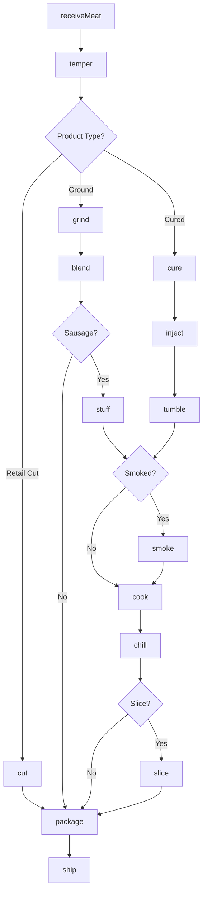
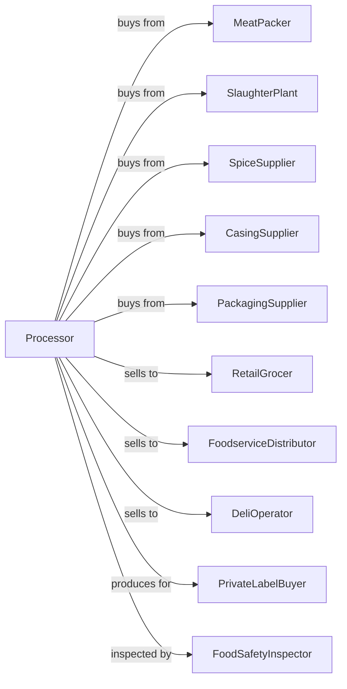

# Meat Processed from Carcasses

> Business-as-Code definition for meat processing operations. Models cutting, grinding, curing, smoking, and packaging of beef, pork, and lamb products including bacon, ham, sausage, and deli meats.

## Overview

This U.S. industry comprises establishments primarily engaged in processing or preserving meat and meat byproducts (except poultry and small game) from purchased meats. This industry includes establishments primarily engaged in assembly cutting and packing of meats (i.e., boxed meats) from purchased meats. Cross-References. Establishments primarily engaged in--

## Actors

| Actor | Description |
|-------|-------------|
| MeatPacker | Supplies boxed beef and primal cuts |
| SlaughterPlant | Provides carcasses for processing |
| SpiceSupplier | Supplies seasonings and cure ingredients |
| CasingSupplier | Provides natural and synthetic casings |
| PackagingSupplier | Supplies vacuum bags, trays, and films |
| RetailGrocer | Purchases processed meats for retail |
| FoodserviceDistributor | Supplies restaurants and institutions |
| DeliOperator | Buys sliced meats and cold cuts |
| PrivateLabelBuyer | Contracts production under store brands |
| FoodSafetyInspector | Ensures food safety compliance |

## Roles

| Role | Description |
|------|-------------|
| PlantManager | Oversees meat processing operations |
| ProductDeveloper | Creates new product formulations |
| QualityManager | Ensures regulatory compliance and food safety |
| CuttingRoomSupervisor | Manages fabrication operations |
| CuringSpecialist | Oversees brine and dry cure processes |
| SmokehousOperator | Controls smoking and cooking equipment |
| PackagingOperator | Runs slicing and packaging lines |
| LabTechnician | Tests for moisture, fat, and pathogens |

## Entities

| Entity | Description |
|--------|-------------|
| PrimalCut | Large meat section for processing |
| SubprimalCut | Smaller cut for retail or further processing |
| GroundMeat | Minced meat product |
| Bacon | Cured and smoked pork belly |
| Ham | Cured and smoked pork leg |
| Sausage | Ground meat in casing |
| DeliMeat | Sliced luncheon meat |
| CuringBrine | Salt and nitrite solution |
| Batch | Traceable production lot |
| Formulation | Recipe for processed product |

## Actions

| Action | Description |
|--------|-------------|
| receiveMeat | Accept and inspect incoming meat |
| temper | Bring meat to processing temperature |
| cut | Fabricate into retail or portion cuts |
| grind | Process through meat grinder |
| blend | Combine meats and ingredients |
| cure | Apply salt, nitrite, and seasonings |
| inject | Pump brine into meat |
| tumble | Massage meat for cure distribution |
| stuff | Fill casings with sausage mixture |
| smoke | Apply smoke flavor and heat |
| cook | Heat to safe internal temperature |
| chill | Rapidly cool after cooking |
| slice | Cut into deli-style portions |
| package | Vacuum seal or wrap products |
| ship | Dispatch refrigerated orders |

## Events

| Event | Description |
|-------|-------------|
| meatReceived | Raw meat accepted and inventoried |
| meatTempered | Processing temperature reached |
| meatCut | Fabrication completed |
| meatGround | Grinding completed |
| batchBlended | Ingredients combined |
| meatCured | Cure application completed |
| brineInjected | Injection process finished |
| sausageStuffed | Casings filled |
| productSmoked | Smoking cycle completed |
| productCooked | Safe temperature achieved |
| productChilled | Cooling completed |
| productSliced | Slicing completed |
| productPackaged | Packaging completed |
| orderShipped | Product dispatched |

## Searches

| Search | Description |
|--------|-------------|
| findMeatInventory | List raw meat by cut and supplier |
| getInventory | Check finished goods stock |
| getFormulations | Retrieve product recipes |
| getBatches | List batches by product and date |
| getOrders | Retrieve orders by customer |
| getCureStatus | Track curing progress |
| getSmokehouseSchedule | View smoking runs |
| getQualityReports | Access test results |

## Workflow



## Actor Relationships



## Usage

### Calling Actions

```typescript
import { prepareMeatProcessed } from '@headlessly/prepare-meat-processed'

const plant = prepareMeatProcessed()

// Check raw meat inventory by cut type
const rawStock = await plant.findMeatInventory({ cut: 'pork-belly', supplier: 'midwest-packing' })

// Review smokehouse availability
const smokeSchedule = await plant.getSmokehouseSchedule({ date: 'today' })

// Receive pork bellies for bacon production
const meat = await plant.receiveMeat({
  supplier: 'midwest-packing',
  cut: 'pork-belly',
  quantity: 5000,
  unit: 'lbs',
  temperature: 34
})

// Cure bacon
await plant.cure({
  batchId: meat.batchId,
  cure: {
    salt: 2.5,
    sugar: 1.0,
    nitrite: 156,
    unit: 'ppm'
  },
  duration: 7,
  method: 'dry-cure'
})

await plant.smoke({
  batchId: meat.batchId,
  woodType: 'applewood',
  temperature: 200,
  duration: 6,
  unit: 'hours'
})

await plant.slice({
  batchId: meat.batchId,
  thickness: 0.0625,
  unit: 'inches'
})
```

### Event-Driven Automation

```typescript
// Auto-smoke after curing
plant.meatCured(async ({ batchId, product }) => {
  const spec = await plant.getFormulations({ product })

  if (spec.smokingRequired) {
    await plant.smoke({
      batchId,
      woodType: spec.woodType,
      temperature: spec.smokeTemp,
      duration: spec.smokeDuration
    })
  }
})

// Auto-chill after cooking
plant.productCooked(async ({ batchId, internalTemp }) => {
  await plant.chill({
    batchId,
    method: 'blast-chill',
    targetTemp: 34,
    maxTime: 4,
    unit: 'hours'
  })
})

// Quality check before packaging
plant.productChilled(async ({ batchId }) => {
  const tests = await plant.runQualityTests({
    batchId,
    tests: ['moisture', 'fat', 'salt', 'listeria']
  })

  if (tests.passed) {
    await plant.package({ batchId })
  } else {
    await plant.quarantine({ batchId, reason: tests.failures })
  }
})
```
