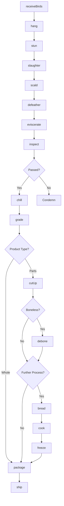
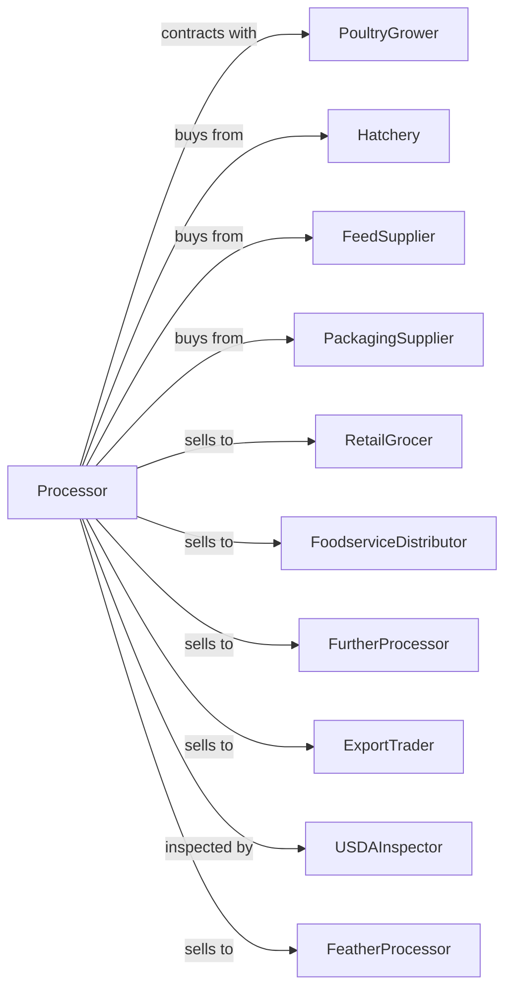

# Poultry Processing

> Business-as-Code definition for poultry processing operations. Models live bird receiving, slaughter, evisceration, chilling, cut-up, and further processing for fresh and frozen chicken, turkey, and duck products.

## Overview

This U.S. industry comprises establishments primarily engaged in (1) slaughtering poultry and small game and/or (2) preparing processed poultry and small game meat and meat byproducts. Cross-References. Establishments primarily engaged in--

## Actors

| Actor | Description |
|-------|-------------|
| PoultryGrower | Raises birds under contract |
| Hatchery | Supplies day-old chicks |
| FeedSupplier | Provides poultry feed |
| PackagingSupplier | Supplies trays, bags, and films |
| RetailGrocer | Purchases fresh and frozen poultry |
| FoodserviceDistributor | Supplies restaurants and institutions |
| FurtherProcessor | Buys products for breading and cooking |
| ExportTrader | Handles international poultry sales |
| USDAInspector | Conducts continuous inspection |
| FeatherProcessor | Purchases feathers for rendering |

## Roles

| Role | Description |
|------|-------------|
| PlantManager | Oversees poultry processing facility |
| LiveHaulManager | Coordinates bird transport |
| QualityManager | Ensures food safety and USDA compliance |
| KillFloorSupervisor | Manages slaughter operations |
| EvisceratingOperator | Runs evisceration line |
| CutUpSupervisor | Oversees portioning operations |
| FurtherProcessingSupervisor | Manages breading and cooking |
| ChillRoomOperator | Controls chilling equipment |

## Entities

| Entity | Description |
|--------|-------------|
| LiveBird | Poultry received for processing |
| WholeBird | Dressed and chilled carcass |
| BonelessBreast | Premium portioned cut |
| Thigh | Dark meat portion |
| Wing | Wing section |
| Drumstick | Leg portion |
| Tender | Tenderloin strip |
| GroundPoultry | Minced poultry meat |
| Nugget | Breaded and formed product |
| Giblets | Heart, liver, and gizzard |

## Actions

| Action | Description |
|--------|-------------|
| receiveBirds | Accept live poultry from growers |
| hang | Shackle birds on processing line |
| stun | Render birds unconscious |
| slaughter | Perform humane slaughter |
| scald | Loosen feathers with hot water |
| defeather | Remove feathers mechanically |
| eviscerate | Remove internal organs |
| inspect | Conduct USDA inspection |
| chill | Reduce temperature in water or air |
| grade | Assign quality grade |
| cutUp | Portion into parts |
| debone | Remove bones from meat |
| bread | Apply breading or batter |
| cook | Fully cook products |
| freeze | Blast freeze products |
| package | Wrap and label for sale |

## Events

| Event | Description |
|-------|-------------|
| birdsReceived | Live birds accepted and hung |
| birdsStunned | Stunning completed |
| birdsSlaughtered | Slaughter finished |
| birdsScalded | Scalding completed |
| birdsDefeathered | Feather removal done |
| birdsEviscerated | Evisceration completed |
| birdsInspected | USDA inspection passed |
| birdsFailed | Birds condemned |
| birdsChilled | Chilling completed |
| birdsGraded | Quality grade assigned |
| birdsCutUp | Portioning completed |
| productBreaded | Breading applied |
| productCooked | Cooking completed |
| productFrozen | Freezing completed |
| productPackaged | Packaging finished |
| orderShipped | Product dispatched |

## Searches

| Search | Description |
|--------|-------------|
| findFlocks | List incoming bird deliveries |
| getInventory | Check product inventory by cut |
| getYieldData | Analyze yield by flock and grower |
| getGradeDistribution | View quality grade breakdown |
| getOrders | Retrieve orders by customer |
| getProductionSchedule | View processing schedule |
| getGibletsInventory | Track offal products |
| getExportCertificates | Access international documentation |

## Workflow



## Actor Relationships



## Usage

### Calling Actions

```typescript
import { processPoultryProcessing } from '@headlessly/process-poultry-processing'

const plant = processPoultryProcessing()

// Receive broiler flock
const flock = await plant.receiveBirds({
  grower: 'smith-poultry-farm',
  flockId: 'SF-2024-042',
  species: 'broiler-chicken',
  headCount: 25000,
  avgWeight: 6.2,
  unit: 'lbs'
})

// Process through slaughter line
await plant.hang({ flockId: flock.id })
await plant.stun({ flockId: flock.id, method: 'electrical' })
await plant.slaughter({ flockId: flock.id })
await plant.scald({
  flockId: flock.id,
  temperature: 140,
  duration: 90,
  unit: 'seconds'
})
await plant.defeather({ flockId: flock.id })
await plant.eviscerate({ flockId: flock.id })

// Chill and grade
await plant.chill({
  flockId: flock.id,
  method: 'air-chill',
  targetTemp: 40
})

await plant.grade({ flockId: flock.id, standard: 'USDA-A' })
```

### Event-Driven Automation

```typescript
// Auto-cut based on order demand
plant.birdsChilled(async ({ flockId }) => {
  const orders = await plant.getOrders({ status: 'pending' })
  const demand = calculateCutDemand(orders)

  await plant.cutUp({
    flockId,
    specification: demand,
    yields: ['breast', 'thigh', 'wing', 'drumstick']
  })
})

// Auto-process for further processing orders
plant.birdsCutUp(async ({ flockId, cuts }) => {
  const fpOrders = await plant.getOrders({
    productType: 'further-processed'
  })

  if (fpOrders.length > 0) {
    await plant.debone({
      flockId,
      cuts: ['breast', 'thigh']
    })
  }
})

// Track yield by grower
plant.birdsGraded(async ({ flockId, gradeDistribution, yieldPercent }) => {
  await updateGrowerMetrics({
    flockId,
    gradeA: gradeDistribution.A,
    yieldPercent,
    settlementBasis: 'performance'
  })
})
```
