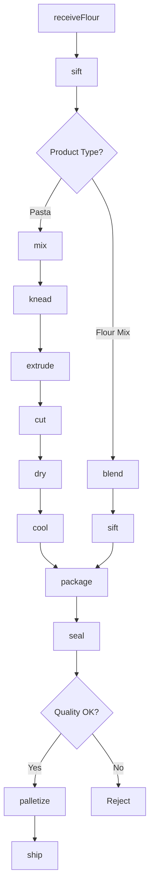
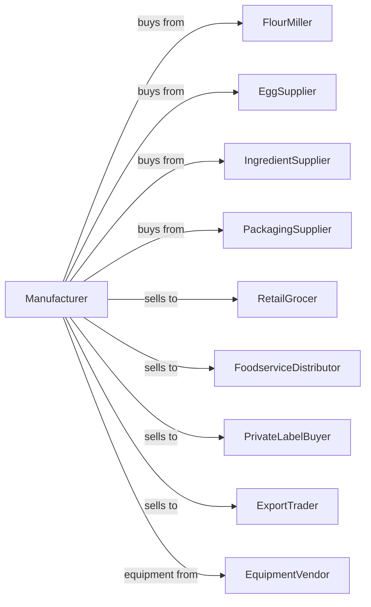

# Dry Pasta, Dough, and Flour Mixes Manufacturing from Purchased Flour

> Business-as-Code definition for dry pasta, dough, and flour mix manufacturing. Models production of spaghetti, macaroni, egg noodles, and prepared baking mixes through mixing, extruding, and drying operations.

## Overview

This U.S. industry comprises establishments primarily engaged in (1) manufacturing dry pasta and/or (2) manufacturing prepared flour mixes or dough from flour ground elsewhere. The establishments in this industry may package the dry pasta they manufacture with other ingredients. This definition exposes actions for pasta extrusion, drying, and flour mix blending.

## Actors

| Actor | Description |
|-------|-------------|
| FlourMiller | Supplies semolina and wheat flour |
| EggSupplier | Provides eggs for egg noodles |
| IngredientSupplier | Provides seasonings and additives |
| PackagingSupplier | Provides boxes, bags, and cartons |
| RetailGrocer | Purchases pasta and baking mixes |
| FoodserviceDistributor | Supplies restaurants and institutions |
| PrivateLabelBuyer | Contracts store-brand production |
| ExportTrader | Handles international pasta sales |
| EquipmentVendor | Supplies extruders and dryers |

## Roles

| Role | Description |
|------|-------------|
| PlantManager | Oversees daily manufacturing operations |
| ProductionSupervisor | Manages pasta lines and mix blending |
| MixingOperator | Prepares dough and dry mixes |
| ExtrusionOperator | Runs pasta extruders and dies |
| DryingOperator | Controls drying chambers |
| PackagingOperator | Operates filling and sealing lines |
| QualityTechnician | Tests moisture, color, and texture |
| MaintenanceTechnician | Maintains dies and equipment |

## Entities

| Entity | Description |
|--------|-------------|
| SemolinaFlour | Durum wheat flour for pasta |
| Dough | Mixed pasta base before extrusion |
| Pasta | Extruded and dried product |
| Noodle | Flat or ribbon pasta shape |
| Spaghetti | Long cylindrical pasta |
| Macaroni | Short tubular pasta |
| FlourMix | Blended baking mix product |
| Die | Metal form for pasta shapes |
| Batch | Traceable production quantity |
| MoistureContent | Critical quality parameter |

## Actions

| Action | Description |
|--------|-------------|
| receiveFlour | Accept flour and ingredients |
| sift | Remove impurities from flour |
| mix | Combine flour, water, and eggs |
| knead | Develop gluten in dough |
| extrude | Push dough through dies |
| cut | Portion extruded pasta to length |
| dry | Remove moisture in controlled chambers |
| cool | Reduce temperature after drying |
| blend | Mix dry ingredients for flour mixes |
| sift | Ensure uniform particle size |
| package | Fill boxes, bags, or pouches |
| seal | Close packages for shelf stability |
| palletize | Stack cases for shipping |
| ship | Dispatch to customers |

## Events

| Event | Description |
|-------|-------------|
| flourReceived | Raw materials accepted |
| doughMixed | Mixing completed |
| doughExtruded | Pasta shapes formed |
| pastaCut | Portions created |
| pastaDried | Target moisture reached |
| pastaCooled | Temperature stabilized |
| mixBlended | Flour mix prepared |
| productPackaged | Products sealed |
| qualityApproved | Batch passed testing |
| qualityFailed | Batch out of specification |
| orderShipped | Products dispatched |

## Searches

| Search | Description |
|--------|-------------|
| getFlourInventory | Check flour stock levels |
| getDoughBatches | List active dough batches |
| getDryingStatus | Monitor drying chambers |
| getInventory | Check finished goods by product |
| getOrders | Retrieve orders by customer |
| getDies | List available pasta dies |
| getMoistureReports | View moisture test results |
| getProductionSchedule | View planned production |

## Workflow



## Actor Relationships



## Usage

### Calling Actions

```typescript
import { bakeDryPasta } from '@headlessly/bake-dry-pasta'

const plant = bakeDryPasta()

// Review current status
const status = await plant.getFlourInventory()

// Review production data
const data = await plant.getDoughBatches()

// Produce spaghetti
const dough = await plant.mix({
  flour: 'semolina-durum',
  water: 30,
  eggs: 0,
  waterPercent: true
})

await plant.knead({
  batchId: dough.batchId,
  duration: 15,
  unit: 'minutes'
})

await plant.extrude({
  batchId: dough.batchId,
  die: 'spaghetti-2mm',
  pressure: 1200,
  unit: 'psi'
})

await plant.cut({
  batchId: dough.batchId,
  length: 260,
  unit: 'mm'
})

await plant.dry({
  batchId: dough.batchId,
  method: 'high-temp',
  targetMoisture: 12.5,
  duration: 8,
  unit: 'hours'
})
```

### Event-Driven Automation

```typescript
// Auto-cool and package after drying
plant.pastaDried(async ({ batchId, moistureContent }) => {
  if (moistureContent <= 12.5) {
    await plant.cool({
      batchId,
      targetTemp: 75,
      unit: 'fahrenheit'
    })
  }
})

plant.pastaCooled(async ({ batchId, productType }) => {
  await plant.package({
    batchId,
    format: productType === 'long-cut' ? 'box' : 'bag',
    weight: 16,
    unit: 'oz'
  })
})

// Quality alert on high moisture
plant.qualityFailed(async ({ batchId, parameter, value }) => {
  if (parameter === 'moisture' && value > 13) {
    await plant.dry({
      batchId,
      additionalTime: 2,
      unit: 'hours'
    })
  }
})
```
