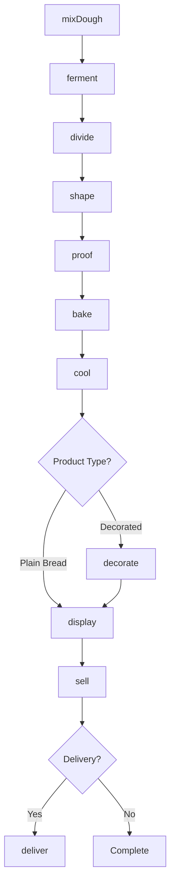
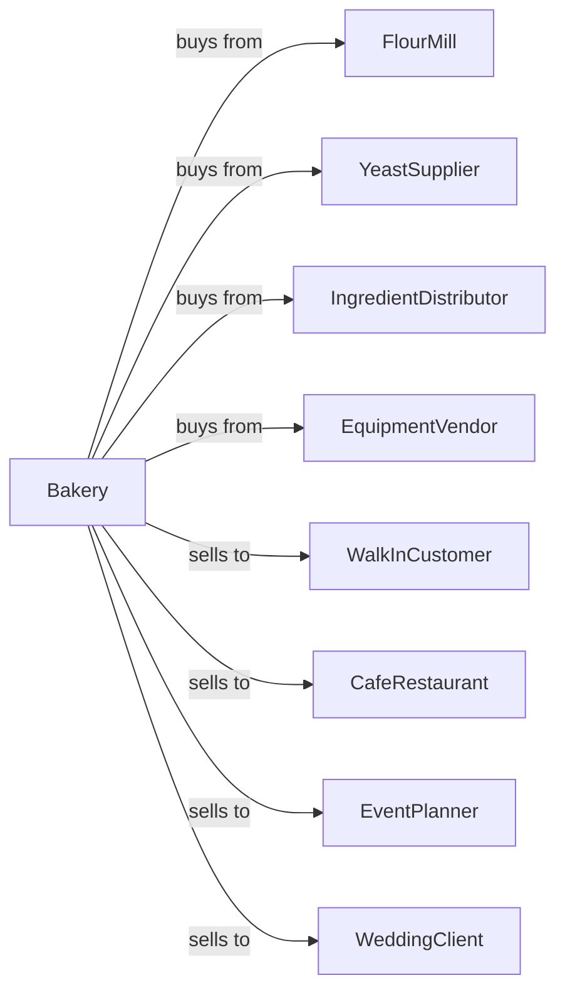

# Retail Bakeries

> Business-as-Code definition for retail bakery operations. Models scratch baking, proofing, baking, and retail sale of bread, pastries, cakes, and specialty baked goods made on premises.

## Overview

This U.S. industry comprises establishments primarily engaged in retailing bread and other bakery products not for immediate consumption made on the premises from flour, not from prepared dough. This definition exposes actions for dough mixing, fermentation, proofing, baking, and retail sales.

## Actors

| Actor | Description |
|-------|-------------|
| FlourMill | Supplies flour and baking mixes |
| YeastSupplier | Provides fresh and dry yeast |
| IngredientDistributor | Supplies butter, eggs, and specialty items |
| EquipmentVendor | Provides ovens, mixers, and proofers |
| WalkInCustomer | Purchases baked goods directly |
| CafeRestaurant | Orders wholesale baked goods |
| EventPlanner | Orders custom cakes and pastries |
| WeddingClient | Commissions wedding cakes |

## Roles

| Role | Description |
|------|-------------|
| BakeryOwner | Owns and manages the bakery |
| HeadBaker | Leads baking production |
| PastryChef | Creates pastries and specialty items |
| CakeDecorator | Designs and decorates custom cakes |
| CounterStaff | Serves customers and handles sales |
| EarlyShiftBaker | Prepares morning bread production |
| BreadShaper | Forms loaves and rolls |

## Entities

| Entity | Description |
|--------|-------------|
| Dough | Mixed and fermented base |
| Bread | Baked loaf product |
| Roll | Individual bread portion |
| Pastry | Sweet layered or filled product |
| Cake | Layered dessert product |
| Cookie | Individual sweet baked item |
| Croissant | Laminated pastry product |
| Starter | Sourdough culture |
| Recipe | Formula for baked goods |
| Order | Customer request for products |

## Actions

| Action | Description |
|--------|-------------|
| mixDough | Combine flour, water, yeast, and ingredients |
| ferment | Allow dough to develop flavor |
| divide | Portion dough into units |
| shape | Form loaves, rolls, or pastries |
| proof | Final rise before baking |
| bake | Apply heat in oven |
| cool | Rest products after baking |
| decorate | Apply icing, glaze, or toppings |
| display | Present products for sale |
| sell | Complete customer transaction |
| orderCustom | Accept special order request |
| deliver | Transport orders to customers |

## Events

| Event | Description |
|-------|-------------|
| doughMixed | Ingredients combined |
| doughFermented | Bulk fermentation complete |
| doughDivided | Portions measured |
| doughShaped | Products formed |
| doughProofed | Final rise achieved |
| productBaked | Baking completed |
| productCooled | Ready for sale |
| productDecorated | Finishing applied |
| productDisplayed | On sale floor |
| saleMade | Customer purchase completed |
| customOrderPlaced | Special order received |
| orderDelivered | Products delivered |

## Searches

| Search | Description |
|--------|-------------|
| getInventory | Check available baked goods |
| getRecipes | List production formulas |
| getOrders | Retrieve custom orders |
| getSales | View daily sales by product |
| getSchedule | View baking schedule |
| findIngredients | Check ingredient stock |
| getCustomerHistory | View customer order history |

## Workflow



## Actor Relationships



## Usage

### Calling Actions

```typescript
import { bakeRetailBread } from '@headlessly/bake-retail-bread'

const bakery = bakeRetailBread()

// Review current status
const status = await bakery.getInventory()

// Review production data
const data = await bakery.getRecipes()

// Prepare sourdough bread
const dough = await bakery.mixDough({
  recipe: 'country-sourdough',
  flourWeight: 10,
  unit: 'lbs',
  hydration: 72
})

await bakery.ferment({
  batchId: dough.batchId,
  duration: 4,
  unit: 'hours',
  temperature: 78
})

await bakery.divide({
  batchId: dough.batchId,
  portionWeight: 1.5,
  unit: 'lbs'
})

await bakery.shape({
  batchId: dough.batchId,
  style: 'boule'
})

await bakery.proof({
  batchId: dough.batchId,
  duration: 90,
  unit: 'minutes'
})

await bakery.bake({
  batchId: dough.batchId,
  temperature: 450,
  steam: true,
  duration: 35
})
```

### Event-Driven Automation

```typescript
// Auto-display when cooled
bakery.productCooled(async ({ batchId, productType }) => {
  if (productType === 'bread') {
    await bakery.display({
      batchId,
      location: 'bread-rack',
      price: getPrice(productType)
    })
  }
})

// Auto-notify for custom orders
bakery.customOrderPlaced(async ({ orderId, customer, dueDate }) => {
  await scheduleProduction({
    orderId,
    customer,
    dueDate,
    notifyBaker: true
  })
})
```
