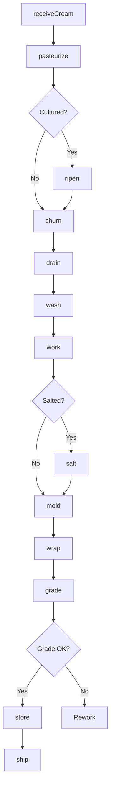
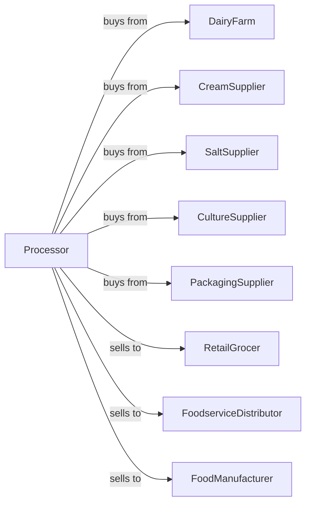

# Creamery Butter Manufacturing

> Business-as-Code definition for creamery butter production operations. Models cream separation, churning, working, packaging, and distribution of butter and butter blends.

## Overview

This U.S. industry comprises establishments primarily engaged in manufacturing creamery butter from milk and/or processed milk products. This definition exposes actions for cream separation, pasteurization, churning, and packaging for retail and foodservice channels.

## Actors

| Actor | Description |
|-------|-------------|
| DairyFarm | Supplies raw milk and cream |
| CreamSupplier | Provides bulk cream for butter production |
| SaltSupplier | Supplies food-grade salt for salted butter |
| CultureSupplier | Provides bacterial cultures for cultured butter |
| PackagingSupplier | Provides wrappers, tubs, and cartons |
| RetailGrocer | Purchases butter for retail sale |
| FoodserviceDistributor | Distributes to restaurants and bakeries |
| FoodManufacturer | Uses butter as ingredient |

## Roles

| Role | Description |
|------|-------------|
| PlantManager | Oversees butter production operations |
| QualityManager | Ensures product meets grade standards |
| ChurnOperator | Runs churning and working equipment |
| PackagingOperator | Operates wrapping and cartoning lines |
| LabTechnician | Tests moisture, fat, and salt content |
| ColdStorageManager | Manages refrigerated inventory |

## Entities

| Entity | Description |
|--------|-------------|
| Cream | High-fat dairy input for churning |
| Butterfat | Fat content extracted during churning |
| Buttermilk | Liquid byproduct of churning |
| Butter | Finished churned product |
| SaltedButter | Butter with added salt |
| UnsaltedButter | Sweet cream butter without salt |
| CulturedButter | Butter made from fermented cream |
| WhippedButter | Aerated butter product |
| Batch | Traceable production quantity |
| Grade | Quality classification for butter |

## Actions

| Action | Description |
|--------|-------------|
| receiveCream | Accept and test incoming cream deliveries |
| pasteurize | Heat treat cream before churning |
| ripen | Culture cream for cultured butter |
| churn | Agitate cream to separate butterfat |
| drain | Remove buttermilk from butter granules |
| wash | Rinse butter to remove residual buttermilk |
| work | Knead butter to uniform consistency |
| salt | Add salt to specified level |
| mold | Form butter into blocks or prints |
| wrap | Package in foil or parchment |
| grade | Evaluate and assign quality grade |
| store | Place in cold storage |

## Events

| Event | Description |
|-------|-------------|
| creamReceived | Cream tested and accepted |
| creamPasteurized | Heat treatment completed |
| creamRipened | Cultures developed flavor |
| butterChurned | Fat separated from buttermilk |
| butterWorked | Moisture and texture adjusted |
| butterSalted | Salt incorporated |
| butterMolded | Shaped into final form |
| butterWrapped | Packaging completed |
| butterGraded | Quality grade assigned |
| batchReleased | Quality approved for sale |
| orderShipped | Product dispatched |

## Searches

| Search | Description |
|--------|-------------|
| findCreamLots | List available cream inventory |
| getInventory | Check butter stock by grade and type |
| getOrders | Retrieve orders by customer |
| getGradeHistory | View grading results by batch |
| getButtermilkVolume | Track byproduct production |
| getProductionSchedule | View planned churning runs |
| findByGrade | List butter by quality grade |

## Workflow



## Actor Relationships



## Usage

### Calling Actions

```typescript
import { produceCreameryButter } from '@headlessly/produce-creamery-butter'

const plant = produceCreameryButter()

// Check available cream lots
const creamLots = await plant.findCreamLots({ butterfatMin: 38, status: 'available' })

// Review production schedule
const schedule = await plant.getProductionSchedule({ date: 'today' })

// Receive cream and begin production
const cream = await plant.receiveCream({
  supplierId: 'dairy-gold',
  volume: 2000,
  unit: 'gallons',
  butterfatPercent: 40
})

await plant.pasteurize({
  batchId: cream.batchId,
  temperature: 185,
  holdTime: 15
})

// Churn and process butter
await plant.churn({
  batchId: cream.batchId,
  temperature: 55,
  duration: 45
})

await plant.work({
  batchId: cream.batchId,
  targetMoisture: 16
})
```

### Event-Driven Automation

```typescript
// Auto-salt based on product type
plant.butterWorked(async ({ batchId, productType }) => {
  if (productType === 'salted') {
    await plant.salt({
      batchId,
      saltPercent: 1.5
    })
  }
})

// Auto-grade after packaging
plant.butterWrapped(async ({ batchId }) => {
  const gradeResult = await plant.grade({ batchId })

  if (gradeResult.grade === 'AA') {
    await plant.assignPremiumPricing({ batchId })
  }
})
```
