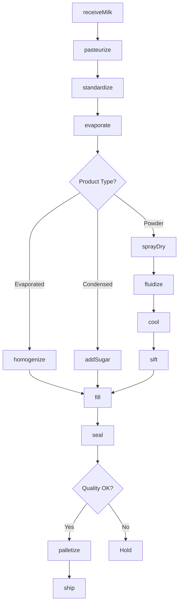
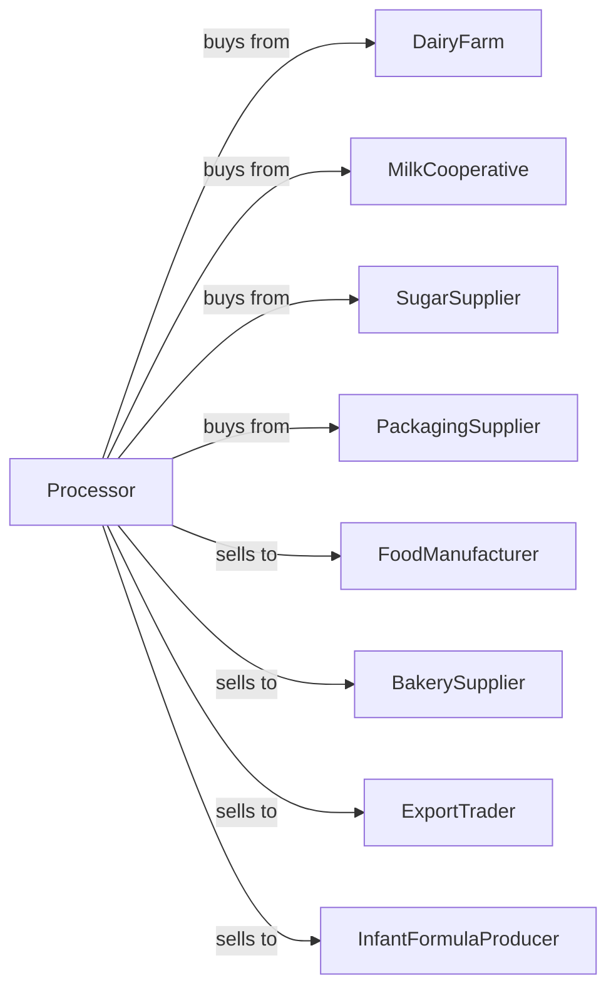

# Dry, Condensed, and Evaporated Dairy Product Manufacturing

> Business-as-Code definition for dry, condensed, and evaporated dairy manufacturing operations. Models evaporation, spray drying, and packaging of shelf-stable milk products.

## Overview

This U.S. industry comprises establishments primarily engaged in manufacturing dry, condensed, and evaporated milk and dairy substitute products. This definition exposes actions for concentrating, drying, and packaging milk powder, evaporated milk, and sweetened condensed milk.

## Actors

| Actor | Description |
|-------|-------------|
| DairyFarm | Supplies raw milk for processing |
| MilkCooperative | Aggregates bulk milk supply |
| SugarSupplier | Provides sugar for sweetened condensed milk |
| PackagingSupplier | Provides cans, bags, and containers |
| FoodManufacturer | Uses dry dairy as ingredient |
| BakerySupplier | Distributes to commercial bakeries |
| ExportTrader | Handles international sales |
| InfantFormulaProducer | Uses milk powder for formula |

## Roles

| Role | Description |
|------|-------------|
| PlantManager | Oversees production operations |
| EvaporatorOperator | Runs vacuum evaporation equipment |
| DryerOperator | Controls spray drying systems |
| QualityManager | Ensures product specifications |
| LabTechnician | Tests moisture, protein, and fat content |
| PackagingOperator | Operates filling and sealing lines |
| WarehouseManager | Manages dry goods storage |

## Entities

| Entity | Description |
|--------|-------------|
| RawMilk | Fresh milk input |
| ConcentratedMilk | Partially evaporated milk |
| EvaporatedMilk | Shelf-stable concentrated milk |
| SweetenedCondensedMilk | Sugar-added concentrated milk |
| MilkPowder | Spray-dried milk solids |
| WholeMilkPowder | Full-fat dried milk |
| SkimMilkPowder | Fat-free dried milk |
| WheyPowder | Dried whey byproduct |
| Batch | Traceable production lot |
| MoistureContent | Critical quality parameter |

## Actions

| Action | Description |
|--------|-------------|
| receiveMilk | Accept and test incoming milk |
| pasteurize | Heat treat for safety |
| standardize | Adjust fat content |
| evaporate | Remove water under vacuum |
| addSugar | Incorporate sugar for SCM |
| homogenize | Ensure uniform consistency |
| sprayDry | Convert liquid to powder |
| fluidize | Agglomerate powder for instant dissolving |
| cool | Reduce temperature after drying |
| sift | Remove oversized particles |
| fill | Package into cans or bags |
| seal | Close containers for shelf stability |
| palletize | Stack for storage and shipping |

## Events

| Event | Description |
|-------|-------------|
| milkReceived | Raw milk accepted |
| milkPasteurized | Heat treatment complete |
| milkEvaporated | Water removed |
| sugarAdded | Sweetener incorporated |
| productDried | Powder created |
| productCooled | Temperature stabilized |
| productSifted | Particle size verified |
| containerFilled | Product packaged |
| containerSealed | Package closed |
| batchReleased | Quality approved |
| orderShipped | Product dispatched |

## Searches

| Search | Description |
|--------|-------------|
| findMilkLots | List incoming milk deliveries |
| getInventory | Check finished goods by product type |
| getOrders | Retrieve orders by customer or date |
| getMoistureReports | View moisture test results |
| getProductionSchedule | View planned runs |
| findByShelfLife | List products by expiration |
| getExportDocuments | Retrieve certificates for international sales |

## Workflow



## Actor Relationships



## Usage

### Calling Actions

```typescript
import { produceDryDairyProducts } from '@headlessly/produce-dry-dairy-products'

const plant = produceDryDairyProducts()

// Check incoming milk deliveries
const milkLots = await plant.findMilkLots({ status: 'en-route', date: 'today' })

// Review current inventory levels
const inventory = await plant.getInventory({ product: 'skim-milk-powder' })

// Produce skim milk powder
const milk = await plant.receiveMilk({
  cooperativeId: 'midwest-dairy',
  volume: 50000,
  unit: 'gallons',
  butterfatPercent: 3.5
})

await plant.pasteurize({
  batchId: milk.batchId,
  method: 'HTST'
})

await plant.standardize({
  batchId: milk.batchId,
  targetFat: 0.1 // skim
})

await plant.evaporate({
  batchId: milk.batchId,
  targetSolids: 48
})

await plant.sprayDry({
  batchId: milk.batchId,
  inletTemp: 180,
  outletTemp: 90,
  unit: 'celsius'
})
```

### Event-Driven Automation

```typescript
// Auto-agglomerate for instant powder
plant.productDried(async ({ batchId, productType }) => {
  if (productType === 'instant-skim') {
    await plant.fluidize({
      batchId,
      lecithinSpray: true
    })
  }
})

// Auto-generate export certificates
plant.batchReleased(async ({ batchId, destination }) => {
  if (destination === 'export') {
    await plant.generateCertificate({
      batchId,
      type: 'phytosanitary',
      market: destination
    })
  }
})
```
