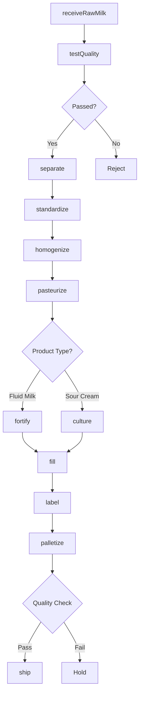
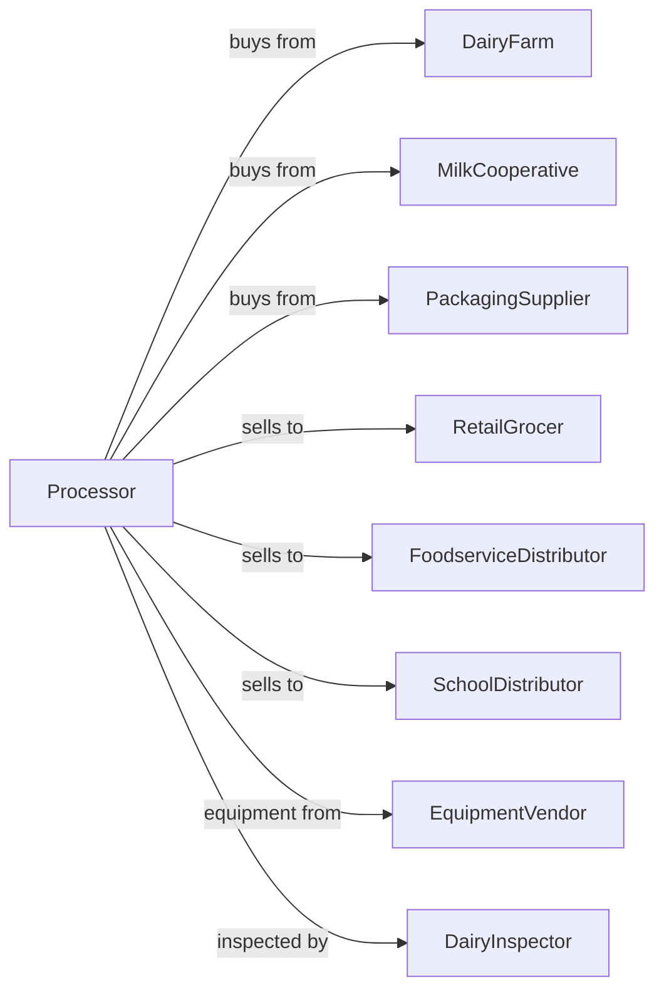

# Fluid Milk Manufacturing

> Business-as-Code definition for fluid milk processing operations. Models pasteurization, homogenization, packaging, and distribution of milk and dairy substitutes for retail and foodservice.

## Overview

This U.S. industry comprises establishments primarily engaged in (1) manufacturing processed milk products, such as pasteurized milk or cream and sour cream and/or (2) manufacturing fluid milk dairy substitutes from soybeans and other nondairy substances. This definition exposes actions for receiving raw milk, processing, quality testing, and packaging for distribution.

## Actors

| Actor | Description |
|-------|-------------|
| DairyFarm | Supplies raw milk from dairy operations |
| MilkCooperative | Aggregates and markets milk from member farms |
| PackagingSupplier | Provides bottles, cartons, and containers |
| RetailGrocer | Purchases fluid milk for retail sale |
| FoodserviceDistributor | Distributes to restaurants and institutions |
| SchoolDistributor | Supplies milk to school lunch programs |
| EquipmentVendor | Supplies pasteurizers and homogenizers |
| DairyInspector | Conducts dairy safety inspections |

## Roles

| Role | Description |
|------|-------------|
| PlantManager | Oversees daily processing operations |
| QualityManager | Ensures product safety and compliance |
| ReceivingOperator | Tests and accepts incoming raw milk |
| PasteurizerOperator | Runs heat treatment equipment |
| PackagingOperator | Operates filling and sealing lines |
| LabTechnician | Performs microbiological and chemical tests |
| MaintenanceTechnician | Maintains processing equipment |

## Entities

| Entity | Description |
|--------|-------------|
| RawMilk | Unprocessed milk from dairy farms |
| PasteurizedMilk | Heat-treated milk safe for consumption |
| Cream | High-fat dairy product separated from milk |
| SourCream | Cultured cream product |
| DairySubstitute | Plant-based milk alternatives |
| Tanker | Bulk transport vessel for raw milk |
| Batch | Traceable production quantity |
| QualityTest | Somatic cell count and composition analysis |
| Container | Retail packaging unit |
| ShelfLife | Product freshness window |

## Actions

| Action | Description |
|--------|-------------|
| receiveRawMilk | Accept tanker delivery and perform initial testing |
| testQuality | Analyze for bacteria, antibiotics, and composition |
| separate | Split milk into skim and cream fractions |
| standardize | Adjust fat content to target levels |
| homogenize | Break down fat globules for uniform texture |
| pasteurize | Heat treat to eliminate harmful bacteria |
| culture | Add bacterial cultures for cultured products |
| fortify | Add vitamins A and D as required |
| fill | Package into retail containers |
| label | Apply date codes and product information |
| palletize | Stack cases for shipping |
| ship | Dispatch refrigerated loads to customers |

## Events

| Event | Description |
|-------|-------------|
| milkReceived | Raw milk tested and accepted into storage |
| milkRejected | Raw milk failed quality tests |
| batchSeparated | Cream and skim fractions created |
| batchStandardized | Fat content adjusted |
| batchHomogenized | Fat globules processed |
| batchPasteurized | Heat treatment completed |
| batchCultured | Cultures added for sour cream |
| batchFortified | Vitamins added |
| batchFilled | Containers filled and sealed |
| batchReleased | Quality approved for distribution |
| orderShipped | Product dispatched to customer |

## Searches

| Search | Description |
|--------|-------------|
| findTankers | List incoming milk deliveries |
| getInventory | Check finished goods stock by SKU |
| getOrders | Retrieve orders by customer or delivery date |
| getQualityResults | View test results by batch |
| getProductionSchedule | View planned processing runs |
| findExpiring | List products approaching sell-by date |
| getSupplierHistory | Review quality history by farm |

## Workflow



## Actor Relationships



## Usage

### Calling Actions

```typescript
import { produceFluidMilk } from '@headlessly/produce-fluid-milk'

const plant = produceFluidMilk()

// Check incoming tanker schedule
const tankers = await plant.findTankers({ status: 'en-route', date: 'today' })

// Review supplier quality history
const supplierHistory = await plant.getSupplierHistory({ farmId: 'meadow-dairy' })

// Receive and test incoming raw milk
const delivery = await plant.receiveRawMilk({
  tankerId: 'TK-2024-0142',
  farmId: 'meadow-dairy',
  volume: 6000,
  unit: 'gallons',
  temperature: 38
})

const quality = await plant.testQuality({
  deliveryId: delivery.id,
  tests: ['bacteria', 'antibiotics', 'scc', 'butterfat']
})

// Process whole milk batch
await plant.standardize({
  batchId: delivery.batchId,
  targetFat: 3.25
})

await plant.homogenize({ batchId: delivery.batchId })
await plant.pasteurize({
  batchId: delivery.batchId,
  method: 'HTST',
  temperature: 161,
  holdTime: 15
})
```

### Event-Driven Automation

```typescript
// Auto-fortify after pasteurization
plant.batchPasteurized(async ({ batchId, productType }) => {
  if (productType === 'fluid-milk') {
    await plant.fortify({
      batchId,
      vitaminA: 2000,
      vitaminD: 400,
      unit: 'IU-per-quart'
    })
  }
})

// Auto-alert on quality failures
plant.milkRejected(async ({ deliveryId, farmId, reason }) => {
  await plant.notifySupplier({
    farmId,
    subject: 'Milk Delivery Rejected',
    reason,
    deliveryId
  })
})
```
