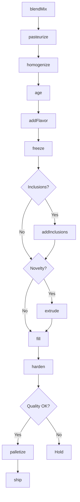
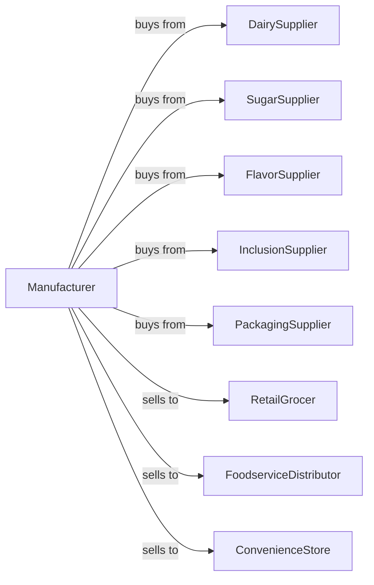

# Ice Cream and Frozen Dessert Manufacturing

> Business-as-Code definition for ice cream and frozen dessert manufacturing operations. Models mixing, pasteurization, freezing, and packaging of ice cream, frozen yogurt, sherbet, and novelty products.

## Overview

This industry comprises establishments primarily engaged in manufacturing ice cream, frozen yogurts, frozen ices, sherbets, frozen tofu, and other frozen desserts (except bakery products). This definition exposes actions for batch mixing, freezing, hardening, and packaging frozen dairy desserts.

## Actors

| Actor | Description |
|-------|-------------|
| DairySupplier | Provides milk, cream, and dairy ingredients |
| SugarSupplier | Supplies sweeteners and corn syrup |
| FlavorSupplier | Provides extracts, fruits, and flavorings |
| InclusionSupplier | Supplies nuts, candy, and mix-in ingredients |
| PackagingSupplier | Provides cartons, cups, and novelty packaging |
| RetailGrocer | Purchases ice cream for retail sale |
| FoodserviceDistributor | Distributes to restaurants and shops |
| ConvenienceStore | Purchases single-serve novelties |

## Roles

| Role | Description |
|------|-------------|
| PlantManager | Oversees production operations |
| FlavorDeveloper | Creates and tests new flavor formulations |
| MixOperator | Prepares and pasteurizes ice cream base |
| FreezerOperator | Controls continuous freezing equipment |
| HardeningOperator | Manages blast freezing chambers |
| PackagingOperator | Runs filling and cartoning lines |
| QualityTechnician | Tests butterfat, overrun, and flavor |

## Entities

| Entity | Description |
|--------|-------------|
| Mix | Liquid ice cream base before freezing |
| IceCream | Premium frozen dessert with minimum butterfat |
| FrozenYogurt | Cultured frozen dairy dessert |
| Sherbet | Fruit-flavored frozen dessert |
| Sorbet | Non-dairy frozen fruit dessert |
| Novelty | Individual frozen treat on stick or in cup |
| Overrun | Air incorporated during freezing |
| Batch | Traceable production quantity |
| Flavor | Recipe formulation |
| Inclusion | Mix-in ingredient added after freezing |

## Actions

| Action | Description |
|--------|-------------|
| blendMix | Combine dairy, sugar, and stabilizers |
| pasteurize | Heat treat mix for safety |
| homogenize | Break down fat globules |
| age | Hold mix to improve texture |
| addFlavor | Incorporate flavoring before freezing |
| freeze | Convert liquid mix to soft-serve consistency |
| addInclusions | Fold in nuts, candy, or fruit pieces |
| extrude | Form novelty shapes |
| fill | Package into containers |
| harden | Blast freeze to storage temperature |
| palletize | Stack cases for cold storage |
| ship | Dispatch frozen loads |

## Events

| Event | Description |
|-------|-------------|
| mixBlended | Base ingredients combined |
| mixPasteurized | Heat treatment complete |
| mixAged | Holding time reached |
| flavorAdded | Flavoring incorporated |
| productFrozen | Soft-serve consistency achieved |
| inclusionsAdded | Mix-ins folded in |
| productFilled | Containers packaged |
| productHardened | Target temperature reached |
| batchReleased | Quality approved |
| orderShipped | Frozen product dispatched |

## Searches

| Search | Description |
|--------|-------------|
| findMixBatches | List available mix inventory |
| getInventory | Check frozen stock by flavor |
| getOrders | Retrieve orders by customer |
| getFlavorFormulas | List recipes by product type |
| getOverrunReports | View air incorporation data |
| getProductionSchedule | View planned runs |
| findByBestBy | List products by expiration |

## Workflow



## Actor Relationships



## Usage

### Calling Actions

```typescript
import { produceIceCream } from '@headlessly/produce-ice-cream'

const plant = produceIceCream()

// Check frozen inventory levels by flavor
const inventory = await plant.getInventory({ flavor: 'vanilla', location: 'hardening-room' })

// Review production schedule
const schedule = await plant.getProductionSchedule({ date: 'today' })

// Create premium vanilla ice cream
const mix = await plant.blendMix({
  cream: 40,
  milk: 50,
  sugar: 15,
  stabilizer: 0.5,
  unit: 'percent'
})

await plant.pasteurize({
  batchId: mix.batchId,
  temperature: 175,
  holdTime: 25
})

await plant.age({
  batchId: mix.batchId,
  duration: 4,
  unit: 'hours',
  temperature: 40
})

await plant.addFlavor({
  batchId: mix.batchId,
  flavor: 'madagascar-vanilla',
  amount: 2.5,
  unit: 'percent'
})
```

### Event-Driven Automation

```typescript
// Auto-add inclusions after freezing
plant.productFrozen(async ({ batchId, sku }) => {
  const formula = await plant.getFlavorFormulas({ sku })

  if (formula.inclusions.length > 0) {
    await plant.addInclusions({
      batchId,
      inclusions: formula.inclusions,
      rate: formula.inclusionRate
    })
  }
})

// Auto-route to hardening chamber
plant.productFilled(async ({ batchId, containers }) => {
  await plant.harden({
    batchId,
    targetTemp: -20,
    chamber: 'blast-3'
  })
})
```
