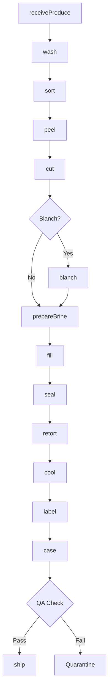
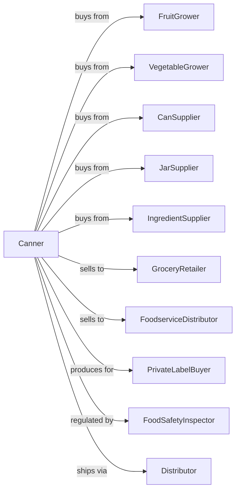

# Fruit and Vegetable Canning

> Business-as-Code definition for fruit and vegetable canning operations. Models receiving fresh produce, washing, preparation, filling, retort processing, and labeling for shelf-stable canned goods including juices, sauces, and pickled products.

## Overview

This U.S. industry comprises establishments primarily engaged in manufacturing canned, pickled, and brined fruits and vegetables. Examples of products made in these establishments are canned juices; canned jams and jellies; canned tomato-based sauces, such as catsup, salsa, chili sauce, spaghetti sauce, barbeque sauce, and tomato paste; and pickles, relishes, and sauerkraut. Cross-References. Establishments primarily engaged in--

## Actors

| Actor | Description |
|-------|-------------|
| FruitGrower | Supplies fresh fruits for canning |
| VegetableGrower | Provides fresh vegetables for processing |
| CanSupplier | Provides tin cans and lids |
| JarSupplier | Supplies glass jars and closures |
| IngredientSupplier | Provides sugar, vinegar, spices, and additives |
| GroceryRetailer | Purchases canned goods for consumer sale |
| FoodserviceDistributor | Buys institutional-size canned products |
| PrivateLabelBuyer | Contracts canning under store brands |
| FoodSafetyInspector | Ensures canning safety and compliance |
| Distributor | Warehouses and delivers to retail |

## Roles

| Role | Description |
|------|-------------|
| PlantManager | Oversees canning facility operations |
| QualityManager | Ensures product safety and standards |
| ProductionSupervisor | Manages canning line activities |
| ReceivingClerk | Inspects incoming produce |
| PrepOperator | Runs washing, peeling, and cutting equipment |
| FillerOperator | Operates can and jar filling lines |
| RetortOperator | Controls thermal processing equipment |
| LabTechnician | Tests pH, brix, and microbiology |

## Entities

| Entity | Description |
|--------|-------------|
| RawProduce | Fresh fruits or vegetables received |
| Can | Metal container for products |
| Jar | Glass container for products |
| Brine | Salt or vinegar solution |
| Syrup | Sugar solution for fruit packing |
| Sauce | Prepared tomato or other sauce |
| Batch | Traceable production lot |
| RetortRecord | Thermal processing documentation |
| Label | Product identification and nutrition |
| PalletLoad | Stacked cases for shipping |

## Actions

| Action | Description |
|--------|-------------|
| receiveProduce | Accept and inspect fresh produce |
| wash | Clean produce thoroughly |
| sort | Grade by size and quality |
| peel | Remove skins from fruits and vegetables |
| cut | Slice, dice, or prepare pieces |
| blanch | Heat-treat to preserve color and texture |
| prepareBrine | Mix salt, vinegar, or sugar solutions |
| fill | Place product and liquid in containers |
| seal | Apply lids and closures |
| retort | Apply thermal processing for sterilization |
| cool | Reduce temperature after retort |
| label | Apply product labels |
| case | Pack into shipping cases |
| ship | Dispatch to customers |

## Events

| Event | Description |
|-------|-------------|
| produceReceived | Fresh produce accepted |
| produceWashed | Cleaning completed |
| producePrepared | Cutting and peeling done |
| brinePrepped | Packing solution ready |
| containersFilled | Cans or jars filled |
| containersSealed | Lids applied |
| retortComplete | Thermal processing finished |
| productCooled | Temperature reduced |
| productLabeled | Labels applied |
| productCased | Packed for shipping |
| qualityApproved | Product passed testing |
| qualityFailed | Product did not meet standards |
| orderShipped | Canned goods dispatched |

## Searches

| Search | Description |
|--------|-------------|
| findProduce | List incoming produce by variety |
| getInventory | Check canned goods stock |
| getBatches | Retrieve batch records |
| getRetortRecords | Access thermal processing logs |
| getOrders | List orders by customer |
| getQualityReports | Retrieve lab test results |
| getProductionSchedule | View canning line schedule |
| traceProduct | Track lot through distribution |

## Workflow



## Actor Relationships



## Usage

### Calling Actions

```typescript
import { preserveFruitVegetable } from '@headlessly/preserve-fruit-vegetable'

const cannery = preserveFruitVegetable()

// Check can and container inventory
const containers = await cannery.getInventory({ type: 'can-28oz', location: 'warehouse' })

// Review incoming produce schedule
const schedule = await cannery.getProductionSchedule({ date: 'today' })

// Receive fresh tomatoes for sauce
const batch = await cannery.receiveProduce({
  supplier: 'valley-farms',
  product: 'roma-tomatoes',
  quantity: 40000,
  unit: 'lbs'
})

// Process into pasta sauce
await cannery.wash({ batchId: batch.id })
await cannery.sort({ batchId: batch.id, gradeSpec: 'sauce-grade' })
await cannery.peel({ batchId: batch.id, method: 'steam-peel' })
await cannery.cut({ batchId: batch.id, method: 'crush' })

// Can and retort
await cannery.fill({
  batchId: batch.id,
  containerType: 'can-28oz',
  fillWeight: 26,
  headspace: 0.25
})

await cannery.seal({ batchId: batch.id })

await cannery.retort({
  batchId: batch.id,
  temperature: 250,
  pressure: 15,
  duration: 45,
  unit: 'minutes'
})
```

### Event-Driven Automation

```typescript
// Auto-cool after retort
cannery.retortComplete(async ({ batchId, retortId }) => {
  await cannery.cool({
    batchId,
    method: 'water-spray',
    targetTemp: 100
  })

  // Log retort record for compliance
  await cannery.logRetortRecord({
    batchId,
    retortId,
    compliance: 'thermal-process-standard'
  })
})

// Label and case after cooling
cannery.productCooled(async ({ batchId }) => {
  const spec = await cannery.getBatches({ batchId })

  await cannery.label({
    batchId,
    labelType: spec.product.label,
    includeDate: true
  })

  await cannery.case({
    batchId,
    caseSize: 12,
    palletPattern: 'column-stack'
  })
})

// Quality hold on failed tests
cannery.qualityFailed(async ({ batchId, failure }) => {
  await cannery.quarantine({ batchId })
  await notifyQualityTeam({
    batchId,
    issue: failure,
    action: 'evaluate-disposition'
  })
})
```
