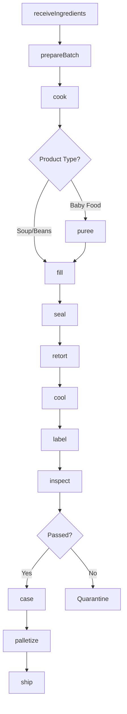
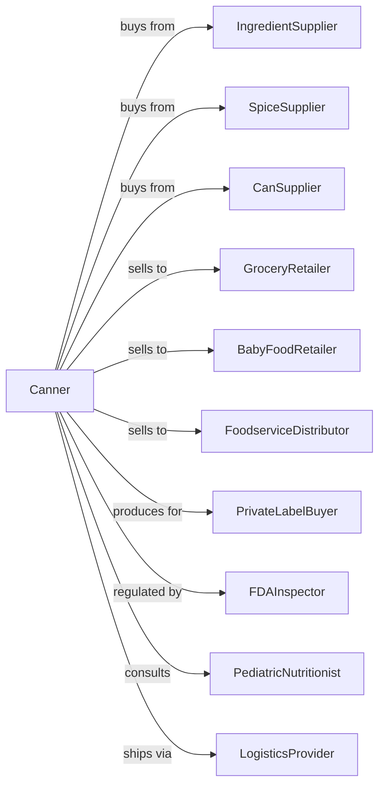

# Specialty Canning

> Business-as-Code definition for specialty canning operations. Models manufacturing of canned soups, baby food, baked beans, prepared pasta, and ethnic foods through ingredient preparation, cooking, filling, and retort processing.

## Overview

This U.S. industry comprises establishments primarily engaged in manufacturing canned specialty foods. Examples of products made in these establishments are canned baby food, canned baked beans, canned soups (except seafood), canned spaghetti, and other canned nationality foods. Cross-References. Establishments primarily engaged in--

## Actors

| Actor | Description |
|-------|-------------|
| IngredientSupplier | Provides vegetables, beans, meats, and starches |
| SpiceSupplier | Supplies seasonings and flavorings |
| CanSupplier | Provides cans in various sizes |
| GroceryRetailer | Purchases canned specialty foods |
| BabyFoodRetailer | Sells infant nutrition products |
| FoodserviceDistributor | Buys institutional-size products |
| PrivateLabelBuyer | Contracts manufacturing for store brands |
| FDAInspector | Ensures food safety compliance |
| PediatricNutritionist | Advises on baby food formulations |
| LogisticsProvider | Warehouses and distributes products |

## Roles

| Role | Description |
|------|-------------|
| PlantManager | Oversees specialty canning operations |
| ProductDeveloper | Creates recipes and formulations |
| QualityManager | Ensures safety and consistency |
| ProductionSupervisor | Manages cooking and canning lines |
| CookOperator | Prepares soups, beans, and sauces |
| FillerOperator | Runs can filling equipment |
| RetortOperator | Controls thermal processing |
| LabTechnician | Tests nutrition, pH, and microbiology |

## Entities

| Entity | Description |
|--------|-------------|
| Recipe | Formula for specialty product |
| Ingredient | Component for canned product |
| Batch | Traceable production lot |
| Soup | Prepared liquid meal product |
| BabyFood | Pureed infant food |
| BakedBeans | Prepared bean product |
| Can | Metal container in various sizes |
| RetortRecord | Thermal processing documentation |
| NutritionPanel | Product nutritional information |
| Case | Shipping container of cans |

## Actions

| Action | Description |
|--------|-------------|
| receiveIngredients | Accept and inspect incoming materials |
| prepareBatch | Weigh and combine ingredients per recipe |
| cook | Heat and blend ingredients |
| puree | Blend to smooth consistency for baby food |
| fill | Dispense product into cans |
| seal | Apply lids under vacuum |
| retort | Thermally process for sterilization |
| cool | Reduce temperature post-processing |
| label | Apply product and nutrition labels |
| case | Pack cans into shipping cases |
| inspect | Test for quality and safety |
| palletize | Stack cases on pallets |
| ship | Dispatch to distribution |
| develop | Create new products and recipes |

## Events

| Event | Description |
|-------|-------------|
| ingredientsReceived | Materials accepted and stored |
| batchPrepared | Ingredients weighed and combined |
| productCooked | Cooking completed |
| productPureed | Blending completed |
| cansFilled | Product dispensed into containers |
| cansSealed | Lids applied |
| retortCompleted | Thermal processing finished |
| productCooled | Temperature reduced |
| productLabeled | Labels applied |
| productCased | Packed for shipping |
| qualityApproved | Product passed all tests |
| qualityFailed | Product did not meet standards |
| orderShipped | Products dispatched |

## Searches

| Search | Description |
|--------|-------------|
| findIngredients | List ingredient inventory |
| getRecipes | Retrieve product formulas |
| getBatches | List batches by product and date |
| getInventory | Check finished goods stock |
| getRetortRecords | Access thermal processing logs |
| getOrders | Retrieve orders by customer |
| getQualityReports | Get test results |
| getNutritionData | Retrieve nutritional information |

## Workflow



## Actor Relationships



## Usage

### Calling Actions

```typescript
import { preserveSpecialtyCanning } from '@headlessly/preserve-specialty-canning'

const cannery = preserveSpecialtyCanning()

// Prepare chicken noodle soup batch
const batch = await cannery.prepareBatch({
  recipe: 'chicken-noodle-classic',
  ingredients: [
    { item: 'chicken-broth', quantity: 500, unit: 'gallons' },
    { item: 'chicken-diced', quantity: 200, unit: 'lbs' },
    { item: 'egg-noodles', quantity: 150, unit: 'lbs' },
    { item: 'carrots-diced', quantity: 75, unit: 'lbs' },
    { item: 'celery-diced', quantity: 50, unit: 'lbs' }
  ],
  targetCans: 10000
})

// Cook and can
await cannery.cook({
  batchId: batch.id,
  temperature: 190,
  duration: 45,
  unit: 'minutes'
})

await cannery.fill({
  batchId: batch.id,
  canSize: '10.75oz',
  fillWeight: 10.5
})

await cannery.seal({ batchId: batch.id, vacuum: true })

await cannery.retort({
  batchId: batch.id,
  temperature: 250,
  pressure: 15,
  duration: 65
})
```

### Event-Driven Automation

```typescript
// Special handling for baby food
cannery.productCooked(async ({ batchId, productType }) => {
  if (productType === 'baby-food') {
    await cannery.puree({
      batchId,
      consistency: 'stage-2',
      screens: [40, 60]
    })
  }
})

// Auto-label after cooling
cannery.productCooled(async ({ batchId }) => {
  const batch = await cannery.getBatches({ batchId })

  await cannery.label({
    batchId,
    labelSku: batch.product.labelSku,
    printDate: true,
    printLot: true
  })
})

// Alert on retort deviation
cannery.retortCompleted(async ({ batchId, retortId, deviation }) => {
  if (deviation) {
    await cannery.quarantine({ batchId })
    await alertQualityTeam({
      batchId,
      retortId,
      issue: 'thermal-process-deviation',
      action: 'evaluate-per-SOP'
    })
  }
})
```
