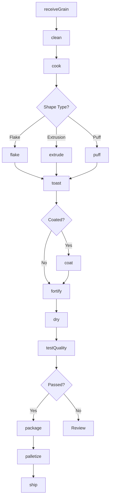
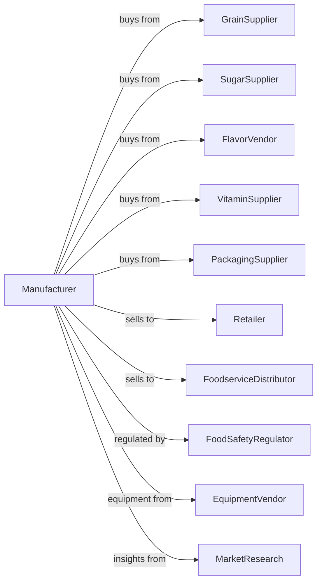

# Breakfast Cereal Manufacturing

> Business-as-Code definition for breakfast cereal manufacturing operations. Models grain processing, cooking, shaping, and packaging of ready-to-eat and hot cereals for retail and foodservice markets.

## Overview

This industry comprises establishments primarily engaged in manufacturing breakfast cereal foods. This definition exposes actions for grain cooking, flaking, extrusion, puffing, coating, and packaging for both ready-to-eat cold cereals and instant hot cereals.

## Actors

| Actor | Description |
|-------|-------------|
| GrainSupplier | Provides wheat, corn, oats, and rice |
| SugarSupplier | Supplies sugar, corn syrup, and sweeteners |
| FlavorVendor | Provides flavors, colors, and fruit pieces |
| VitaminSupplier | Supplies vitamins and minerals for fortification |
| PackagingSupplier | Provides boxes, bags, and packaging materials |
| Retailer | Purchases cereals for consumer sale |
| FoodserviceDistributor | Supplies cereals to hotels and institutions |
| FoodSafetyRegulator | Regulates food safety and nutritional labeling |
| EquipmentVendor | Supplies processing and packaging equipment |
| MarketResearch | Provides consumer insights and trend data |

## Roles

| Role | Description |
|------|-------------|
| PlantManager | Oversees cereal production operations |
| ProductDeveloper | Creates new cereal recipes and formulations |
| QualityManager | Ensures product safety and consistency |
| ProcessEngineer | Optimizes cooking, shaping, and drying processes |
| ExtrusionOperator | Controls extruders and shaping equipment |
| CoatingOperator | Applies sugar coatings and flavors |
| PackagingOperator | Runs filling, sealing, and cartoning lines |
| ProcurementManager | Sources ingredients and packaging materials |

## Entities

| Entity | Description |
|--------|-------------|
| Formula | Recipe specifying ingredients and proportions |
| Batch | Production lot tracked through processing |
| Grain | Raw cereal grain as feedstock |
| Dough | Cooked grain mixture before shaping |
| Flake | Rolled and toasted cereal piece |
| Puff | Expanded grain piece from puffing process |
| Extrusion | Shaped piece from extruder die |
| Coating | Sugar, honey, or flavor applied to pieces |
| NutritionalProfile | Vitamin and mineral fortification levels |
| Package | Consumer unit with specified fill weight |

## Actions

| Action | Description |
|--------|-------------|
| receiveGrain | Accept and test incoming grain shipments |
| clean | Remove foreign material from grain |
| cook | Steam or pressure cook grain to gelatinize starch |
| flake | Roll cooked grain through roller mills |
| extrude | Force dough through shaped die |
| puff | Expand grain using pressure release |
| toast | Apply heat to develop color and flavor |
| coat | Apply sweetener or flavor coating |
| fortify | Add vitamins and minerals to specification |
| dry | Remove moisture to target level |
| package | Fill bags, seal, and carton products |
| testQuality | Analyze moisture, density, and nutrition |
| palletize | Stack cases for warehouse storage |
| ship | Dispatch orders to customers |

## Events

| Event | Description |
|-------|-------------|
| grainReceived | Grain shipment tested and accepted |
| batchCooked | Grain cooked and ready for shaping |
| batchFlaked | Cereal flakes formed |
| batchExtruded | Cereal shapes produced |
| batchPuffed | Cereal expanded and puffed |
| batchToasted | Cereal toasted to specification |
| batchCoated | Coating applied to cereal pieces |
| batchFortified | Vitamins and minerals added |
| batchPackaged | Cereal packaged and cartoned |
| qualityApproved | Batch passed quality testing |
| qualityFailed | Batch failed testing requirements |
| orderShipped | Product dispatched to customer |

## Searches

| Search | Description |
|--------|-------------|
| findBatches | List batches by product, date, or status |
| getFormulas | Retrieve recipes by product line |
| checkInventory | Get ingredient and finished goods stock |
| getOrders | Retrieve orders by customer or ship date |
| getQualityReports | Retrieve test results by batch |
| getProductionSchedule | View planned production runs |
| getNutritionalData | Retrieve fortification levels by product |
| findSuppliers | List approved suppliers by ingredient |

## Workflow



## Actor Relationships



## Usage

### Calling Actions

```typescript
import { millBreakfastCereal } from '@headlessly/mill-breakfast-cereal'

const plant = millBreakfastCereal()

// Check grain inventory levels
const grainStock = await plant.checkInventory({ category: 'grains', lowStockOnly: true })

// Develop a new cereal product
const formula = await plant.createFormula({
  name: 'Honey Oat Clusters',
  grains: [
    { type: 'oats', percentage: 60 },
    { type: 'wheat', percentage: 30 },
    { type: 'rice', percentage: 10 }
  ],
  coating: 'honey',
  fortification: 'standard'
})

// Run production batch
const batch = await plant.cook({
  formulaId: formula.id,
  quantity: 5000,
  unit: 'pounds',
  steamPressure: 15,
  cookTime: 90
})

// Shape and toast
await plant.extrude({
  batchId: batch.id,
  dieShape: 'cluster',
  temperature: 280
})

await plant.toast({
  batchId: batch.id,
  temperature: 350,
  duration: 8
})
```

### Event-Driven Automation

```typescript
// Auto-coat after toasting
plant.batchToasted(async ({ batchId, formulaId }) => {
  const formula = await plant.getFormulas({ id: formulaId })

  if (formula.coating) {
    await plant.coat({
      batchId,
      coatingType: formula.coating,
      coverage: 35
    })
  }
})

// Auto-package when quality approved
plant.qualityApproved(async ({ batchId, moistureLevel }) => {
  const orders = await plant.getOrders({ status: 'pending' })

  if (orders.length > 0) {
    await plant.package({
      batchId,
      orderId: orders[0].id,
      packageSize: orders[0].packageSize
    })
  }
})
```
