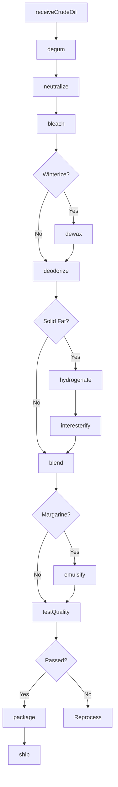
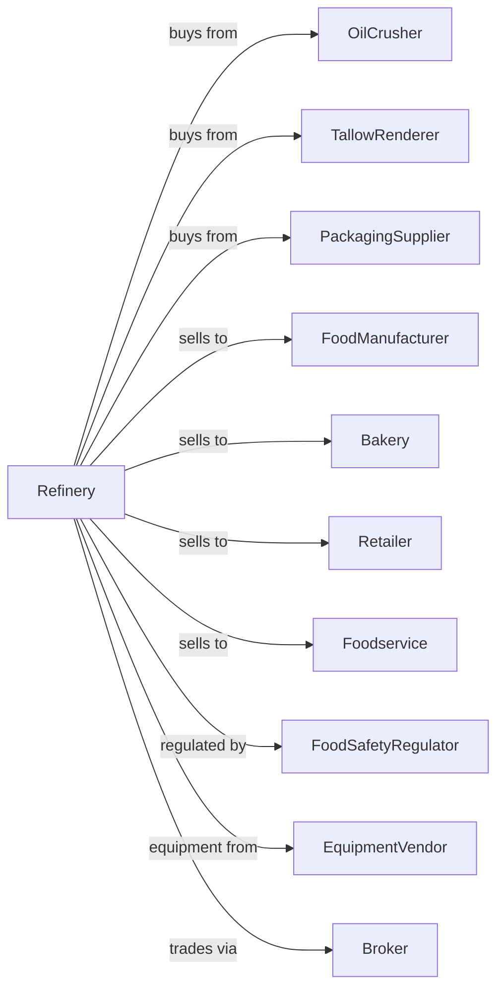

# Fats and Oils Refining and Blending

> Business-as-Code definition for edible oil refining and margarine manufacturing. Models crude oil refining, bleaching, deodorizing, and blending into shortenings, margarines, and cooking oils.

## Overview

This U.S. industry comprises establishments primarily engaged in manufacturing shortening and margarine from purchased fats and oils, refining and/or blending vegetable, oilseed, and tree nut oils from purchased oils, and blending purchased animal fats with purchased vegetable fats. This definition exposes actions for degumming, neutralizing, bleaching, deodorizing, and formulating finished products.

## Actors

| Actor | Description |
|-------|-------------|
| OilCrusher | Supplies crude vegetable oils |
| TallowRenderer | Provides animal fats for blending |
| PackagingSupplier | Supplies bottles, tubs, and flexible packaging |
| FoodManufacturer | Purchases oils and fats for food production |
| Bakery | Uses shortening in baked goods |
| Retailer | Sells branded cooking oils and margarines |
| Foodservice | Purchases frying oils for restaurants |
| FoodSafetyRegulator | Regulates food safety and labeling |
| EquipmentVendor | Supplies refining and packaging equipment |
| Broker | Facilitates oil trading and logistics |

## Roles

| Role | Description |
|------|-------------|
| PlantManager | Oversees refining operations |
| ProcessEngineer | Optimizes refining and blending processes |
| QualityManager | Ensures product safety and specifications |
| RefineryOperator | Controls degumming, bleaching, and deodorizing |
| BlendOperator | Formulates oil and fat blends |
| PackagingOperator | Runs filling and labeling lines |
| ProductDeveloper | Creates new blends and formulations |
| ProcurementManager | Sources crude oils and fats |

## Entities

| Entity | Description |
|--------|-------------|
| CrudeOil | Unrefined vegetable or seed oil |
| RefinedOil | Purified oil after refining steps |
| Shortening | Solid fat for baking applications |
| Margarine | Butter substitute with emulsifiers |
| CookingOil | Liquid oil for consumer and foodservice |
| FryingOil | Oil formulated for deep frying |
| Blend | Custom mixture of oils and fats |
| Specification | Customer requirements for oil properties |
| Batch | Traceable lot through production |
| Certificate | Quality analysis for customer shipments |

## Actions

| Action | Description |
|--------|-------------|
| receiveCrudeOil | Accept and test incoming crude oil |
| degum | Remove phospholipids with water or acid |
| neutralize | Remove free fatty acids with alkali |
| bleach | Adsorb color bodies with bleaching earth |
| dewax | Remove waxes for clear appearance |
| deodorize | Steam distill to remove odors and flavors |
| hydrogenate | Add hydrogen to increase solid fat content |
| interesterify | Rearrange fatty acids for functionality |
| fractionate | Separate oil into liquid and solid fractions |
| blend | Combine oils to meet specifications |
| emulsify | Add emulsifiers for margarine production |
| package | Fill containers and label products |
| testQuality | Analyze for color, FFA, and stability |
| ship | Deliver products to customers |

## Events

| Event | Description |
|-------|-------------|
| crudeOilReceived | Crude oil tested and accepted |
| oilDegummed | Phospholipids removed |
| oilNeutralized | Free fatty acids removed |
| oilBleached | Color reduced to specification |
| oilDeodorized | Flavors and odors removed |
| oilHydrogenated | Solid fat content increased |
| blendCreated | Custom blend formulated |
| productPackaged | Finished product filled and labeled |
| qualityApproved | Product met specifications |
| qualityFailed | Product failed testing |
| orderShipped | Product dispatched to customer |
| formulaApproved | New blend approved for production |

## Searches

| Search | Description |
|--------|-------------|
| findCrudeOilLots | List crude oil inventory by type and quality |
| getRefinedInventory | Check refined oil stock |
| getBlends | List available blend formulations |
| getOrders | Retrieve orders by customer or product |
| getQualityReports | Retrieve product analysis certificates |
| getProductionSchedule | View planned batches |
| findCustomers | List customers by product type |
| getMarketPrices | Retrieve oil commodity prices |

## Workflow



## Actor Relationships



## Usage

### Calling Actions

```typescript
import { millFatsOils } from '@headlessly/mill-fats-oils'

const refinery = millFatsOils()

// Check crude oil inventory by type
const crudeStock = await refinery.findCrudeOilLots({ type: 'soybeanOil', maxFFA: 1.0 })

// Review blend formulations
const blends = await refinery.getBlends({ product: 'fryingOil' })

// Receive crude soybean oil
const crude = await refinery.receiveCrudeOil({
  source: 'crusher-midwest',
  type: 'soybeanOil',
  quantity: 100000,
  unit: 'pounds',
  ffa: 0.8,
  phosphorus: 150
})

// Refine through standard process
await refinery.degum({
  lotId: crude.lotId,
  method: 'water',
  waterRate: 3
})

await refinery.neutralize({
  lotId: crude.lotId,
  alkaliStrength: 12,
  targetFFA: 0.05
})

await refinery.bleach({
  lotId: crude.lotId,
  earthDosage: 1.5,
  targetColor: 0.5
})

await refinery.deodorize({
  lotId: crude.lotId,
  temperature: 450,
  vacuum: 3,
  duration: 90
})
```

### Event-Driven Automation

```typescript
// Auto-blend after deodorizing
refinery.oilDeodorized(async ({ lotId, oilType, quality }) => {
  const orders = await refinery.getOrders({
    product: 'fryingOil',
    status: 'pending'
  })

  if (orders.length > 0) {
    await refinery.blend({
      components: [
        { lotId, percentage: 70 },
        { type: 'highOleicSunflower', percentage: 30 }
      ],
      targetOxidativeStability: 25
    })
  }
})

// Quality control automation
refinery.qualityFailed(async ({ lotId, parameter, value, specification }) => {
  if (parameter === 'color' && value > specification * 1.2) {
    await refinery.bleach({
      lotId,
      earthDosage: 2.0,
      reprocess: true
    })
  }
})
```
