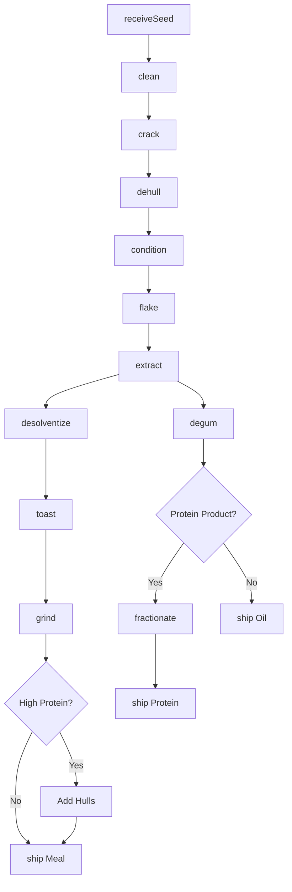
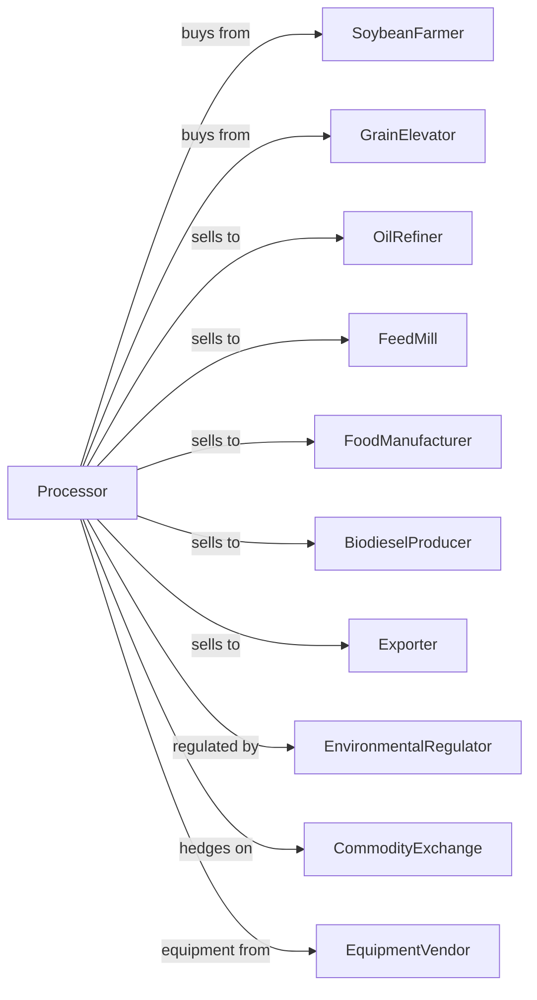

# Soybean and Other Oilseed Processing

> Business-as-Code definition for oilseed crushing operations. Models soybean, canola, and sunflower processing into crude oil, meal, protein concentrates, and lecithin through extraction and separation.

## Overview

This U.S. industry comprises establishments primarily engaged in crushing oilseeds and tree nuts, such as soybeans, cottonseeds, linseeds, peanuts, and sunflower seeds. Examples of products produced in these establishments are oilseed oils, cakes, meals, and protein isolates and concentrates. This definition exposes actions for seed conditioning, solvent extraction, meal processing, and protein fractionation.

## Actors

| Actor | Description |
|-------|-------------|
| SoybeanFarmer | Produces soybeans for crushing |
| GrainElevator | Stores and delivers oilseeds |
| OilRefiner | Purchases crude oil for refining |
| FeedMill | Purchases soybean meal for animal feed |
| FoodManufacturer | Uses protein and lecithin in food products |
| BiodieselProducer | Purchases soybean oil for biofuel |
| Exporter | Ships meal and oil to international markets |
| EnvironmentalRegulator | Regulates solvent emissions and waste |
| CommodityExchange | Provides price discovery and hedging |
| EquipmentVendor | Supplies extraction and processing equipment |

## Roles

| Role | Description |
|------|-------------|
| PlantManager | Oversees crushing operations |
| ProcessEngineer | Optimizes extraction and processing efficiency |
| QualityManager | Ensures product specifications and safety |
| ExtractionOperator | Controls solvent extraction system |
| MealOperator | Operates desolventizer-toaster and grinders |
| GrainBuyer | Procures oilseeds and manages inventory |
| EnvironmentalManager | Manages solvent recovery and emissions |
| SalesManager | Manages customer contracts and logistics |

## Entities

| Entity | Description |
|--------|-------------|
| Soybean | Whole oilseed as received from farm |
| Flake | Conditioned and rolled soybean for extraction |
| Miscella | Oil-solvent mixture from extractor |
| CrudeOil | Unrefined oil after solvent removal |
| WhiteFlake | Defatted flakes after extraction |
| Meal | Ground protein-rich byproduct for feed |
| Hulls | Seed coat separated during conditioning |
| Lecithin | Phospholipid emulsifier from degumming |
| ProteinConcentrate | High-protein product for food use |
| ProteinIsolate | Purified protein for specialty applications |

## Actions

| Action | Description |
|--------|-------------|
| receiveSeed | Accept and test incoming oilseed shipments |
| clean | Remove foreign material and damaged seeds |
| crack | Break seeds into smaller pieces |
| dehull | Separate hulls from seed meats |
| condition | Heat and add moisture to prepare for flaking |
| flake | Roll conditioned seeds into thin flakes |
| extract | Remove oil using hexane solvent |
| desolventize | Remove solvent from extracted flakes |
| toast | Heat treat meal to improve digestibility |
| grind | Mill meal to target particle size |
| degum | Remove phospholipids from crude oil |
| refine | Process oil to remove impurities |
| fractionate | Produce protein concentrates or isolates |
| ship | Deliver products to customers |

## Events

| Event | Description |
|-------|-------------|
| seedReceived | Oilseed shipment tested and accepted |
| seedConditioned | Seeds prepared for flaking |
| flakesProduced | Seeds rolled into extraction-ready flakes |
| oilExtracted | Crude oil separated from flakes |
| mealDesolventized | Solvent removed from white flakes |
| mealToasted | Meal heat treated and ready for grinding |
| mealGround | Meal processed to specification |
| oilDegummed | Lecithin separated from crude oil |
| productShipped | Product dispatched to customer |
| qualityApproved | Product met specifications |
| priceHedged | Futures position established |
| inventoryDepleted | Stock fell below threshold |

## Searches

| Search | Description |
|--------|-------------|
| findSeedLots | List oilseed inventory by variety and quality |
| getOilInventory | Check crude oil stock and quality |
| getMealInventory | Check meal stock by protein and specification |
| getOrders | Retrieve orders by customer or product |
| getExtractionYields | View oil and meal yields by batch |
| getQualityReports | Retrieve product analysis certificates |
| getMarketPrices | Retrieve soybean, oil, and meal prices |
| getHedgePositions | View futures and basis positions |

## Workflow



## Actor Relationships



## Usage

### Calling Actions

```typescript
import { millSoybean } from '@headlessly/mill-soybean'

const crusher = millSoybean()

// Check current seed inventory and oil yields
const seedStock = await crusher.findSeedLots({ variety: 'soybean', oilContentMin: 19.0 })

// Review market prices for crush margin calculation
const prices = await crusher.getMarketPrices()

// Receive soybeans
const beans = await crusher.receiveSeed({
  source: 'elevator-iowa',
  variety: 'soybean',
  quantity: 60000,
  unit: 'bushels',
  moisture: 13.0,
  oilContent: 19.5
})

// Process through extraction
await crusher.clean({ lotId: beans.lotId })
await crusher.crack({ lotId: beans.lotId })
await crusher.dehull({ lotId: beans.lotId })
await crusher.condition({
  lotId: beans.lotId,
  targetMoisture: 11,
  temperature: 160
})
await crusher.flake({
  lotId: beans.lotId,
  thickness: 0.3
})
await crusher.extract({
  lotId: beans.lotId,
  solvent: 'hexane',
  extractionTime: 90
})
```

### Event-Driven Automation

```typescript
// Auto-process meal after extraction
crusher.oilExtracted(async ({ lotId, oilYield }) => {
  await crusher.desolventize({ lotId })
  await crusher.toast({
    lotId,
    temperature: 220,
    duration: 30
  })
  await crusher.grind({
    lotId,
    targetProtein: 47.5
  })
})

// Hedge based on crush margin
crusher.seedReceived(async ({ lotId, quantity }) => {
  const prices = await crusher.getMarketPrices()
  const crushMargin = (prices.meal * 0.44 + prices.oil * 11) - prices.soybeans

  if (crushMargin > 1.50) {
    await crusher.priceHedged({
      lotId,
      hedgeRatio: 0.75,
      products: ['meal', 'oil']
    })
  }
})
```
