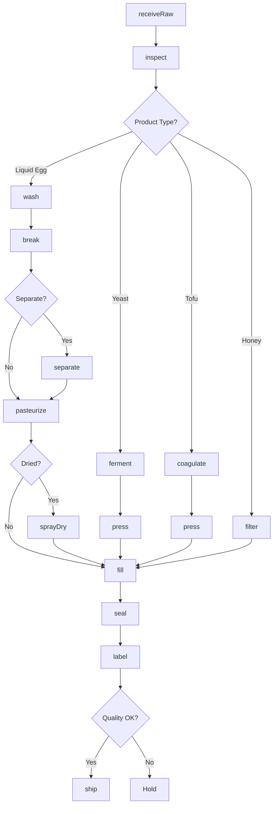
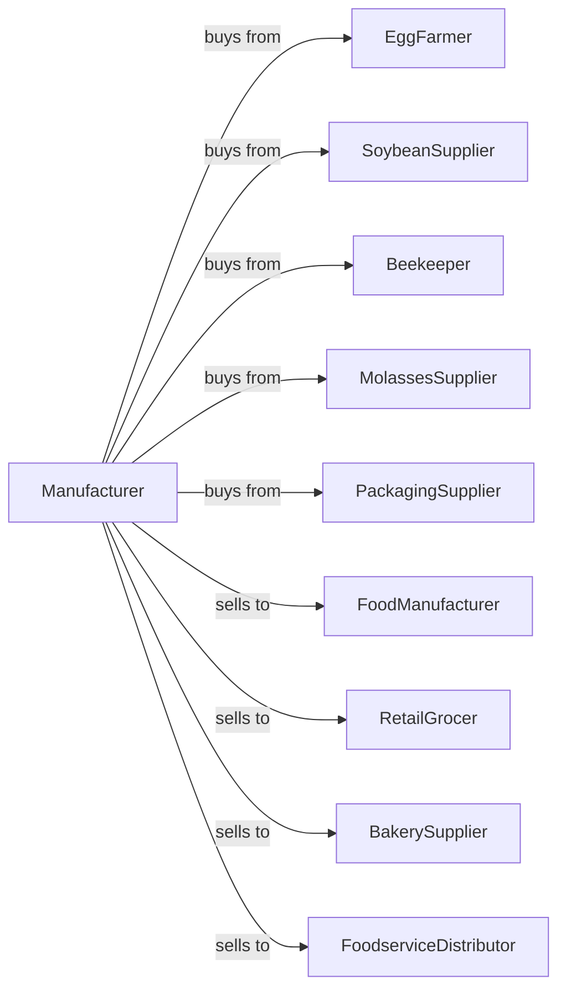

# All Other Miscellaneous Food Manufacturing

> Business-as-Code definition for miscellaneous food manufacturing. Models production of egg products, yeast, tofu, honey, molasses, tortillas chips from purchased tortillas, and other specialty food products not classified elsewhere.

## Overview

This U.S. industry comprises establishments primarily engaged in manufacturing food (except animal food; grain and oilseed milling; sugar and confectionery products; preserved fruits, vegetables, and specialties; dairy products; meat products; seafood products; bakeries and tortillas; snack foods; coffee and tea; flavoring syrups and concentrates; seasonings and dressings; and perishable prepared food). This includes egg processing, yeast, tofu, honey packaging, and specialty ingredients.

## Actors

| Actor | Description |
|-------|-------------|
| EggFarmer | Supplies shell eggs for processing |
| SoybeanSupplier | Provides soybeans for tofu production |
| Beekeeper | Supplies raw honey |
| MolassesSupplier | Provides molasses for packaging |
| PackagingSupplier | Supplies containers and films |
| FoodManufacturer | Uses ingredients in food production |
| RetailGrocer | Purchases consumer food products |
| BakerySupplier | Buys yeast and egg products |
| FoodserviceDistributor | Supplies restaurants and institutions |

## Roles

| Role | Description |
|------|-------------|
| PlantManager | Oversees daily manufacturing operations |
| ProcessingOperator | Runs specialty processing equipment |
| QualityManager | Ensures product safety and specifications |
| LabTechnician | Tests product composition and safety |
| PackagingOperator | Operates filling and sealing lines |
| FermentationTechnician | Manages yeast cultivation |
| PasteurizationOperator | Runs egg pasteurization equipment |
| WarehousingManager | Manages storage and inventory |

## Entities

| Entity | Description |
|--------|-------------|
| ShellEgg | Whole eggs in shell |
| LiquidEgg | Pasteurized whole egg product |
| EggWhite | Separated albumen product |
| EggYolk | Separated yolk product |
| DriedEgg | Spray-dried egg powder |
| Yeast | Cultivated leavening agent |
| Tofu | Soybean curd product |
| Honey | Packaged bee product |
| Molasses | Refined sugar byproduct |
| Batch | Traceable production lot |

## Actions

| Action | Description |
|--------|-------------|
| receiveRaw | Accept raw materials |
| inspect | Check quality and grade |
| wash | Clean shell eggs |
| break | Separate eggs from shells |
| separate | Divide whites from yolks |
| pasteurize | Heat treat for safety |
| homogenize | Create uniform texture |
| sprayDry | Convert liquid to powder |
| ferment | Cultivate yeast cells |
| coagulate | Form tofu from soy milk |
| press | Remove water from tofu |
| filter | Clarify honey |
| fill | Package into containers |
| seal | Close containers |
| label | Apply product labels |
| ship | Dispatch to customers |

## Events

| Event | Description |
|-------|-------------|
| rawReceived | Raw materials accepted |
| productInspected | Quality verified |
| eggsBroken | Shell separation completed |
| eggsSeparated | Whites and yolks divided |
| productPasteurized | Heat treatment completed |
| productDried | Spray drying completed |
| yeastFermented | Cultivation completed |
| tofuCoagulated | Curd formed |
| tofuPressed | Water removed |
| productFilled | Packaging completed |
| qualityApproved | Batch passed testing |
| orderShipped | Products dispatched |

## Searches

| Search | Description |
|--------|-------------|
| getRawInventory | Check incoming material stock |
| getBatches | List active production batches |
| getByProduct | Find inventory by product type |
| getOrders | Retrieve orders by customer |
| getQualityResults | View test results |
| getYieldData | Review production yields |
| getExpirations | List products by expiration date |
| getProductionSchedule | View manufacturing schedule |

## Workflow



## Actor Relationships



## Usage

### Calling Actions

```typescript
import { manufactureFood } from '@headlessly/manufacture-food'

const plant = manufactureFood()

// Review current status
const status = await plant.getRawInventory()

// Review production data
const data = await plant.getBatches()

// Process liquid whole egg
const eggs = await plant.receiveRaw({
  supplier: 'midwest-egg-farm',
  product: 'shell-eggs',
  quantity: 50000,
  unit: 'dozen',
  grade: 'AA'
})

await plant.inspect({
  batchId: eggs.batchId,
  checks: ['candling', 'weight', 'shell-quality']
})

await plant.wash({
  batchId: eggs.batchId,
  method: 'spray-wash',
  sanitizer: 'chlorinated',
  temperature: 110
})

await plant.break({
  batchId: eggs.batchId,
  method: 'automated-breaker',
  shellDestination: 'calcium-processing'
})

await plant.pasteurize({
  batchId: eggs.batchId,
  temperature: 140,
  holdTime: 3.5,
  unit: 'minutes'
})

await plant.fill({
  batchId: eggs.batchId,
  format: 'bag-in-box',
  volume: 30,
  unit: 'pounds'
})
```

### Event-Driven Automation

```typescript
// Auto-separate for specialty products
plant.eggsBroken(async ({ batchId, productSpec }) => {
  if (productSpec === 'whites-only' || productSpec === 'yolks-only') {
    await plant.separate({
      batchId,
      whitesDestination: productSpec === 'whites-only' ? 'primary' : 'secondary',
      yolksDestination: productSpec === 'yolks-only' ? 'primary' : 'secondary'
    })
  }
})

// Auto-spray-dry for powder products
plant.productPasteurized(async ({ batchId, productType }) => {
  if (productType === 'dried-egg') {
    await plant.sprayDry({
      batchId,
      inletTemp: 180,
      outletTemp: 85,
      targetMoisture: 5,
      unit: 'percent'
    })
  }
})

// Quality monitoring
plant.productInspected(async ({ batchId, grade, defects }) => {
  if (defects > 5) {
    await plant.alertQuality({
      batchId,
      issue: `Defect rate ${defects}% exceeds 5% threshold`,
      action: 'evaluate-supplier-quality'
    })
  }
})
```
