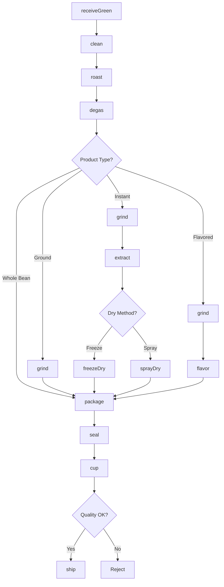
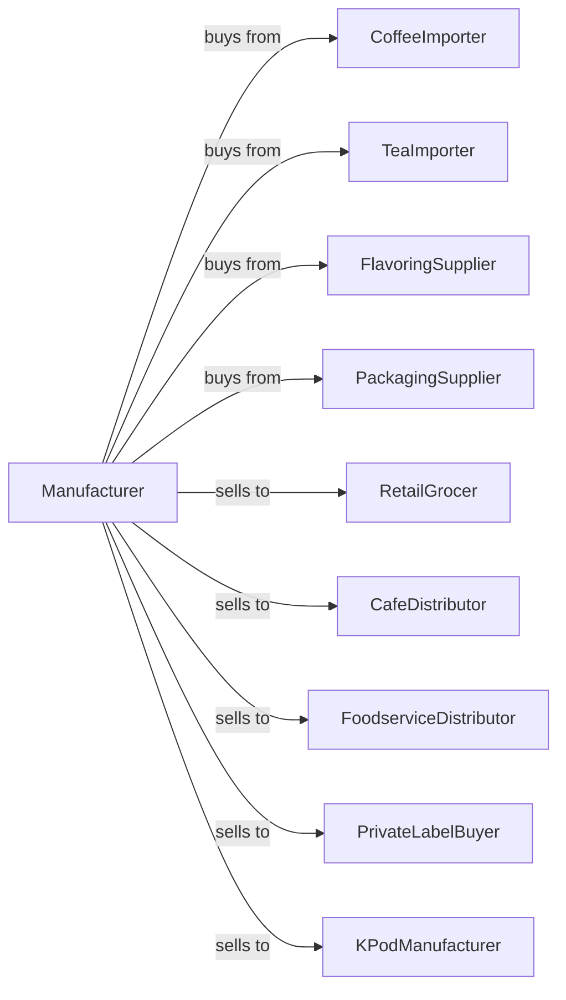

# Coffee and Tea Manufacturing

> Business-as-Code definition for coffee and tea manufacturing operations. Models roasting, grinding, blending, and packaging of coffee beans, plus blending and packaging of tea products.

## Overview

This industry comprises establishments primarily engaged in one or more of the following: (1) roasting coffee; (2) manufacturing coffee and tea concentrates (including instant and freeze-dried); (3) blending tea; (4) manufacturing herbal tea; and (5) manufacturing coffee extracts, flavorings, and syrups. This definition exposes actions for sourcing, roasting, grinding, blending, and packaging.

## Actors

| Actor | Description |
|-------|-------------|
| CoffeeImporter | Supplies green coffee beans |
| TeaImporter | Provides tea leaves from origin |
| FlavoringSupplier | Supplies syrups and flavorings |
| PackagingSupplier | Provides bags, cans, and pods |
| RetailGrocer | Purchases packaged coffee and tea |
| CafeDistributor | Supplies coffee shops and roasters |
| FoodserviceDistributor | Distributes to restaurants |
| PrivateLabelBuyer | Contracts store-brand production |
| KPodManufacturer | Purchases ground coffee for pods |

## Roles

| Role | Description |
|------|-------------|
| PlantManager | Oversees daily manufacturing operations |
| MasterRoaster | Develops roast profiles and quality |
| GreenBuyer | Sources and evaluates green coffee |
| TeaBlender | Creates tea blends and formulations |
| RoasterOperator | Runs roasting equipment |
| GrindingOperator | Controls grind size and consistency |
| PackagingOperator | Operates filling and sealing lines |
| QualityTechnician | Cups and evaluates product quality |

## Entities

| Entity | Description |
|--------|-------------|
| GreenCoffee | Unroasted coffee beans |
| RoastedCoffee | Heat-treated coffee beans |
| GroundCoffee | Milled roasted coffee |
| InstantCoffee | Soluble coffee concentrate |
| TeaLeaf | Processed tea leaves |
| TeaBlend | Mixed tea formulation |
| HerbalTea | Caffeine-free herbal infusion |
| RoastProfile | Time and temperature curve |
| Batch | Traceable production lot |
| CupScore | Quality evaluation rating |

## Actions

| Action | Description |
|--------|-------------|
| receiveGreen | Accept green coffee shipments |
| receiveTea | Accept tea leaf shipments |
| clean | Remove defects and foreign matter |
| roast | Apply heat to develop flavor |
| degas | Allow CO2 release after roasting |
| grind | Mill to specified particle size |
| blend | Combine origins or varieties |
| extract | Brew for instant coffee production |
| freezeDry | Sublimate water from extract |
| sprayDry | Dry extract into powder |
| flavor | Add syrups or essences |
| package | Fill bags, cans, or pods |
| seal | Close with one-way valves |
| cup | Evaluate quality through tasting |
| ship | Dispatch to customers |

## Events

| Event | Description |
|-------|-------------|
| greenReceived | Green coffee accepted |
| teaReceived | Tea leaves accepted |
| coffeeRoasted | Roasting completed |
| coffeeDegassed | Outgassing period completed |
| coffeeGround | Grinding completed |
| teaBlended | Blending completed |
| coffeeExtracted | Brewing for instant completed |
| productDried | Instant coffee dried |
| productFlavored | Flavoring added |
| productPackaged | Filling completed |
| qualityApproved | Cup score passed |
| orderShipped | Products dispatched |

## Searches

| Search | Description |
|--------|-------------|
| getGreenInventory | Check green coffee stock by origin |
| getTeaInventory | Check tea leaf inventory |
| getRoastQueue | View roasting schedule |
| getBlends | List blend formulations |
| getRoastProfiles | View roasting specifications |
| getInventory | Check finished goods stock |
| getOrders | Retrieve orders by customer |
| getCupScores | View quality evaluations |

## Workflow



## Actor Relationships



## Usage

### Calling Actions

```typescript
import { roastCoffeeTea } from '@headlessly/roast-coffee-tea'

const roaster = roastCoffeeTea()

// Check green coffee inventory by origin
const greenStock = await roaster.getGreenInventory({ origin: 'colombia', minCupScore: 82 })

// Review roasting schedule
const queue = await roaster.getRoastQueue({ date: 'today' })

// Roast Colombian coffee
const green = await roaster.receiveGreen({
  origin: 'colombia-huila',
  quantity: 5000,
  unit: 'pounds',
  cupScore: 84
})

await roaster.clean({
  batchId: green.batchId,
  method: 'destoner'
})

await roaster.roast({
  batchId: green.batchId,
  profile: 'medium-city',
  targetTemp: 430,
  duration: 12,
  unit: 'minutes'
})

await roaster.degas({
  batchId: green.batchId,
  duration: 24,
  unit: 'hours'
})

await roaster.grind({
  batchId: green.batchId,
  grindSize: 'drip',
  particleSize: 750,
  unit: 'microns'
})
```

### Event-Driven Automation

```typescript
// Auto-degas after roasting
roaster.coffeeRoasted(async ({ batchId, roastLevel }) => {
  const degasTime = roastLevel === 'dark' ? 48 : 24

  await roaster.degas({
    batchId,
    duration: degasTime,
    unit: 'hours'
  })
})

// Auto-package after degassing
roaster.coffeeDegassed(async ({ batchId, productType }) => {
  if (productType === 'whole-bean') {
    await roaster.package({
      batchId,
      format: 'bag-with-valve',
      size: 12,
      unit: 'oz'
    })
  } else {
    await roaster.grind({ batchId })
  }
})

// Quality check before shipping
roaster.productPackaged(async ({ batchId }) => {
  const score = await roaster.cup({
    batchId,
    cuppers: 3
  })

  if (score.average < 80) {
    await roaster.alertQuality({
      batchId,
      score: score.average,
      action: 'hold-for-review'
    })
  }
})
```
