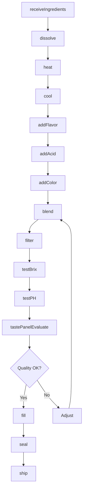
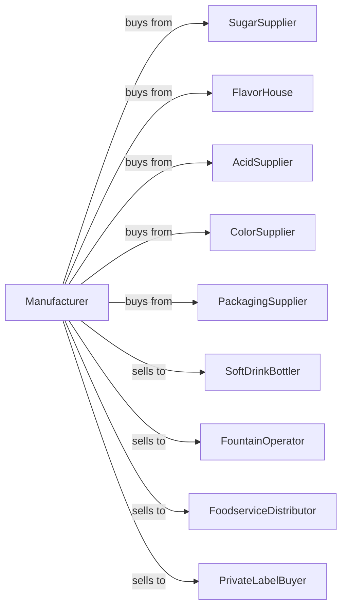

# Flavoring Syrup and Concentrate Manufacturing

> Business-as-Code definition for flavoring syrup and concentrate manufacturing. Models production of soft drink syrups, fountain concentrates, and flavoring bases through blending, dissolving, and packaging operations.

## Overview

This industry comprises establishments primarily engaged in manufacturing flavoring syrup drink concentrates and related products for soda fountain use or for the manufacture of soft drinks. This definition exposes actions for ingredient blending, syrup cooking, quality testing, and bulk packaging.

## Actors

| Actor | Description |
|-------|-------------|
| SugarSupplier | Provides sugar and sweeteners |
| FlavorHouse | Supplies flavor compounds and extracts |
| AcidSupplier | Provides citric and phosphoric acids |
| ColorSupplier | Supplies natural and artificial colors |
| PackagingSupplier | Provides drums, bags-in-box, and tanks |
| SoftDrinkBottler | Purchases concentrates for bottling |
| FountainOperator | Uses syrups in dispensing equipment |
| FoodserviceDistributor | Supplies restaurants and venues |
| PrivateLabelBuyer | Contracts branded concentrate production |

## Roles

| Role | Description |
|------|-------------|
| PlantManager | Oversees daily manufacturing operations |
| FlavorChemist | Develops and maintains flavor formulations |
| BlendingOperator | Combines ingredients to specification |
| CookingOperator | Heats and dissolves sugar syrups |
| QualityTechnician | Tests sweetness, pH, and flavor profile |
| PackagingOperator | Operates filling and sealing equipment |
| WarehouseManager | Manages bulk storage and shipping |
| RegulatoryManager | Ensures ingredient compliance |

## Entities

| Entity | Description |
|--------|-------------|
| Sugar | Sweetener base for syrups |
| FlavorCompound | Concentrated flavor essence |
| Acid | pH modifier and preservative |
| Colorant | Visual appearance ingredient |
| SimpleSyrup | Dissolved sugar base |
| Concentrate | Finished flavoring product |
| QualitySpec | Target ranges for sweetness, pH, and flavor |
| Formula | Proprietary recipe specification |
| Batch | Traceable production lot |
| BagInBox | Packaging format for fountain use |

## Actions

| Action | Description |
|--------|-------------|
| receiveIngredients | Accept raw materials |
| dissolve | Create simple syrup from sugar |
| heat | Cook syrup to dissolve solids |
| cool | Reduce temperature after cooking |
| addFlavor | Incorporate flavor compounds |
| addAcid | Adjust pH to specification |
| addColor | Incorporate colorants |
| blend | Mix all components thoroughly |
| filter | Remove particulates |
| testBrix | Measure sugar concentration |
| testPH | Verify acidity level |
| tastePanelEvaluate | Sensory quality assessment |
| fill | Package into containers |
| seal | Close packages for shipment |
| ship | Dispatch to customers |

## Events

| Event | Description |
|-------|-------------|
| ingredientsReceived | Raw materials accepted |
| syrupDissolved | Sugar solution created |
| syrupCooked | Heating completed |
| syrupCooled | Temperature stabilized |
| flavorAdded | Flavoring incorporated |
| acidAdded | pH adjusted |
| colorAdded | Colorant incorporated |
| batchBlended | Mixing completed |
| batchFiltered | Filtration completed |
| qualityApproved | Batch passed testing |
| qualityFailed | Batch out of specification |
| productFilled | Packaging completed |
| orderShipped | Products dispatched |

## Searches

| Search | Description |
|--------|-------------|
| getIngredients | Check raw material inventory |
| getBatches | List active batches |
| getFormulas | View concentrate recipes |
| getBrixHistory | Review sugar level data |
| getPHHistory | Review acidity data |
| getInventory | Check finished goods stock |
| getOrders | Retrieve orders by customer |
| getProductionSchedule | View blending schedule |

## Workflow



## Actor Relationships



## Usage

### Calling Actions

```typescript
import { manufactureFlavoringSyrup } from '@headlessly/manufacture-flavoring-syrup'

const plant = manufactureFlavoringSyrup()

// Check raw material inventory
const ingredients = await plant.getIngredients({ category: 'sweeteners', lowStockOnly: true })

// Review pending bottler orders
const orders = await plant.getOrders({ customer: 'bottler', status: 'pending' })

// Produce cola concentrate
const batch = await plant.dissolve({
  formula: 'cola-classic',
  sugar: 5000,
  water: 3000,
  unit: 'pounds'
})

await plant.heat({
  batchId: batch.batchId,
  temperature: 180,
  duration: 30,
  unit: 'minutes'
})

await plant.cool({
  batchId: batch.batchId,
  targetTemp: 70,
  unit: 'fahrenheit'
})

await plant.addFlavor({
  batchId: batch.batchId,
  flavorCode: 'COLA-7X',
  quantity: 50,
  unit: 'pounds'
})

await plant.addAcid({
  batchId: batch.batchId,
  acidType: 'phosphoric',
  targetPH: 2.5
})

await plant.blend({
  batchId: batch.batchId,
  duration: 15,
  unit: 'minutes'
})
```

### Event-Driven Automation

```typescript
// Auto-test after blending
plant.batchBlended(async ({ batchId }) => {
  await plant.filter({ batchId, meshSize: 100 })

  const brix = await plant.testBrix({ batchId })
  const ph = await plant.testPH({ batchId })

  if (brix.value >= 65 && ph.value <= 2.6) {
    await plant.tastePanelEvaluate({
      batchId,
      panelists: 5
    })
  }
})

// Auto-fill after quality approval
plant.qualityApproved(async ({ batchId, customer }) => {
  const format = customer === 'bottler' ? 'bulk-tank' : 'bag-in-box'

  await plant.fill({
    batchId,
    format,
    volume: format === 'bulk-tank' ? 5000 : 5,
    unit: 'gallons'
  })
})

// Alert on quality failure
plant.qualityFailed(async ({ batchId, parameter, value, spec }) => {
  await plant.alertQuality({
    batchId,
    issue: `${parameter} at ${value}, spec is ${spec}`,
    action: 'blend-adjustment-required'
  })
})
```
