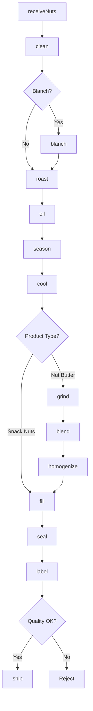
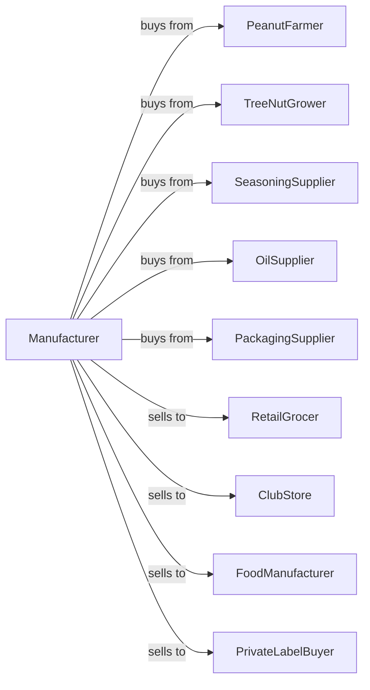

# Roasted Nuts and Peanut Butter Manufacturing

> Business-as-Code definition for roasted nuts and nut butter manufacturing. Models roasting, salting, flavoring, and packaging of tree nuts and peanuts, plus grinding and blending for peanut butter production.

## Overview

This U.S. industry comprises establishments primarily engaged in one or more of the following: (1) salting, roasting, drying, cooking, or canning nuts; (2) processing grains or seeds into snacks; and (3) manufacturing peanut butter and other nut butters. This definition exposes actions for cleaning, roasting, seasoning, grinding, and packaging nut products.

## Actors

| Actor | Description |
|-------|-------------|
| PeanutFarmer | Supplies raw peanuts |
| TreeNutGrower | Provides almonds, cashews, and walnuts |
| SeasoningSupplier | Supplies salt, spices, and coatings |
| OilSupplier | Provides oils for roasting and butter |
| PackagingSupplier | Supplies jars, cans, and bags |
| RetailGrocer | Purchases packaged nuts and butters |
| ClubStore | Orders bulk nut containers |
| FoodManufacturer | Uses nuts as ingredients |
| PrivateLabelBuyer | Contracts store-brand production |

## Roles

| Role | Description |
|------|-------------|
| PlantManager | Oversees daily nut processing operations |
| RoasterOperator | Runs roasting ovens and drums |
| SeasoningOperator | Applies salt and flavorings |
| GrindingOperator | Runs peanut butter mills |
| BlendingOperator | Mixes nut butter formulations |
| PackagingOperator | Operates filling and sealing lines |
| QualityTechnician | Tests moisture, texture, and flavor |
| AllergenCoordinator | Manages allergen controls |

## Entities

| Entity | Description |
|--------|-------------|
| RawNut | Unprocessed peanuts or tree nuts |
| BlanchedNut | Skinless nut after blanching |
| RoastedNut | Heat-treated nut product |
| SeasonedNut | Salted or flavored nut |
| PeanutButter | Ground peanut spread |
| AlmondButter | Ground almond spread |
| NutMix | Blended variety pack |
| Batch | Traceable production lot |
| RoastProfile | Time and temperature specification |
| AllergenLabel | Required allergy warning |

## Actions

| Action | Description |
|--------|-------------|
| receiveNuts | Accept raw nuts from suppliers |
| clean | Remove debris and foreign material |
| blanch | Remove skins with heat or water |
| roast | Apply heat to develop flavor |
| oil | Apply oil coating for texture |
| season | Add salt, spices, or coatings |
| cool | Reduce temperature after roasting |
| grind | Mill nuts into butter |
| blend | Mix with oils, salt, and sweeteners |
| homogenize | Create smooth butter texture |
| fill | Dispense into jars, cans, or bags |
| seal | Close packages for freshness |
| label | Apply product and allergen labels |
| ship | Dispatch to customers |

## Events

| Event | Description |
|-------|-------------|
| nutsReceived | Raw materials accepted |
| nutsCleaned | Cleaning completed |
| nutsBlanched | Skins removed |
| nutsRoasted | Roasting completed |
| nutsSeasoned | Flavoring applied |
| nutsCooled | Temperature reduced |
| nutsGround | Grinding completed |
| butterBlended | Formulation mixed |
| productFilled | Packaging completed |
| productSealed | Containers closed |
| qualityApproved | Batch passed testing |
| orderShipped | Products dispatched |

## Searches

| Search | Description |
|--------|-------------|
| getRawNuts | Check raw nut inventory |
| getRoastSchedule | View roasting queue |
| getInventory | Check finished goods stock |
| getOrders | Retrieve orders by customer |
| getRecipes | List butter formulations |
| getRoastProfiles | View roasting specifications |
| getQualityData | Access test results |
| getAllergenStatus | Check allergen line clearance |

## Workflow



## Actor Relationships



## Usage

### Calling Actions

```typescript
import { manufactureRoastedNuts } from '@headlessly/manufacture-roasted-nuts'

const plant = manufactureRoastedNuts()

// Review current status
const status = await plant.getRawNuts()

// Review production data
const data = await plant.getRoastSchedule()

// Produce roasted salted peanuts
const nuts = await plant.receiveNuts({
  supplier: 'georgia-peanut-co',
  variety: 'virginia-peanuts',
  quantity: 20000,
  unit: 'pounds'
})

await plant.clean({
  batchId: nuts.batchId,
  method: 'air-screen'
})

await plant.blanch({
  batchId: nuts.batchId,
  method: 'dry-heat',
  temperature: 280
})

await plant.roast({
  batchId: nuts.batchId,
  temperature: 320,
  duration: 25,
  unit: 'minutes',
  oilType: 'peanut-oil'
})

await plant.season({
  batchId: nuts.batchId,
  seasoning: 'salt',
  rate: 2,
  unit: 'percent'
})
```

### Event-Driven Automation

```typescript
// Auto-cool after roasting
plant.nutsRoasted(async ({ batchId }) => {
  await plant.cool({
    batchId,
    targetTemp: 90,
    unit: 'fahrenheit'
  })
})

// Route to grinding for butter products
plant.nutsCooled(async ({ batchId, productType }) => {
  if (productType === 'peanut-butter') {
    await plant.grind({
      batchId,
      grindStage: 'coarse',
      targetParticle: 'smooth'
    })
  }
})

// Auto-label with allergen warnings
plant.productSealed(async ({ batchId, nutType }) => {
  await plant.label({
    batchId,
    allergenWarning: `Contains ${nutType}`,
    facility: 'processes-tree-nuts'
  })
})
```
