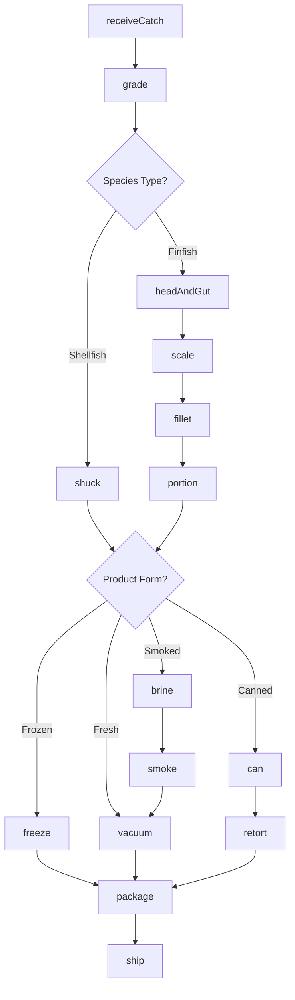
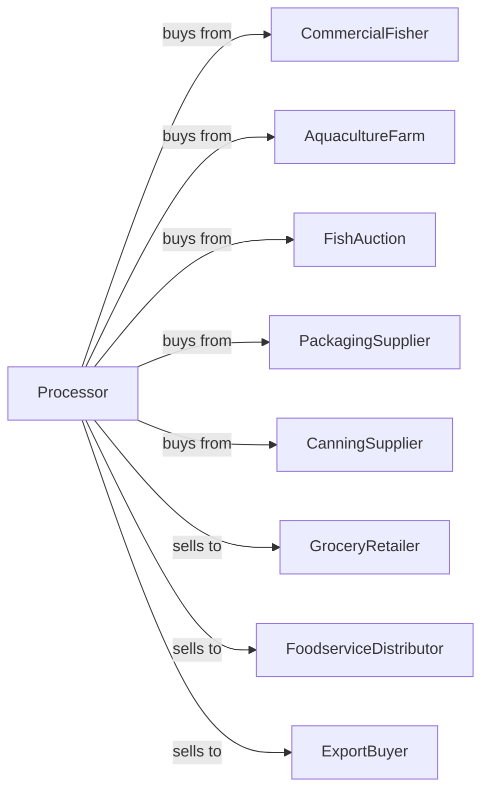

# Seafood Product Preparation and Packaging

> Business-as-Code definition for seafood processing operations. Models receiving catch, filleting, smoking, freezing, canning, and packaging of fish, shellfish, and other marine products.

## Overview

This industry comprises establishments primarily engaged in one or more of the following: (1) canning seafood (including soup); (2) smoking, salting, and drying seafood; (3) eviscerating fresh fish by removing heads, fins, scales, bones, and entrails; (4) shucking and packing fresh shellfish; (5) processing marine fats and oils; and (6) freezing seafood.

## Actors

| Actor | Description |
|-------|-------------|
| CommercialFisher | Supplies wild-caught fish and shellfish |
| AquacultureFarm | Provides farm-raised seafood |
| FishAuction | Facilitates seafood purchasing |
| PackagingSupplier | Provides trays, vacuum bags, and cans |
| GroceryRetailer | Purchases fresh and frozen seafood |
| FoodserviceDistributor | Distributes to restaurants |
| ExportBuyer | Purchases for international markets |
| CanningSupplier | Provides cans and retort equipment |

## Roles

| Role | Description |
|------|-------------|
| PlantManager | Oversees seafood processing facility |
| QualityManager | Ensures safety and HACCP compliance |
| ReceivingManager | Inspects incoming catch |
| FilletOperator | Performs fish filleting |
| SmokehouseOperator | Controls smoking and curing |
| CanningOperator | Runs canning and retort lines |
| PackagingOperator | Operates vacuum sealing and IQF |
| ColdStorageManager | Manages frozen inventory |

## Entities

| Entity | Description |
|--------|-------------|
| WholeRound | Unprocessed fish as caught |
| Fillet | Boneless fish portion |
| Steak | Cross-cut portion with bone |
| Loin | Premium cut from large fish |
| ShelledShellfish | Shucked oysters, clams, or mussels |
| CannedSeafood | Retort-processed shelf-stable product |
| SmokedFish | Cured and smoked product |
| IQFSeafood | Individually frozen pieces |
| FishOil | Extracted marine oil |
| Batch | Traceable production lot |

## Actions

| Action | Description |
|--------|-------------|
| receiveCatch | Accept and inspect incoming seafood |
| grade | Assess quality and size |
| headAndGut | Remove heads and viscera |
| scale | Remove fish scales |
| fillet | Cut boneless portions |
| portion | Cut to specified weights |
| smoke | Apply smoking and curing process |
| brine | Soak in salt solution |
| shuck | Remove shellfish from shells |
| freeze | IQF or blast freeze product |
| can | Fill and seal cans |
| retort | Thermal process canned goods |
| vacuum | Package in vacuum-sealed bags |
| ship | Dispatch refrigerated or frozen loads |

## Events

| Event | Description |
|-------|-------------|
| catchReceived | Seafood accepted and graded |
| fishProcessed | Headed, gutted, and scaled |
| fishFilleted | Boneless portions created |
| fishPortioned | Cut to specification |
| fishSmoked | Smoking cycle completed |
| shellfishShucked | Meat removed from shells |
| productFrozen | Freezing completed |
| productCanned | Cans filled and sealed |
| retortCompleted | Thermal processing done |
| qualityApproved | Product released |
| orderShipped | Product dispatched |

## Searches

| Search | Description |
|--------|-------------|
| findCatch | List incoming seafood by species |
| getInventory | Check stock by product type |
| getOrders | Retrieve orders by customer |
| getYieldData | Analyze yield by species |
| getQualityReports | View grading and test results |
| getColdChainStatus | Monitor temperature logs |
| getTraceability | Track lot through supply chain |

## Workflow



## Actor Relationships



## Usage

### Calling Actions

```typescript
import { prepareSeafood } from '@headlessly/prepare-seafood'

const plant = prepareSeafood()

// Check incoming catch schedule
const incoming = await plant.findCatch({ species: 'atlantic-salmon', status: 'en-route' })

// Monitor cold chain before receiving
const coldChain = await plant.getColdChainStatus({ location: 'receiving-dock' })

// Receive salmon catch
const catch_ = await plant.receiveCatch({
  source: 'pacific-fleet',
  species: 'atlantic-salmon',
  quantity: 10000,
  unit: 'lbs',
  temperature: 32
})

await plant.grade({
  catchId: catch_.id,
  gradeSpec: 'sashimi-grade'
})

// Process into portions
await plant.headAndGut({ catchId: catch_.id })
await plant.scale({ catchId: catch_.id })
await plant.fillet({ catchId: catch_.id })
await plant.portion({
  catchId: catch_.id,
  targetWeight: 6,
  unit: 'oz'
})

await plant.freeze({
  catchId: catch_.id,
  method: 'IQF',
  targetTemp: -20
})
```

### Event-Driven Automation

```typescript
// Auto-process based on order type
plant.fishFilleted(async ({ catchId, orderId }) => {
  const order = await plant.getOrders({ orderId })

  if (order.productForm === 'smoked') {
    await plant.brine({
      catchId,
      saltPercent: 3,
      duration: 8,
      unit: 'hours'
    })
  } else if (order.productForm === 'fresh') {
    await plant.vacuum({
      catchId,
      bagType: 'modified-atmosphere'
    })
  }
})

// Auto-ship when frozen
plant.productFrozen(async ({ catchId, orderId }) => {
  await plant.ship({
    catchId,
    orderId,
    method: 'frozen-container'
  })
})
```
