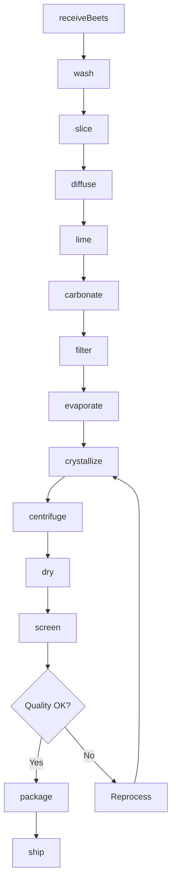
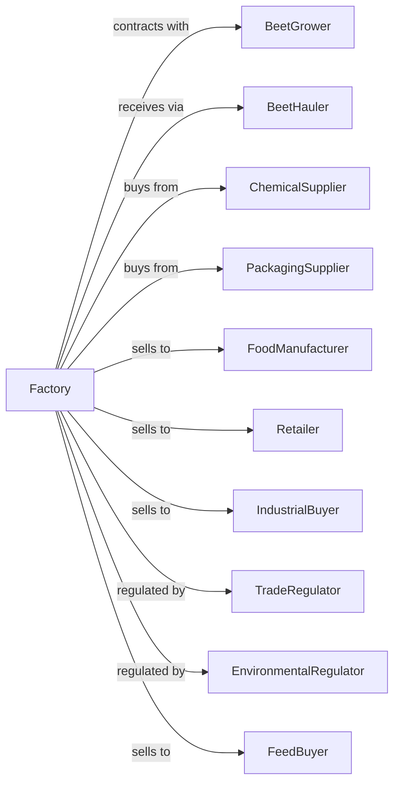

# Beet Sugar Manufacturing

> Business-as-Code definition for beet sugar manufacturing operations. Models sugar beet processing from receiving through slicing, diffusion, purification, crystallization, and refined sugar packaging.

## Overview

This U.S. industry comprises establishments primarily engaged in manufacturing refined beet sugar from sugar beets. This definition exposes actions for beet slicing, juice extraction, purification, evaporation, crystallization, and packaging of white granulated sugar and specialty sugar products.

## Actors

| Actor | Description |
|-------|-------------|
| BeetGrower | Produces sugar beets under contract |
| BeetHauler | Transports beets from farms to factory |
| ChemicalSupplier | Provides lime, sulfur, and processing chemicals |
| PackagingSupplier | Supplies bags, boxes, and bulk containers |
| FoodManufacturer | Purchases sugar for food production |
| Retailer | Sells packaged sugar to consumers |
| IndustrialBuyer | Uses sugar in beverages and processed foods |
| TradeRegulator | Administers sugar programs and quotas |
| EnvironmentalRegulator | Regulates factory emissions and waste |
| FeedBuyer | Purchases beet pulp for animal feed |

## Roles

| Role | Description |
|------|-------------|
| FactoryManager | Oversees sugar processing operations |
| ProcessEngineer | Optimizes extraction and crystallization |
| QualityManager | Ensures sugar purity and compliance |
| BeetReceiver | Manages beet receiving and sampling |
| DiffusionOperator | Controls juice extraction process |
| EvaporatorOperator | Operates evaporators and crystallizers |
| CentrifugeOperator | Separates sugar crystals from syrup |
| PackagingOperator | Runs sugar packaging lines |

## Entities

| Entity | Description |
|--------|-------------|
| SugarBeet | Root vegetable containing 15-20% sucrose |
| Cossette | Thin beet slices for juice extraction |
| RawJuice | Sugar solution extracted from cossettes |
| ThinJuice | Purified juice after liming and carbonation |
| ThickJuice | Concentrated juice after evaporation |
| Massecuite | Crystallized sugar and mother liquor mixture |
| WhiteSugar | Refined granulated sugar product |
| Molasses | Byproduct syrup from crystallization |
| BeetPulp | Extracted beet fiber for animal feed |
| Batch | Traceable production lot |

## Actions

| Action | Description |
|--------|-------------|
| receiveBeets | Accept and sample incoming beet loads |
| wash | Clean beets and remove soil and debris |
| slice | Cut beets into thin cossettes |
| diffuse | Extract sugar juice using hot water |
| lime | Add milk of lime to precipitate impurities |
| carbonate | Bubble CO2 to remove excess lime |
| filter | Remove precipitated impurities |
| evaporate | Concentrate juice by removing water |
| crystallize | Form sugar crystals in vacuum pans |
| centrifuge | Separate crystals from mother liquor |
| dry | Remove remaining moisture from sugar |
| screen | Grade sugar by crystal size |
| package | Fill bags, boxes, or bulk containers |
| ship | Deliver sugar to customers |

## Events

| Event | Description |
|-------|-------------|
| beetsReceived | Beet load sampled and accepted |
| beetsWashed | Beets cleaned and ready for slicing |
| cossettesSliced | Beets cut into extraction-ready slices |
| juiceExtracted | Sugar juice diffused from cossettes |
| juicePurified | Impurities removed from raw juice |
| juiceConcentrated | Juice evaporated to thick juice |
| sugarCrystallized | Sugar crystals formed |
| sugarCentrifuged | Crystals separated from liquor |
| sugarDried | Sugar dried to specification |
| sugarPackaged | Sugar packaged for shipment |
| qualityApproved | Sugar met purity specifications |
| orderShipped | Sugar dispatched to customer |

## Searches

| Search | Description |
|--------|-------------|
| findBeetLots | List beet inventory by grower and quality |
| getSugarInventory | Check sugar stock by grade and package |
| getOrders | Retrieve orders by customer or ship date |
| getQualityReports | Retrieve purity test results |
| getCampaignStats | View processing statistics for campaign |
| getByproducts | Check molasses and pulp inventory |
| findGrowers | List contracted beet growers |
| getMarketPrices | Retrieve sugar commodity prices |

## Workflow



## Actor Relationships



## Usage

### Calling Actions

```typescript
import { manufactureBeetSugar } from '@headlessly/manufacture-beet-sugar'

const factory = manufactureBeetSugar()

// Check beet inventory by grower
const beetLots = await factory.findBeetLots({ sugarContentMin: 16.0, status: 'available' })

// Review campaign processing statistics
const campaignStats = await factory.getCampaignStats({ campaign: 'current' })

// Receive beet load
const beets = await factory.receiveBeets({
  growerId: 'farm-north-dakota-01',
  truckWeight: 25,
  unit: 'tons',
  sugarContent: 17.5,
  tare: 3.2
})

// Process through extraction
await factory.wash({ lotId: beets.lotId })
await factory.slice({
  lotId: beets.lotId,
  cossetteThickness: 3
})

await factory.diffuse({
  lotId: beets.lotId,
  temperature: 70,
  duration: 60
})

// Purify juice
await factory.lime({
  lotId: beets.lotId,
  limeRate: 2.5
})
await factory.carbonate({ lotId: beets.lotId })
await factory.filter({ lotId: beets.lotId })
```

### Event-Driven Automation

```typescript
// Auto-crystallize when juice is concentrated
factory.juiceConcentrated(async ({ lotId, brix }) => {
  if (brix >= 65) {
    await factory.crystallize({
      lotId,
      vacuumPressure: -0.8,
      seedSugar: 'fine-grain',
      targetCrystalSize: 0.5
    })
  }
})

// Auto-package when quality approved
factory.qualityApproved(async ({ lotId, purity, color }) => {
  const grade = purity >= 99.9 ? 'extra-fine' : 'standard'

  await factory.package({
    lotId,
    grade,
    packageSizes: ['1kg', '2kg', '25kg']
  })
})
```
