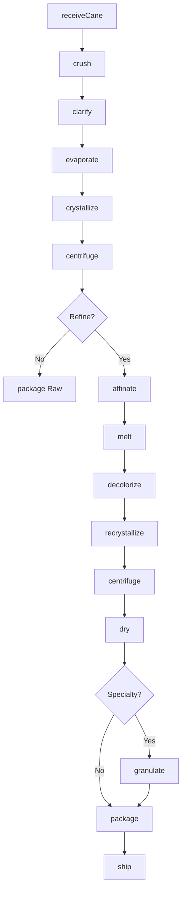
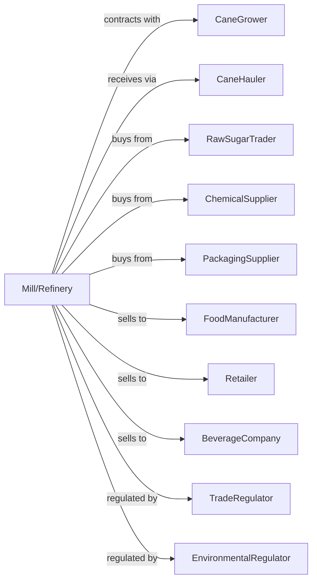

# Cane Sugar Manufacturing

> Business-as-Code definition for cane sugar manufacturing operations. Models sugarcane milling and raw sugar production, plus refining of raw sugar into white granulated and specialty sugars.

## Overview

This U.S. industry comprises establishments primarily engaged in processing sugarcane and/or refining cane sugar from raw cane sugar. This definition exposes actions for cane milling, juice clarification, evaporation, raw sugar crystallization, and refining processes including affination, melting, and recrystallization.

## Actors

| Actor | Description |
|-------|-------------|
| CaneGrower | Produces sugarcane for harvest and delivery |
| CaneHauler | Transports cut cane from fields to mill |
| RawSugarTrader | Supplies raw sugar for refining |
| ChemicalSupplier | Provides lime, sulfur, and refining chemicals |
| PackagingSupplier | Supplies bags, boxes, and bulk packaging |
| FoodManufacturer | Purchases sugar for food production |
| Retailer | Sells consumer sugar products |
| BeverageCompany | Uses sugar in soft drinks and beverages |
| TradeRegulator | Administers sugar tariffs and quotas |
| EnvironmentalRegulator | Regulates mill emissions and waste |

## Roles

| Role | Description |
|------|-------------|
| MillManager | Oversees cane milling operations |
| RefineryManager | Oversees sugar refining operations |
| ProcessEngineer | Optimizes extraction and crystallization |
| QualityManager | Ensures sugar purity and food safety |
| MillOperator | Operates crushers and extraction equipment |
| ClarifierOperator | Controls juice clarification process |
| PanOperator | Manages vacuum pans for crystallization |
| RefineryOperator | Controls affination and recrystallization |

## Entities

| Entity | Description |
|--------|-------------|
| Sugarcane | Harvested cane stalks for processing |
| Bagasse | Crushed cane fiber used as fuel |
| CaneJuice | Sugar solution extracted from cane |
| Syrup | Clarified and concentrated juice |
| RawSugar | Partially refined sugar crystals |
| MeltLiquor | Dissolved raw sugar for refining |
| WhiteSugar | Refined granulated sugar |
| BrownSugar | Sugar with molasses for color and flavor |
| Molasses | Byproduct syrup from sugar production |
| Batch | Traceable production lot |

## Actions

| Action | Description |
|--------|-------------|
| receiveCane | Accept and weigh incoming cane loads |
| crush | Extract juice by crushing cane through mills |
| clarify | Remove impurities using lime and heat |
| evaporate | Concentrate juice by removing water |
| crystallize | Form raw sugar crystals in vacuum pans |
| centrifuge | Separate raw sugar from molasses |
| affinate | Wash raw sugar to remove surface molasses |
| melt | Dissolve raw sugar in water |
| decolorize | Remove color using carbon or ion exchange |
| recrystallize | Form refined white sugar crystals |
| dry | Remove moisture from sugar |
| granulate | Produce specialty sugars like powdered |
| package | Fill containers and label products |
| ship | Deliver sugar to customers |

## Events

| Event | Description |
|-------|-------------|
| caneReceived | Cane load weighed and accepted |
| juiceExtracted | Juice crushed from cane |
| juiceClarified | Impurities removed from juice |
| syrupConcentrated | Juice evaporated to syrup |
| rawSugarCrystallized | Raw sugar crystals formed |
| rawSugarCentrifuged | Raw sugar separated from molasses |
| rawSugarAffinated | Raw sugar washed for refining |
| liquorDecolorized | Color removed from melt liquor |
| whiteSugarCrystallized | Refined sugar crystals formed |
| sugarPackaged | Sugar packaged for shipment |
| qualityApproved | Sugar met specifications |
| orderShipped | Sugar dispatched to customer |

## Searches

| Search | Description |
|--------|-------------|
| findCaneLots | List cane inventory by grower and field |
| getRawSugarInventory | Check raw sugar stock and quality |
| getRefinedInventory | Check refined sugar by grade |
| getOrders | Retrieve orders by customer or date |
| getQualityReports | Retrieve purity and color test results |
| getMillingStats | View extraction and recovery rates |
| getByproducts | Check bagasse and molasses inventory |
| getMarketPrices | Retrieve sugar commodity prices |

## Workflow



## Actor Relationships



## Usage

### Calling Actions

```typescript
import { manufactureCaneSugar } from '@headlessly/manufacture-cane-sugar'

const mill = manufactureCaneSugar()

// Check raw sugar inventory
const rawStock = await mill.getRawSugarInventory({ minPol: 98, location: 'warehouse' })

// Review milling performance metrics
const millingStats = await mill.getMillingStats({ campaign: 'current' })

// Receive cane during harvest
const cane = await mill.receiveCane({
  growerId: 'plantation-louisiana-01',
  truckWeight: 30,
  unit: 'tons',
  variety: 'LCP85-384',
  burnStatus: 'green'
})

// Mill and extract juice
await mill.crush({
  lotId: cane.lotId,
  rollPressure: 500,
  passes: 4
})

await mill.clarify({
  lotId: cane.lotId,
  limeRate: 1.2,
  temperature: 105
})

// Produce raw sugar
await mill.evaporate({
  lotId: cane.lotId,
  targetBrix: 65
})

await mill.crystallize({
  lotId: cane.lotId,
  boilingScheme: 'three-massecuite'
})
```

### Event-Driven Automation

```typescript
// Auto-refine raw sugar based on orders
mill.rawSugarCentrifuged(async ({ lotId, pol, color }) => {
  const refinedOrders = await mill.getOrders({ product: 'refined', status: 'pending' })

  if (refinedOrders.length > 0) {
    await mill.affinate({
      lotId,
      syrupConcentration: 75
    })
  } else {
    await mill.package({
      lotId,
      product: 'raw-sugar',
      destination: 'refinery'
    })
  }
})

// Produce specialty sugars on demand
mill.whiteSugarCrystallized(async ({ lotId, crystalSize }) => {
  const orders = await mill.getOrders({ product: 'powdered', status: 'pending' })

  if (orders.length > 0) {
    await mill.granulate({
      lotId,
      targetSize: 'powdered',
      anticaking: true
    })
  }
})
```
