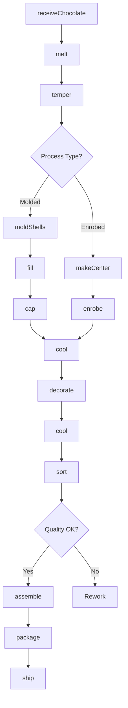
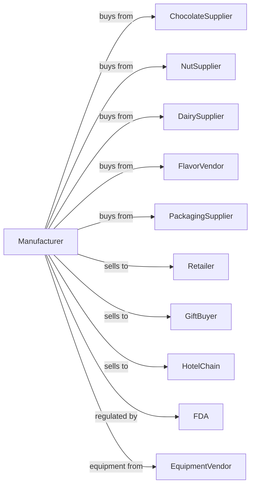

# Confectionery Manufacturing from Purchased Chocolate

> Business-as-Code definition for chocolate confectionery manufacturing from purchased chocolate. Models candy production including truffles, filled chocolates, enrobed candies, and molded pieces using couverture and coatings.

## Overview

This U.S. industry comprises establishments primarily engaged in manufacturing chocolate confectioneries from chocolate produced elsewhere. This definition exposes actions for tempering purchased chocolate, preparing centers and fillings, enrobing, molding, and packaging premium and mass-market chocolate candies.

## Actors

| Actor | Description |
|-------|-------------|
| ChocolateSupplier | Provides couverture and coating chocolate |
| NutSupplier | Supplies almonds, hazelnuts, and peanuts |
| DairySupplier | Provides cream, butter, and dairy ingredients |
| FlavorVendor | Supplies flavors, liqueurs, and extracts |
| PackagingSupplier | Provides boxes, trays, and gift packaging |
| Retailer | Purchases chocolates for consumer sale |
| GiftBuyer | Orders custom gift assortments |
| HotelChain | Purchases chocolates for turndown service |
| FDA | Regulates food safety and allergen labeling |
| EquipmentVendor | Supplies tempering and enrobing equipment |

## Roles

| Role | Description |
|------|-------------|
| PlantManager | Oversees confectionery production |
| Chocolatier | Creates recipes and flavor combinations |
| QualityManager | Ensures product safety and consistency |
| TemperingOperator | Controls chocolate tempering machines |
| CenterMaker | Prepares ganaches, caramels, and fillings |
| EnrobingOperator | Operates chocolate coating lines |
| MoldingOperator | Runs shell molding equipment |
| Decorator | Applies finishing and decorations |
| PackagingOperator | Assembles boxes and gift sets |

## Entities

| Entity | Description |
|--------|-------------|
| Couverture | High-quality chocolate for coating and molding |
| Coating | Chocolate compound for enrobing |
| Ganache | Chocolate and cream filling |
| Caramel | Cooked sugar and dairy center |
| Praline | Nut and sugar paste filling |
| Truffle | Rolled ganache ball coated in chocolate |
| Shell | Molded chocolate exterior |
| Center | Filling inside chocolate shell |
| Enrobed | Candy dipped in chocolate coating |
| Assortment | Curated selection of different pieces |

## Actions

| Action | Description |
|--------|-------------|
| receiveChocolate | Accept and store incoming chocolate |
| melt | Liquefy chocolate blocks or buttons |
| temper | Control crystallization for proper set |
| makeGanache | Combine chocolate and cream for centers |
| makeCaramel | Cook sugar and dairy for chewy centers |
| makePraline | Grind nuts with caramelized sugar |
| moldShells | Create chocolate shells in molds |
| fill | Deposit centers into shells |
| cap | Close shells with chocolate |
| enrobe | Coat centers on enrobing line |
| decorate | Apply patterns, drizzles, or toppings |
| cool | Set chocolate in cooling tunnel |
| sort | Grade pieces for quality |
| assemble | Create assortments and gift boxes |
| package | Wrap and box finished products |

## Events

| Event | Description |
|-------|-------------|
| chocolateReceived | Chocolate shipment accepted and stored |
| chocolateMelted | Chocolate liquefied for processing |
| chocolateTempered | Proper crystal structure achieved |
| ganacheMade | Ganache prepared and ready |
| caramelMade | Caramel cooked to temperature |
| shellsMolded | Chocolate shells formed |
| centersFilled | Shells filled with centers |
| shellsCapped | Chocolates closed and complete |
| candiesEnrobed | Centers coated with chocolate |
| candiesDecorated | Finishing applied |
| candiesCooled | Chocolate set and hardened |
| assortmentAssembled | Gift box filled and complete |
| orderPackaged | Order packaged and ready |
| orderShipped | Product dispatched to customer |

## Searches

| Search | Description |
|--------|-------------|
| findChocolateLots | List chocolate inventory by type and supplier |
| getFillingInventory | Check ganache and center stock |
| getFinishedInventory | Check finished candy stock |
| getOrders | Retrieve orders by customer or date |
| getRecipes | Retrieve candy recipes and formulas |
| getMoldSchedule | View mold usage and cleaning schedule |
| getQualityReports | Retrieve inspection results |
| findCustomers | List customers by order history |

## Workflow



## Actor Relationships



## Usage

### Calling Actions

```typescript
import { manufactureChocolateConfections } from '@headlessly/manufacture-chocolate-confections'

const plant = manufactureChocolateConfections()

// Prepare chocolate for production
const chocolate = await plant.melt({
  chocolateType: 'dark-64',
  quantity: 100,
  unit: 'kilograms'
})

await plant.temper({
  batchId: chocolate.batchId,
  method: 'seeding',
  targetTemperature: 31.5
})

// Make truffles
const ganache = await plant.makeGanache({
  chocolateRatio: 60,
  creamRatio: 40,
  flavor: 'raspberry',
  quantity: 50
})

// Mold and fill
await plant.moldShells({
  batchId: chocolate.batchId,
  moldType: 'truffle-dome',
  quantity: 500
})

await plant.fill({
  shellBatch: chocolate.batchId,
  fillingBatch: ganache.batchId,
  fillLevel: 80
})
```

### Event-Driven Automation

```typescript
// Auto-cap after filling
plant.centersFilled(async ({ shellBatchId, fillingType }) => {
  await plant.cap({
    batchId: shellBatchId,
    chocolateType: 'matching',
    thickness: 2
  })
})

// Auto-decorate premium products
plant.candiesCooled(async ({ batchId, product, grade }) => {
  if (grade === 'premium') {
    await plant.decorate({
      batchId,
      decoration: product.decorationType,
      transferSheet: product.pattern
    })
  }
})

// Assemble gift boxes for orders
plant.candiesDecorated(async ({ batchId }) => {
  const orders = await plant.getOrders({
    product: 'gift-assortment',
    status: 'pending'
  })

  if (orders.length > 0) {
    await plant.assemble({
      orderId: orders[0].id,
      pieces: orders[0].assortment,
      boxType: orders[0].packaging
    })
  }
})
```
