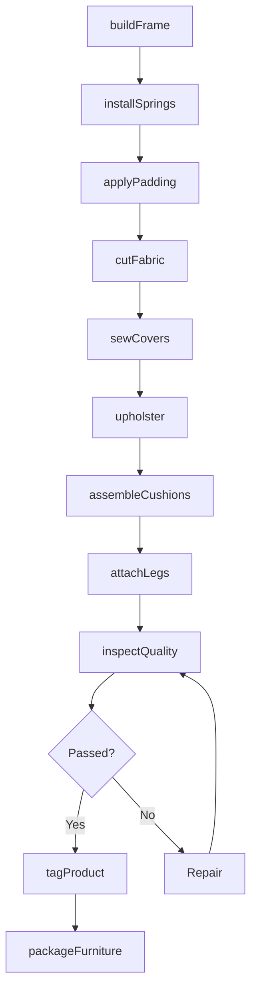
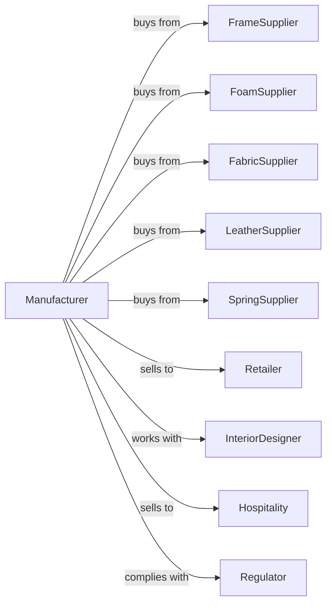

# Upholstered Household Furniture Manufacturing

> Business-as-Code definition for upholstered household furniture manufacturing operations. Models the complete production lifecycle from frame construction through final upholstery.

## Overview

Upholstered household furniture manufacturing involves producing sofas, chairs, recliners, and other seating with fabric or leather coverings over padded frames. This definition exposes actions for frame building, cushion fabrication, and upholstery application, events for workflow automation, and searches for materials and order tracking.

## Actors

| Actor | Description |
|-------|-------------|
| FrameSupplier | Provides hardwood lumber and engineered wood for frames |
| FoamSupplier | Supplies cushion foam, batting, and padding materials |
| FabricSupplier | Provides upholstery fabrics in various patterns and textures |
| LeatherSupplier | Supplies hides and synthetic leather materials |
| SpringSupplier | Provides coil springs, sinuous springs, and webbing |
| Retailer | Purchases furniture for showroom display and consumer sales |
| InteriorDesigner | Specifies custom upholstery for residential projects |
| Hospitality | Bulk orders for hotels, resorts, and cruise lines |
| Regulator | Enforces flammability standards and labeling requirements |

## Roles

| Role | Description |
|------|-------------|
| ProductionManager | Oversees manufacturing schedules and workflow |
| FrameBuilder | Constructs wooden frames using joinery and fasteners |
| SpringTier | Installs spring systems and suspension components |
| CushionMaker | Cuts and assembles foam cushions and padding |
| Cutter | Cuts fabric or leather using patterns and templates |
| Upholsterer | Applies covering materials and performs finish work |
| QualityInspector | Tests durability and inspects finish quality |

## Entities

| Entity | Description |
|--------|-------------|
| Frame | The structural skeleton of the furniture piece |
| Cushion | The padded seating or back support component |
| Fabric | The textile covering material |
| Leather | Animal hide or synthetic covering material |
| Spring | The suspension element providing comfort and support |
| Padding | Foam, batting, or fiber fill materials |
| Pattern | The template for cutting covering materials |
| WorkOrder | Production job with specifications and timeline |
| SKU | Stock keeping unit identifying specific product configuration |

## Actions

| Action | Description |
|--------|-------------|
| buildFrame | Construct structural frame using lumber and joinery |
| installSprings | Attach spring system to frame for seat suspension |
| applyPadding | Add foam and batting layers to frame |
| cutFabric | Cut covering material using patterns |
| sewCovers | Stitch fabric panels into cushion covers and skirts |
| upholster | Apply covering material to frame and attach trim |
| assembleCushions | Insert foam cores into sewn covers |
| attachLegs | Install feet, casters, or base components |
| inspectQuality | Verify construction, comfort, and appearance |
| tagProduct | Attach required labels and care instructions |
| packageFurniture | Wrap and protect for shipment |

## Events

| Event | Description |
|-------|-------------|
| frameBuilt | Frame construction completed |
| springsInstalled | Suspension system attached to frame |
| paddingApplied | Foam and batting layers in place |
| fabricCut | All covering pieces cut from material |
| coversSewn | Fabric panels stitched into covers |
| upholsteryCompleted | Covering material fully applied |
| cushionsAssembled | All cushions filled and finished |
| qualityApproved | Inspection passed all criteria |
| productTagged | Labels and tags attached |
| orderShipped | Furniture dispatched to customer |

## Searches

| Search | Description |
|--------|-------------|
| findOrders | List work orders by status, customer, or ship date |
| getFabricInventory | Query available fabrics by color, pattern, or grade |
| getLeatherStock | Check hide inventory by color and square footage |
| getFoamSupply | View foam inventory by density and thickness |
| findFrameDesigns | Search frame blueprints by model and size |
| getProductionCapacity | Check available labor and machine hours |
| trackOrder | Get status and location of customer orders |

## Workflow

## Actor Relationships

