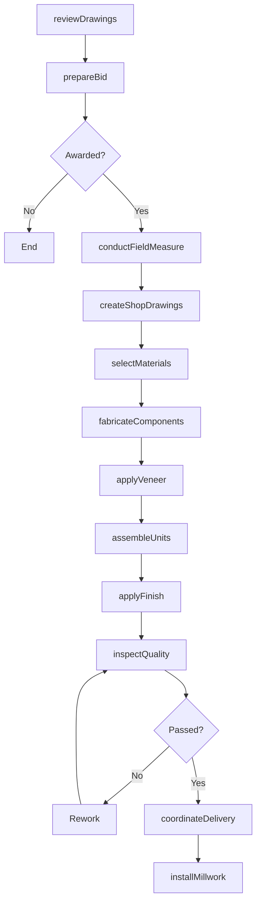
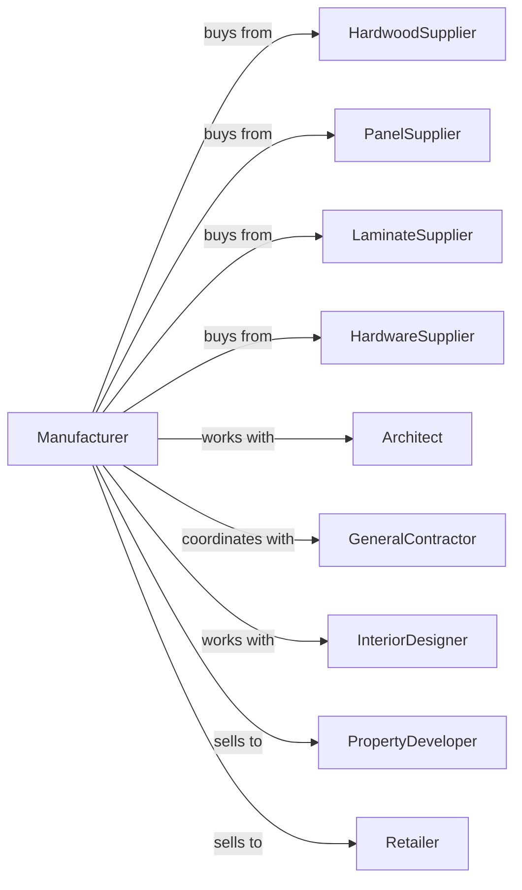

# Custom Architectural Woodwork and Millwork Manufacturing

> Business-as-Code definition for custom architectural woodwork and millwork manufacturing operations. Models the complete production lifecycle from design through installation of bespoke interior elements.

## Overview

Custom architectural woodwork manufacturing involves producing made-to-order interior elements including reception desks, wall paneling, display fixtures, architectural trim, and custom cabinetry. All output is made to individual order requiring skilled craftsmen and detailed coordination with architects and contractors.

## Actors

| Actor | Description |
|-------|-------------|
| HardwoodSupplier | Provides premium hardwood lumber and veneers |
| PanelSupplier | Supplies plywood, MDF, and specialty substrates |
| LaminateSupplier | Provides high-pressure laminates and solid surfaces |
| HardwareSupplier | Supplies specialty hinges, slides, and mounting systems |
| Architect | Designs spaces and specifies custom millwork |
| GeneralContractor | Coordinates construction and installation schedules |
| InteriorDesigner | Specifies finishes and aesthetic details |
| PropertyDeveloper | Commissions millwork for new construction |
| Retailer | Orders custom fixtures for store buildouts |

## Roles

| Role | Description |
|------|-------------|
| ProjectManager | Coordinates project from bid through installation |
| Draftsman | Creates detailed shop drawings from architectural specs |
| MasterCraftsman | Leads skilled woodworking and finishing operations |
| CNCProgrammer | Develops cutting programs for complex components |
| VeneerSpecialist | Matches and sequences veneers for visual continuity |
| Finisher | Applies custom stains and multi-step finishes |
| FieldMeasurer | Takes precise site dimensions before fabrication |
| Installer | Performs on-site assembly and attachment |

## Entities

| Entity | Description |
|--------|-------------|
| ShopDrawing | Detailed fabrication drawings with dimensions |
| Fixture | Custom display or storage element |
| Paneling | Decorative wall covering systems |
| Molding | Architectural trim and crown elements |
| ReceptionDesk | Custom entry or lobby work surface |
| Casework | Built-in cabinets and storage units |
| Veneer | Decorative wood surface material |
| Laminate | Plastic or resin surface material |
| Finish | Multi-layer coating system |

## Actions

| Action | Description |
|--------|-------------|
| reviewDrawings | Analyze architectural specifications and details |
| prepareBid | Develop pricing and timeline proposal |
| conductFieldMeasure | Take precise dimensions at installation site |
| createShopDrawings | Produce detailed fabrication drawings |
| selectMaterials | Choose lumber, veneers, and finishes for project |
| fabricateComponents | Machine all millwork parts and assemblies |
| applyVeneer | Bond decorative surfaces to substrates |
| assembleUnits | Join components into shippable assemblies |
| applyFinish | Apply stain, sealer, and topcoat systems |
| inspectQuality | Verify dimensions and finish to specifications |
| coordinateDelivery | Schedule shipping to align with site readiness |
| installMillwork | Mount, level, and finish millwork on site |

## Events

| Event | Description |
|-------|-------------|
| bidSubmitted | Pricing proposal delivered to client |
| contractAwarded | Project confirmed and authorized |
| fieldMeasureCompleted | Site dimensions captured and verified |
| shopDrawingsApproved | Fabrication drawings signed off |
| materialsReceived | Lumber and supplies delivered |
| fabricationCompleted | All components manufactured |
| finishCompleted | Coating system cured and ready |
| qualityApproved | Inspection passed specifications |
| millworkShipped | Product transported to site |
| installationCompleted | All elements mounted and finished |
| projectClosed | Punch list resolved and warranty started |

## Searches

| Search | Description |
|--------|-------------|
| findProjects | List projects by status, client, or timeline |
| getMaterialInventory | Query available lumber and panel stock |
| getVeneerFlitches | View available veneer species and sizes |
| findShopDrawings | Search drawings by project or detail type |
| getProductionSchedule | View shop capacity and machine availability |
| trackProject | Monitor status through fabrication and install |
| getBidHistory | Review past proposals and win rates |

## Workflow

## Actor Relationships

