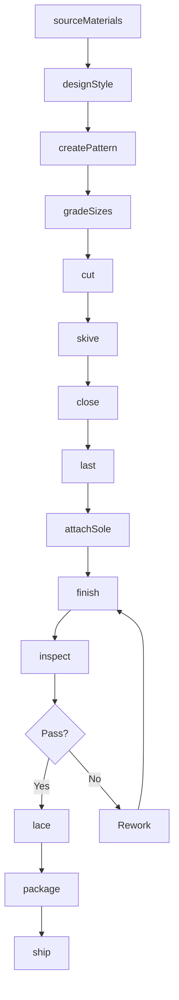
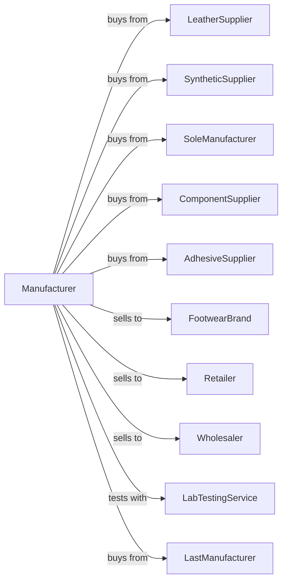

# Footwear Manufacturing

> Business-as-Code definition for footwear manufacturing operations. Models the complete production lifecycle from material sourcing through finished shoe distribution.

## Overview

This industry comprises establishments primarily engaged in manufacturing footwear (except orthopedic extension footwear). Illustrative Examples: Athletic shoes manufacturing, ballet slippers manufacturing, cleated athletic shoes manufacturing, shoes for children's, men's, and women's (except orthopedic extension).

## Actors

| Actor | Description |
|-------|-------------|
| LeatherSupplier | Provides tanned leather for upper and lining materials |
| SyntheticSupplier | Supplies synthetic materials, textiles, and mesh fabrics |
| SoleManufacturer | Provides rubber, EVA, and polyurethane outsoles |
| ComponentSupplier | Supplies laces, eyelets, buckles, and hardware |
| AdhesiveSupplier | Provides bonding agents and cements |
| FootwearBrand | Fashion and athletic brands purchasing finished shoes |
| Retailer | Stores purchasing footwear for resale |
| Wholesaler | Distributes footwear to regional markets |
| LastManufacturer | Provides shoe forms for production |
| LabTestingService | Tests shoes for durability and safety |

## Roles

| Role | Description |
|------|-------------|
| ProductionManager | Oversees daily manufacturing operations |
| PatternEngineer | Creates patterns for shoe components |
| CuttingOperator | Cuts upper materials using dies or automated equipment |
| ClosingOperator | Stitches upper components together |
| LastingOperator | Shapes upper over last and attaches to sole |
| SoleAttacher | Bonds or stitches soles to upper assemblies |
| FinishingWorker | Completes final details and cleaning |
| QualityInspector | Examines shoes for defects and fit |

## Entities

| Entity | Description |
|--------|-------------|
| Shoe | Complete footwear product |
| Upper | Top portion of shoe covering the foot |
| Sole | Bottom portion providing traction and cushioning |
| Last | Form over which shoe is constructed |
| Pattern | Template for cutting shoe components |
| Insole | Interior bottom component for comfort |
| Lining | Interior material next to foot |
| Component | Hardware and trim elements |
| Style | Design specification for shoe model |
| Size | Dimensional specification for fit |

## Actions

| Action | Description |
|--------|-------------|
| sourceMaterials | Procure leather, synthetics, and components |
| designStyle | Create new shoe designs and specifications |
| createPattern | Develop cutting patterns for components |
| gradeSizes | Scale patterns across size range |
| cut | Cut upper and lining materials |
| skive | Thin edges of leather for smooth seams |
| close | Stitch upper components together |
| last | Shape upper over form |
| attachSole | Bond or stitch sole to upper |
| finish | Clean, polish, and complete final details |
| inspect | Examine shoes for quality and fit |
| lace | Insert laces and prepare for packaging |
| package | Box shoes with tissue and accessories |
| ship | Deliver finished goods to customers |

## Events

| Event | Description |
|-------|-------------|
| materialsReceived | Raw materials delivered to facility |
| designApproved | New style specification finalized |
| patternCreated | Cutting patterns completed |
| cuttingCompleted | Upper materials cut |
| closingCompleted | Upper assembly stitched |
| lastingCompleted | Upper shaped and attached |
| soleAttached | Sole bonded to upper |
| finishingCompleted | Final details completed |
| inspectionPassed | Quality control approved |
| inspectionFailed | Defects identified |
| orderReceived | Customer purchase order entered |
| orderShipped | Finished goods dispatched |

## Searches

| Search | Description |
|--------|-------------|
| findStyles | List shoe styles by category, season, or brand |
| getInventory | Check stock levels by style, size, and color |
| findOrders | List orders by customer, status, or date |
| getMaterialStock | Check raw material inventory |
| getProductionStatus | View work-in-progress by style |
| findSuppliers | List approved material vendors |
| getQualityMetrics | Retrieve defect rates and inspection data |
| getSizeBreakdown | View inventory distribution by size |

## Workflow



## Actor Relationships



## Usage

### Calling Actions

```typescript
import { manufactureFootwear } from '@headlessly/manufacture-footwear'

const factory = manufactureFootwear()

// Check available stock
const stock = await factory.findStyles({ status: 'available' })

// Check finished goods inventory
const inventory = await factory.getInventory({ lowStockOnly: true })

// Produce men's dress oxford shoes
const materials = await factory.sourceMaterials({
  leather: { type: 'calfskin', color: 'black', quantity: 200, unit: 'hides' },
  lining: { type: 'pig-leather', quantity: 100, unit: 'hides' },
  soles: { type: 'leather-outsole', sizes: ['7-13'], quantity: 2000 }
})

await factory.designStyle({
  styleNumber: 'MEN-OXF-001',
  category: 'dress',
  construction: 'goodyear-welt',
  lastType: 'oxford-D-width'
})

await factory.createPattern({
  styleNumber: 'MEN-OXF-001',
  components: ['vamp', 'quarter', 'tongue', 'toe-cap', 'counter'],
  baseSize: 9
})

await factory.gradeSizes({
  styleNumber: 'MEN-OXF-001',
  sizeRange: ['7', '7.5', '8', '8.5', '9', '9.5', '10', '10.5', '11', '12', '13'],
  widths: ['D']
})

await factory.cut({
  batchId: materials.batchId,
  pattern: 'MEN-OXF-001',
  method: 'die-click',
  quantity: 1000,
  unit: 'pairs'
})
```

### Event-Driven Automation

```typescript
// Auto-skive after cutting
factory.cuttingCompleted(async ({ batchId, leatherType }) => {
  await factory.skive({
    batchId,
    edges: ['seam-allowance', 'fold-lines'],
    thickness: leatherType === 'calfskin' ? 0.6 : 0.8,
    unit: 'mm'
  })
})

// Auto-close after skiving
factory.closingCompleted(async ({ batchId }) => {
  await factory.last({
    batchId,
    method: 'toe-lasting-first',
    heatActivate: true,
    holdTime: 30,
    unit: 'seconds'
  })
})

// Auto-sole attachment after lasting
factory.lastingCompleted(async ({ batchId, construction }) => {
  await factory.attachSole({
    batchId,
    method: construction,
    cement: construction === 'cemented' ? 'polyurethane' : null,
    stitchType: construction === 'goodyear-welt' ? 'lock-stitch' : null
  })
})

// Auto-finish and inspect after sole
factory.soleAttached(async ({ batchId }) => {
  await factory.finish({
    batchId,
    operations: ['edge-trim', 'burnish', 'polish', 'clean']
  })

  await factory.inspect({
    batchId,
    checks: ['fit-on-last', 'sole-bond', 'stitch-quality', 'finish']
  })
})

// Auto-package after passing inspection
factory.inspectionPassed(async ({ batchId, style }) => {
  await factory.lace({
    batchId,
    laceType: 'waxed-cotton',
    length: 30,
    unit: 'inches'
  })

  await factory.package({
    batchId,
    box: 'branded-shoebox',
    inserts: ['tissue', 'shoe-horn', 'care-card']
  })
})
```
