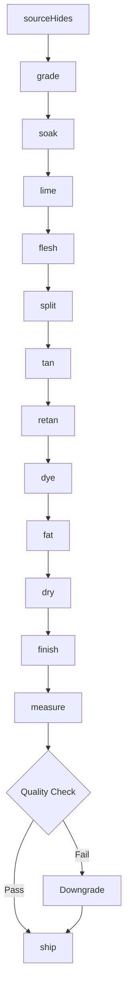
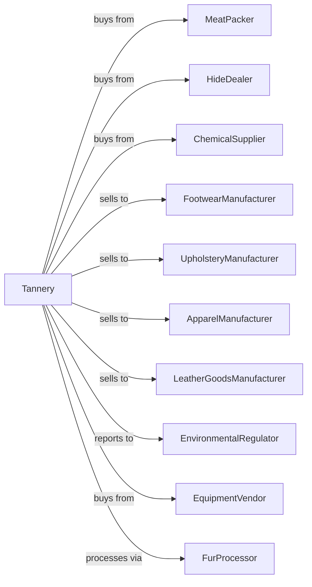

# Leather and Hide Tanning and Finishing

> Business-as-Code definition for leather tanning and finishing operations. Models the complete production lifecycle from raw hide procurement through finished leather distribution to product manufacturers.

## Overview

This industry comprises establishments primarily engaged in one or more of the following: (1) tanning, currying, and finishing hides and skins; (2) having others process hides and skins on a contract basis; and (3) dyeing or dressing furs.

## Actors

| Actor | Description |
|-------|-------------|
| MeatPacker | Supplies raw hides as byproduct of meat processing |
| HideDealer | Trades and brokers raw hides and skins |
| ChemicalSupplier | Provides tanning agents, dyes, and finishing chemicals |
| EquipmentVendor | Sells and services tanning and finishing machinery |
| FootwearManufacturer | Purchases leather for shoe production |
| UpholsteryManufacturer | Buys leather for furniture and auto interiors |
| ApparelManufacturer | Purchases leather for garment production |
| LeatherGoodsManufacturer | Buys leather for bags, belts, and accessories |
| FurProcessor | Specializes in fur dressing and dyeing |
| EnvironmentalRegulator | Oversees waste treatment and compliance |

## Roles

| Role | Description |
|------|-------------|
| TanneryManager | Oversees daily tanning and finishing operations |
| HideSorter | Grades and selects hides by quality and defects |
| BeamhouseOperator | Runs soaking, liming, and fleshing processes |
| TanningOperator | Manages chrome, vegetable, or combination tanning |
| DyeingTechnician | Controls leather coloring processes |
| FinishingOperator | Applies surface coatings and treatments |
| QualityGrader | Inspects and grades finished leather |
| WasteTreatmentOperator | Manages effluent treatment systems |

## Entities

| Entity | Description |
|--------|-------------|
| Hide | Raw cattle skin from meat processing |
| Skin | Raw material from smaller animals |
| Pelt | Hide with hair or fur attached |
| Leather | Tanned and finished hide material |
| TanningAgent | Chemical used to convert hide to leather |
| Dye | Coloring agent for leather finishing |
| Finish | Surface coating applied to leather |
| Grade | Quality classification for finished leather |
| Lot | Production batch with consistent characteristics |
| Effluent | Wastewater requiring treatment |

## Actions

| Action | Description |
|--------|-------------|
| sourceHides | Procure raw hides from packers and dealers |
| grade | Sort and classify hides by quality and size |
| soak | Rehydrate preserved hides in water |
| lime | Remove hair and prepare hide for tanning |
| flesh | Remove fat and tissue from hide |
| split | Separate hide into grain and split layers |
| tan | Convert hide to leather using tanning agents |
| retan | Apply secondary tanning for specific properties |
| dye | Apply color through drum or spray dyeing |
| fat | Add oils for softness and flexibility |
| dry | Remove moisture through air or machine drying |
| finish | Apply surface coatings and texture treatments |
| measure | Calculate area of finished leather |
| treatEffluent | Process wastewater before discharge |

## Events

| Event | Description |
|-------|-------------|
| hidesReceived | Raw hides delivered to tannery |
| gradesAssigned | Hides sorted and classified |
| limingCompleted | Hair removal process finished |
| tanningCompleted | Hide converted to leather |
| retanningCompleted | Secondary tanning finished |
| dyeingCompleted | Color applied to leather |
| dryingCompleted | Moisture removed from leather |
| finishingCompleted | Surface treatments applied |
| qualityGraded | Finished leather inspected and classified |
| orderReceived | Customer purchase order entered |
| orderShipped | Finished leather dispatched |
| effluentTreated | Wastewater processed for discharge |

## Searches

| Search | Description |
|--------|-------------|
| findHideInventory | Check raw hide stock by source and grade |
| getLeatherInventory | List finished leather by type, color, and grade |
| findOrders | List orders by customer, status, or delivery date |
| getProductionStatus | View work-in-progress by lot and stage |
| findSuppliers | List approved hide and chemical vendors |
| getQualityMetrics | Retrieve grade distribution and defect rates |
| getYieldData | Calculate leather yield from hide input |
| getComplianceStatus | Check environmental permit status |

## Workflow



## Actor Relationships



## Usage

### Calling Actions

```typescript
import { tanLeatherHide } from '@headlessly/tan-leather-hide'

const tannery = tanLeatherHide()

// Check available stock
const stock = await tannery.findHideInventory({ status: 'available' })

// Check finished goods inventory
const inventory = await tannery.getLeatherInventory({ lowStockOnly: true })

// Process cattle hides into chrome-tanned leather
const hides = await tannery.sourceHides({
  supplier: 'midwest-packers',
  type: 'cattle',
  preservation: 'salted',
  quantity: 500,
  unit: 'hides',
  avgWeight: 65,
  weightUnit: 'pounds'
})

await tannery.grade({
  lotId: hides.lotId,
  criteria: ['size', 'brand-damage', 'grain-quality'],
  grades: ['A', 'B', 'C']
})

await tannery.soak({
  lotId: hides.lotId,
  duration: 18,
  unit: 'hours',
  temperature: 68,
  tempUnit: 'fahrenheit'
})

await tannery.lime({
  lotId: hides.lotId,
  limePercent: 3,
  sodiumSulfide: 2.5,
  duration: 24,
  unit: 'hours'
})

await tannery.tan({
  lotId: hides.lotId,
  method: 'chrome',
  chromePercent: 8,
  pH: 3.5,
  duration: 12,
  unit: 'hours'
})
```

### Event-Driven Automation

```typescript
// Auto-retan after chrome tanning
tannery.tanningCompleted(async ({ lotId, leatherType }) => {
  await tannery.retan({
    lotId,
    agent: leatherType === 'upholstery' ? 'syntan-soft' : 'vegetable',
    percent: 6
  })
})

// Auto-dye after retanning
tannery.retanningCompleted(async ({ lotId, customerSpec }) => {
  await tannery.dye({
    lotId,
    color: customerSpec.color,
    method: 'drum',
    penetration: customerSpec.type === 'aniline' ? 'through' : 'surface'
  })
})

// Auto-measure and grade after finishing
tannery.finishingCompleted(async ({ lotId }) => {
  const measurement = await tannery.measure({
    lotId,
    method: 'electronic',
    unit: 'square-feet'
  })

  await tannery.qualityGrade({
    lotId,
    area: measurement.totalArea,
    grades: ['premium', 'standard', 'utility']
  })
})

// Environmental compliance
tannery.effluentTreated(async ({ batchId, parameters }) => {
  if (parameters.chromium > 2) {
    await tannery.alertEnvironmental({
      batchId,
      parameter: 'chromium',
      value: parameters.chromium,
      limit: 2,
      action: 'retreat-required'
    })
  }
})
```
