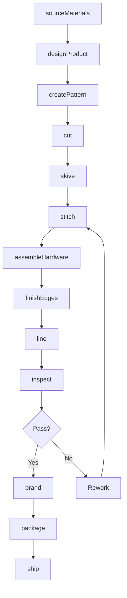
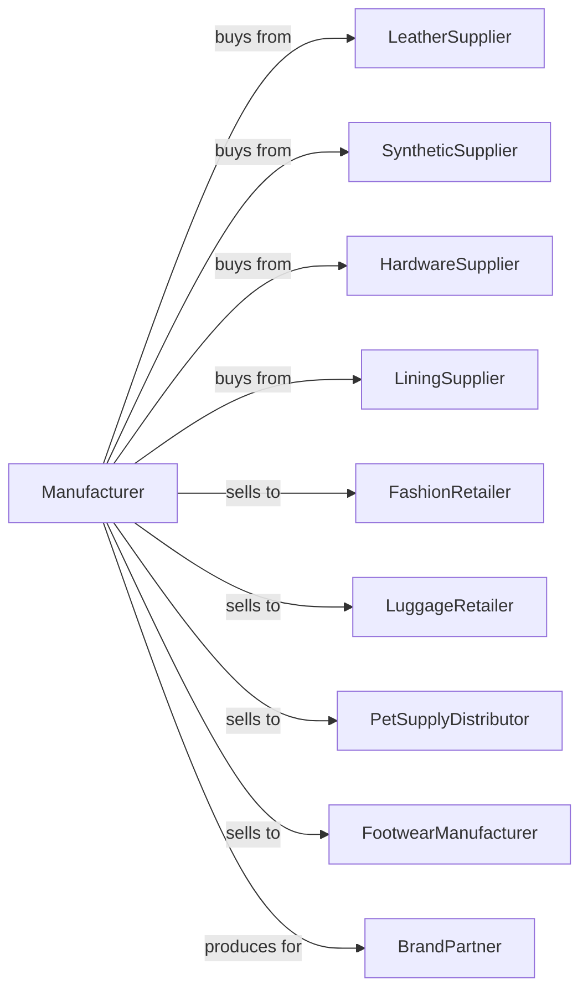

# Other Leather and Allied Product Manufacturing

> Business-as-Code definition for leather goods and allied product manufacturing. Models the complete production lifecycle from material sourcing through finished product distribution.

## Overview

This industry comprises establishments primarily engaged in manufacturing leather products (except footwear and apparel) from purchased leather or leather substitutes (e.g., fabric, plastics). Illustrative Examples: Billfolds, boot and shoe cut stock and findings, dog furnishings (e.g., collars, harnesses, leashes, muzzles), luggage, shoe soles, purses.

## Actors

| Actor | Description |
|-------|-------------|
| LeatherSupplier | Provides tanned leather in various grades and finishes |
| SyntheticSupplier | Supplies vinyl, PU leather, and fabric alternatives |
| HardwareSupplier | Provides zippers, clasps, buckles, and metal fittings |
| LiningSupplier | Supplies interior fabrics and materials |
| FashionRetailer | Department stores and specialty shops |
| LuggageRetailer | Stores specializing in travel goods |
| PetSupplyDistributor | Distributes pet accessories to retail |
| FootwearManufacturer | Purchases cut stock and findings |
| BrandPartner | Fashion brands requiring contract manufacturing |
| EquipmentVendor | Sells and services production machinery |

## Roles

| Role | Description |
|------|-------------|
| ProductionManager | Oversees daily manufacturing operations |
| PatternMaker | Creates patterns for bags, wallets, and accessories |
| CuttingOperator | Cuts leather and materials using dies or lasers |
| SkivingOperator | Thins leather edges for clean assembly |
| SewingOperator | Stitches components using specialty machines |
| AssemblyWorker | Attaches hardware and completes construction |
| EdgeFinisher | Burnishes, paints, and finishes leather edges |
| QualityInspector | Examines products for defects and specifications |

## Entities

| Entity | Description |
|--------|-------------|
| Handbag | Women's bag product in various styles |
| Wallet | Billfold or card case product |
| Luggage | Travel bag or suitcase |
| Belt | Leather waist accessory |
| PetCollar | Dog or cat neck accessory |
| Leash | Pet lead product |
| Harness | Pet or equestrian harness product |
| CutStock | Pre-cut leather components for footwear |
| Finding | Hardware and small components |
| Pattern | Template for cutting product components |

## Actions

| Action | Description |
|--------|-------------|
| sourceMaterials | Procure leather, synthetics, and hardware |
| designProduct | Create new product designs and specifications |
| createPattern | Develop cutting patterns for components |
| cut | Cut materials using dies, lasers, or manual methods |
| skive | Thin leather edges for smooth construction |
| stitch | Sew components using industrial machines |
| assembleHardware | Install zippers, clasps, and metal fittings |
| finishEdges | Burnish, paint, or bind leather edges |
| line | Attach interior lining materials |
| inspect | Examine products for quality compliance |
| brand | Apply logos and branding elements |
| package | Prepare products for retail or shipping |
| ship | Deliver finished goods to customers |

## Events

| Event | Description |
|-------|-------------|
| materialsReceived | Raw materials delivered to facility |
| designApproved | New product design finalized |
| patternCreated | Cutting pattern completed |
| cuttingCompleted | Materials cut for production |
| stitchingCompleted | Sewing operations finished |
| hardwareInstalled | Metal components attached |
| edgesFinished | Edge treatments completed |
| liningAttached | Interior completed |
| inspectionPassed | Quality control approved |
| inspectionFailed | Defects identified |
| orderReceived | Customer purchase order entered |
| orderShipped | Finished goods dispatched |

## Searches

| Search | Description |
|--------|-------------|
| findProducts | List products by category, style, or material |
| getInventory | Check stock levels by product and location |
| findOrders | List orders by customer, status, or date |
| getMaterialStock | Check leather and hardware inventory |
| getProductionStatus | View work-in-progress by style |
| findSuppliers | List approved material vendors |
| getQualityMetrics | Retrieve defect rates and inspection data |
| getCutStockOrders | List footwear manufacturer orders |

## Workflow



## Actor Relationships



## Usage

### Calling Actions

```typescript
import { manufactureLeatherAllied } from '@headlessly/manufacture-leather-allied'

const manufacturer = manufactureLeatherAllied()

// Check available stock
const stock = await manufacturer.findProducts({ status: 'available' })

// Check finished goods inventory
const inventory = await manufacturer.getInventory({ lowStockOnly: true })

// Produce leather handbags
const materials = await manufacturer.sourceMaterials({
  leather: { type: 'pebbled-cowhide', color: 'cognac', quantity: 100, unit: 'hides' },
  lining: { type: 'cotton-twill', color: 'tan', quantity: 200, unit: 'yards' },
  hardware: { type: 'antique-brass', items: ['zipper', 'clasp', 'd-rings'] }
})

await manufacturer.designProduct({
  productType: 'handbag',
  styleNumber: 'HB-TOTE-001',
  dimensions: { height: 12, width: 14, depth: 5, unit: 'inches' },
  features: ['interior-zip-pocket', 'phone-pocket', 'key-leash']
})

await manufacturer.createPattern({
  styleNumber: 'HB-TOTE-001',
  components: ['front-panel', 'back-panel', 'gusset', 'base', 'strap', 'pocket']
})

await manufacturer.cut({
  batchId: materials.batchId,
  pattern: 'HB-TOTE-001',
  method: 'die-clicker',
  quantity: 200
})

await manufacturer.skive({
  batchId: materials.batchId,
  edges: ['seam-allowance', 'fold-lines', 'strap-edges'],
  thickness: 0.5,
  unit: 'mm'
})
```

### Event-Driven Automation

```typescript
// Auto-stitch after skiving
manufacturer.cuttingCompleted(async ({ batchId, productType }) => {
  await manufacturer.skive({
    batchId,
    edges: productType === 'wallet' ? ['fold-lines', 'card-slots'] : ['seam-allowance']
  })
})

// Auto-assemble hardware after stitching
manufacturer.stitchingCompleted(async ({ batchId, hardware }) => {
  await manufacturer.assembleHardware({
    batchId,
    components: hardware,
    method: 'rivet-and-screw'
  })
})

// Auto-finish edges after hardware
manufacturer.hardwareInstalled(async ({ batchId, leatherType }) => {
  await manufacturer.finishEdges({
    batchId,
    method: leatherType === 'vegetable-tan' ? 'burnish' : 'paint',
    color: 'match-leather'
  })
})

// Auto-line and brand after edge finishing
manufacturer.edgesFinished(async ({ batchId, productType }) => {
  if (productType !== 'cut-stock') {
    await manufacturer.line({
      batchId,
      method: 'glue-and-stitch'
    })

    await manufacturer.brand({
      batchId,
      method: 'hot-stamp',
      location: 'interior-label-area'
    })
  }
})

// Auto-package after inspection
manufacturer.inspectionPassed(async ({ batchId, customer }) => {
  await manufacturer.package({
    batchId,
    packaging: customer.includes('luxury') ? 'dust-bag-in-box' : 'poly-bag',
    cartonQuantity: 12
  })
})
```
