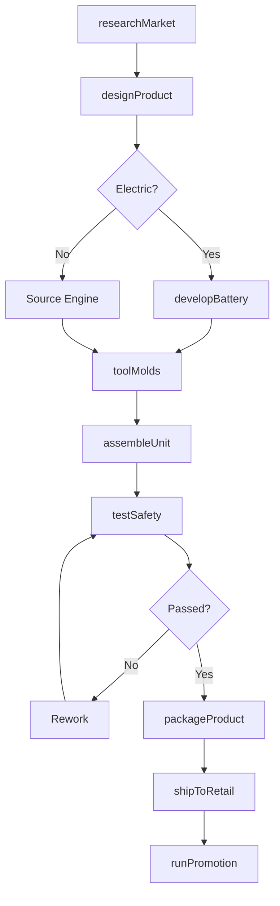
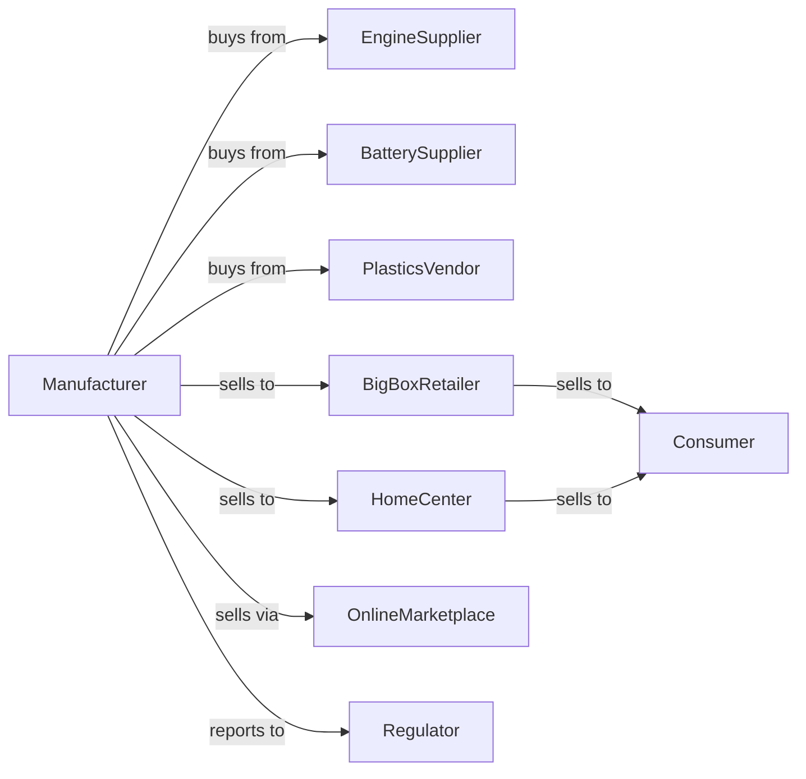

# Lawn and Garden Tractor and Home Lawn and Garden Equipment Manufacturing

> Business-as-Code definition for lawn and garden equipment manufacturing operations. Models the complete production lifecycle from consumer research through retail distribution including battery-electric product development.

## Overview

Lawn and garden equipment manufacturing involves producing powered lawnmowers, garden tractors, tillers, leaf blowers, and other home outdoor power equipment. Operations coordinate with engine suppliers, retailers, and homeowner consumers with strong seasonal demand patterns. This definition exposes actions for product development, mass production, and retail channel management with events for automation and searches for market analytics.

## Actors

| Actor | Description |
|-------|-------------|
| EngineSupplier | Provides small gasoline and electric motors |
| BatterySupplier | Supplies lithium-ion cells and battery packs |
| PlasticsVendor | Provides housings, covers, and molded components |
| BigBoxRetailer | Mass merchant selling equipment to consumers |
| HomeCenter | Home improvement store channel |
| OnlineMarketplace | E-commerce platform for direct sales |
| Consumer | Homeowner purchasing equipment |
| Regulator | Oversees emissions and safety standards |

## Roles

| Role | Description |
|------|-------------|
| ProductDesigner | Creates equipment designs and aesthetics |
| ManufacturingEngineer | Develops production processes and tooling |
| ProductionSupervisor | Manages assembly line operations |
| QualityTechnician | Tests products and monitors defect rates |
| RetailAccountManager | Manages relationships with major retailers |
| CustomerServiceRep | Handles consumer inquiries and warranty claims |

## Entities

| Entity | Description |
|--------|-------------|
| Product | Completed lawn and garden equipment unit |
| SKU | Stock keeping unit for retail inventory |
| Assembly | Major component subassembly |
| Mold | Tooling for plastic component production |
| RetailProgram | Promotional arrangement with retailer |
| WarrantyClaim | Customer defect report and resolution |
| SeasonalForecast | Projected demand by product and region |
| SafetyTest | Compliance verification record |
| PackagingSpec | Retail packaging requirements |
| ReturnAuth | Authorization for product return |

## Actions

| Action | Description |
|--------|-------------|
| researchMarket | Analyze consumer preferences and trends |
| designProduct | Engineer new equipment models |
| developBattery | Create electric power systems |
| toolMolds | Produce injection molds for plastics |
| assembleUnit | Build equipment on production line |
| testSafety | Verify compliance with safety standards |
| packageProduct | Prepare units for retail display |
| shipToRetail | Transport inventory to retail channels |
| runPromotion | Execute seasonal marketing programs |
| processReturn | Handle customer returns and refunds |
| updateDesign | Refresh product for new model year |
| forecastSeason | Project demand for upcoming season |

## Events

| Event | Description |
|-------|-------------|
| marketResearchCompleted | Consumer insights gathered |
| designFinalized | Product engineering complete |
| moldsApproved | Tooling validated for production |
| productionStarted | Assembly line running for season |
| safetyTestPassed | Unit cleared for sale |
| inventoryShipped | Products dispatched to retailers |
| seasonalPeakReached | High-demand period arrived |
| returnReceived | Product returned by customer |
| warrantyClaimFiled | Defect reported by consumer |
| inventoryCleared | End-of-season stock reduction |

## Searches

| Search | Description |
|--------|-------------|
| getProductionStatus | Retrieve assembly progress by model |
| findRetailInventory | Query stock levels by retailer |
| getSalesVelocity | Track sell-through rates by channel |
| getWarrantyClaims | Retrieve defect reports by model |
| findSeasonalTrends | Analyze demand patterns by region |
| getCompetitorPricing | Monitor market pricing |
| trackReturns | Retrieve return rates and reasons |
| getConsumerFeedback | Aggregate reviews and ratings |

## Workflow



## Actor Relationships



## Usage

### Calling Actions

```typescript
import { manufactureLawnGardenEquipment } from '@headlessly/manufacture-lawn-garden-equipment'

const factory = manufactureLawnGardenEquipment()

// Design new battery-powered mower
const newProduct = await factory.designProduct({
  category: 'push-mower',
  powerType: 'battery',
  features: ['self-propelled', 'mulching', 'bagging'],
  targetPrice: 449,
  launchYear: 2025
})

// Develop battery system
await factory.developBattery({
  productId: newProduct.id,
  voltage: 56,
  ampHours: 7.5,
  runtime: 60,
  chargeTime: 90
})

// Start seasonal production
await factory.assembleUnit({
  model: 'eco-mower-2500',
  quantity: 50000,
  retailerAllocations: {
    'home-depot': 20000,
    'lowes': 15000,
    'walmart': 10000,
    'amazon': 5000
  }
})
```

### Event-Driven Automation

```typescript
// Auto-replenish retailer inventory
factory.inventoryShipped(async ({ retailerId, productId, quantity }) => {
  const velocity = await factory.getSalesVelocity({ retailerId, productId })

  if (velocity.weeksOfSupply < 4) {
    await factory.shipToRetail({
      retailerId,
      productId,
      quantity: velocity.weeklyRate * 6,
      priority: 'rush'
    })
  }
})

// Handle seasonal clearance
factory.seasonalPeakReached(async ({ season }) => {
  if (season === 'fall') {
    const inventory = await factory.findRetailInventory({
      category: 'mowers',
      excess: true
    })

    await factory.runPromotion({
      products: inventory.map(i => i.productId),
      discountPercent: 25,
      duration: '6-weeks'
    })
  }
})
```

## Related

- [Farm Machinery Manufacturing](./333111-FarmMachineryAndEquipmentManufacturing.mdx)
- [Power-Driven Handtool Manufacturing](../3339-OtherGeneralPurposeMachineryManufacturing/333991-PowerDrivenHandtoolManufacturing.mdx)
- [Lawn and Garden Equipment Stores](../../444-BuildingMaterialAndGardenEquipmentAndSuppliesDealers/4442-LawnAndGardenEquipmentAndSuppliesStores/444220-NurseryGardenCenterAndFarmSupplyStores.mdx)
