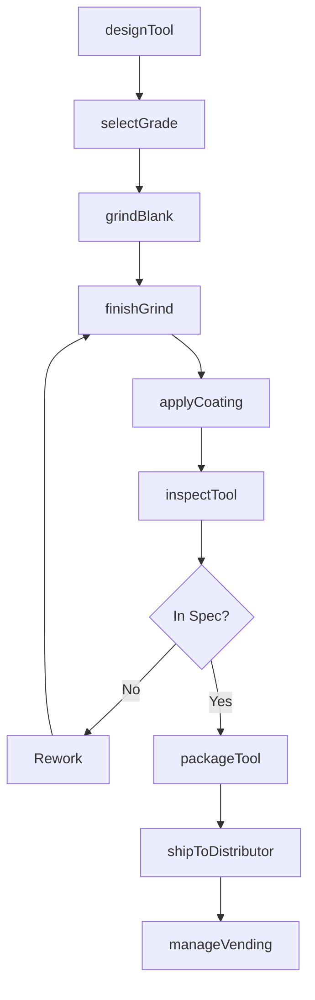
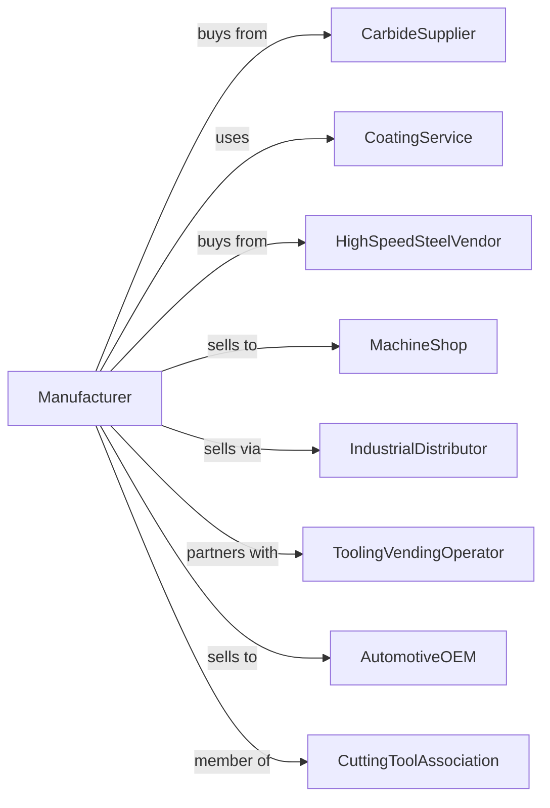

# Cutting Tool and Machine Tool Accessory Manufacturing

> Business-as-Code definition for cutting tool and machine tool accessory manufacturing operations. Models the complete production lifecycle from tool design through distribution including carbide inserts, drills, end mills, and precision workholding.

## Overview

Cutting tool and machine tool accessory manufacturing involves producing metal cutting tools including carbide inserts, drills, end mills, reamers, and machine tool accessories like chucks and collets. Operations coordinate with carbide suppliers, coating services, and machine shops requiring high-performance cutting tools. This definition exposes actions for tool engineering, precision grinding, and distribution channel management with events for automation and searches for cutting performance analytics.

## Actors

| Actor | Description |
|-------|-------------|
| CarbideSupplier | Provides tungsten carbide blanks and grades |
| CoatingService | Applies PVD and CVD tool coatings |
| HighSpeedSteelVendor | Supplies HSS tool blanks |
| MachineShop | End customer using cutting tools |
| IndustrialDistributor | Sells tools to manufacturers |
| ToolingVendingOperator | Manages tool crib automation |
| AutomotiveOEM | High-volume automotive customer |
| CuttingToolAssociation | Industry standards organization |

## Roles

| Role | Description |
|------|-------------|
| ToolDesigner | Engineers cutting tool geometry |
| ApplicationEngineer | Develops cutting parameters |
| GrindingTechnician | Operates CNC grinding machines |
| CoatingSpecialist | Specifies and applies coatings |
| QualityInspector | Measures tool dimensions |
| TechnicalSalesRep | Supports customer applications |

## Entities

| Entity | Description |
|--------|-------------|
| CarbideInsert | Indexable cutting tool tip |
| SolidCarbideTool | One-piece carbide cutting tool |
| Drill | Hole-making cutting tool |
| EndMill | Side and face milling cutter |
| Reamer | Hole-finishing cutting tool |
| ThreadingTool | Thread cutting or forming tool |
| ToolHolder | Device mounting cutting tools |
| Collet | Precision workholding sleeve |
| ToolCoating | Surface treatment for wear and heat |
| ToolGeometry | Cutting edge design specification |

## Actions

| Action | Description |
|--------|-------------|
| designTool | Engineer cutting geometry |
| selectGrade | Choose carbide or HSS material |
| grindBlank | Rough grind tool from blank |
| finishGrind | Precision grind cutting edges |
| applyCoating | PVD or CVD coat tool surfaces |
| inspectTool | Measure dimensions and geometry |
| packageTool | Prepare for shipping and display |
| shipToDistributor | Deliver to distribution channel |
| developApplication | Create cutting parameters |
| supportCustomer | Assist with tool selection and use |
| regrindTool | Sharpen and recondition worn tools |
| manageVending | Stock and track tool cribs |

## Events

| Event | Description |
|-------|-------------|
| designReleased | Tool geometry approved |
| gradeSelected | Carbide material specified |
| grindingCompleted | Tool shapes finished |
| coatingApplied | Surface treatment completed |
| inspectionPassed | Dimensions verified |
| toolPackaged | Ready for shipment |
| toolShipped | Delivered to customer |
| applicationDeveloped | Cutting parameters released |
| regrindRequested | Tool returned for resharpening |
| vendingStockDepleted | Vending stock fell below threshold |

## Searches

| Search | Description |
|--------|-------------|
| findToolsByApplication | Query tools for material and operation |
| getToolInventory | Check stock levels by grade |
| getCuttingData | Retrieve recommended parameters |
| trackToolPerformance | Monitor tool life in applications |
| findRegrindHistory | Get reconditioning records |
| getVendingStatus | Check tool crib inventory |
| findDistributorStock | Query channel inventory |
| getNewProductReleases | List recently launched tools |

## Workflow



## Actor Relationships



## Usage

### Calling Actions

```typescript
import { manufactureCuttingTools } from '@headlessly/manufacture-cutting-tools'

const factory = manufactureCuttingTools()

// Check available stock
const stock = await factory.findToolsByApplication({ status: 'available' })

// Check finished goods inventory
const inventory = await factory.getToolInventory({ lowStockOnly: true })

// Design high-performance end mill
const endmill = await factory.designTool({
  type: 'solid-carbide-endmill',
  diameter: 0.500, // inches
  flutes: 4,
  helix: 40, // degrees
  length: 'stub',
  application: 'hardened-steel'
})

// Select carbide grade
await factory.selectGrade({
  toolId: endmill.id,
  grade: 'micro-grain-carbide',
  substrate: '10-percent-cobalt',
  coating: 'altin-pvd'
})

// Develop cutting parameters
await factory.developApplication({
  toolId: endmill.id,
  material: '4140-hardened-50hrc',
  operation: 'profile-milling',
  parameters: {
    sfm: 400,
    chipload: 0.002,
    doc: 0.100,
    woc: 0.030
  }
})
```

### Event-Driven Automation

```typescript
// Auto-replenish tool cribs
factory.vendingStockDepleted(async ({ vendingId, toolId, currentQty, minQty }) => {
  await factory.manageVending({
    vendingId,
    toolId,
    action: 'replenish',
    quantity: minQty * 2,
    shipping: currentQty === 0 ? 'overnight' : 'standard'
  })
})

// Handle regrind requests
factory.regrindRequested(async ({ toolId, customerId, wornTools }) => {
  await factory.regrindTool({
    toolId,
    customerId,
    quantity: wornTools.length,
    returnShipping: 'prepaid',
    turnaround: '3-day'
  })
})
```

## Related

- [Machine Tool Manufacturing](./333517-MachineToolManufacturing.mdx)
- [Special Die and Tool Manufacturing](./333514-SpecialDieAndToolDieSetJigAndFixtureManufacturing.mdx)
- [Industrial Mold Manufacturing](./333511-IndustrialMoldManufacturing.mdx)
